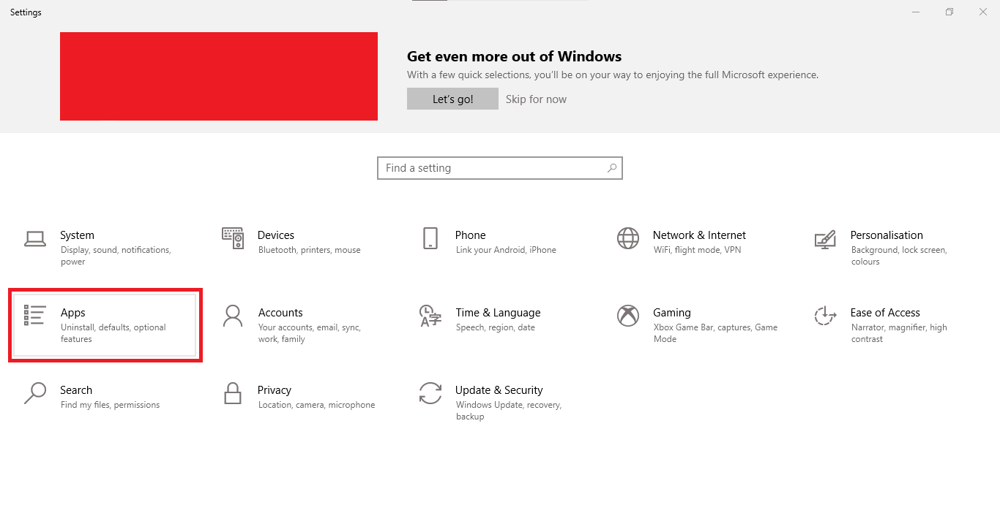
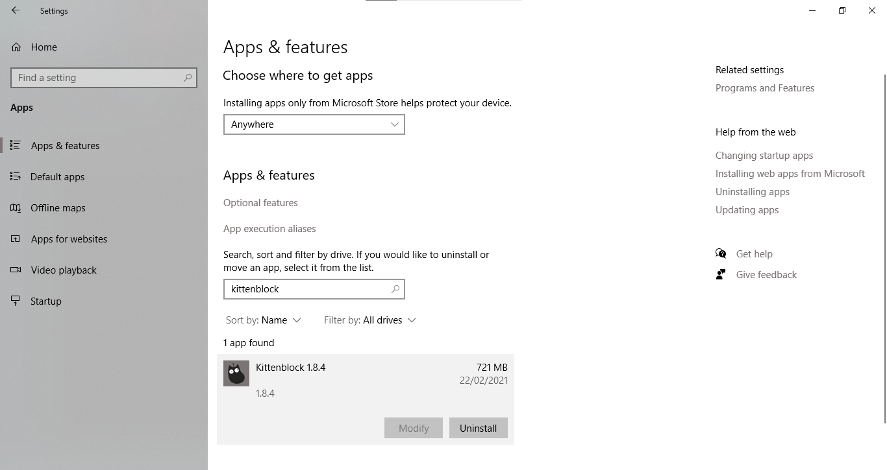
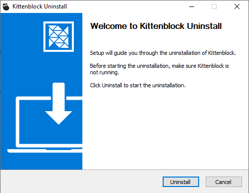
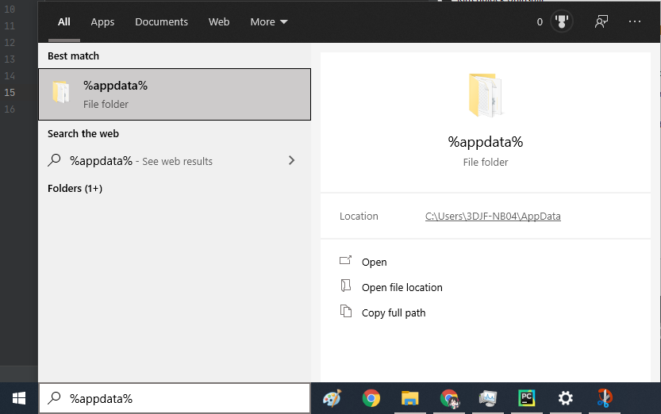
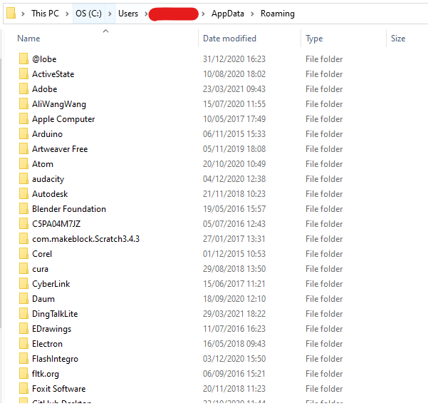
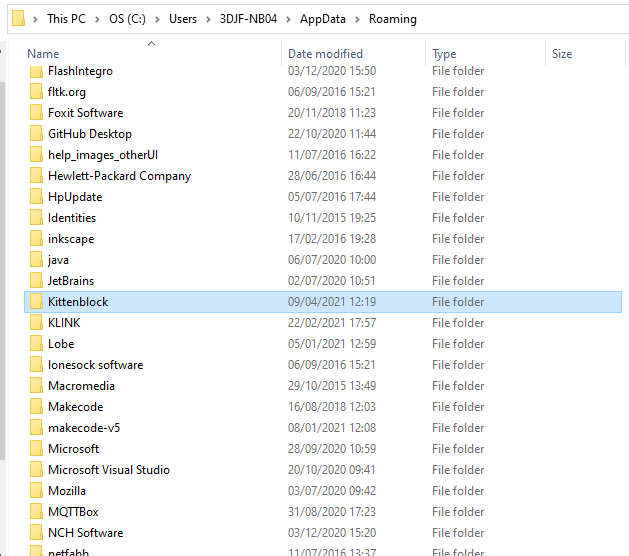

# Removing KittenBlock Completely

The Windows Uninstaller may not remove all files associated with KittenBlock, thus the files must be removed manually.

## 1. Removing Kittenblock via the Control Panel

## 2. Search for %appdata% in the search bar

## 3. Delete the folder named Kittenblock

