# Characters and Backdrops

Characters and backdrops can be edited.

## Characters Editing

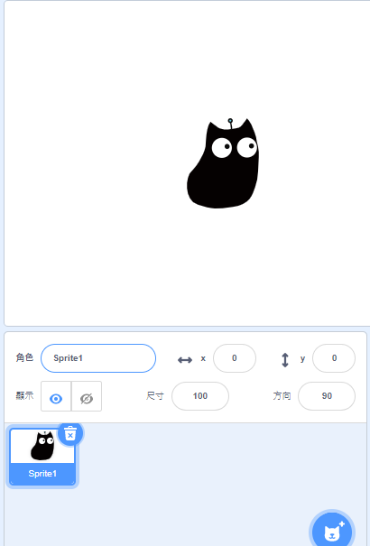

### 1. Parameters

Set the parameters such as position, size, rotation.

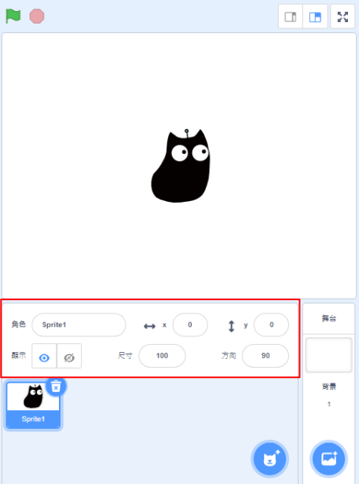

### 2. Characters Selection

Select different characters here.

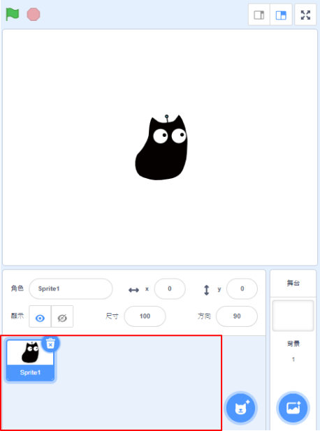

### 3. Characters Editor

We can add new characters via this menu.

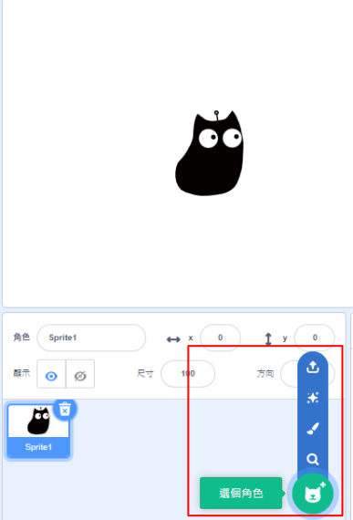

#### 3.1 Premade Characters

Select from a list of premade characters.

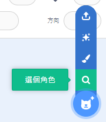

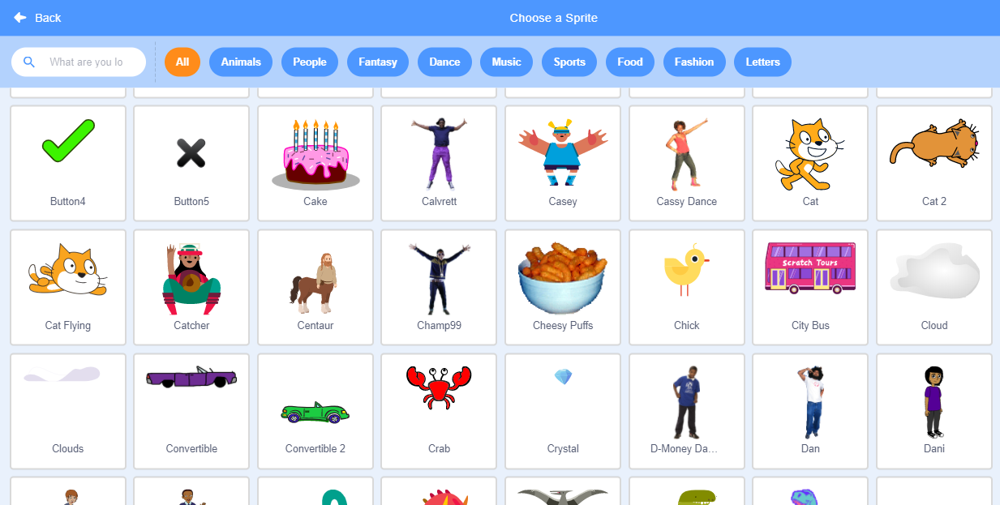

#### 3.2 Creating Characters

You can draw a custom character.

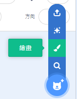

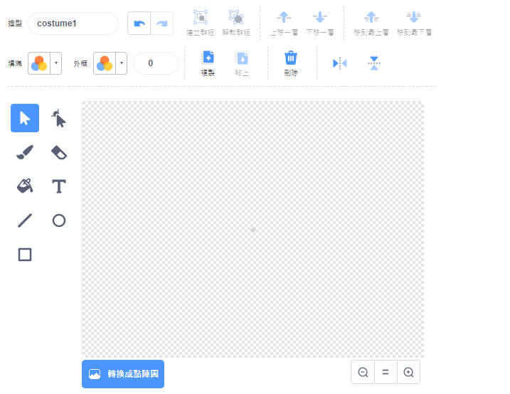

#### 3.3 Surprise

Gets a random character.

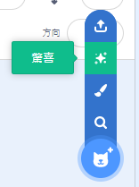

#### 3.4 Upload a character

Upload a sprite to make a custom character.

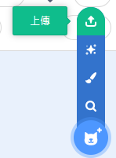

## Backdrop Editor

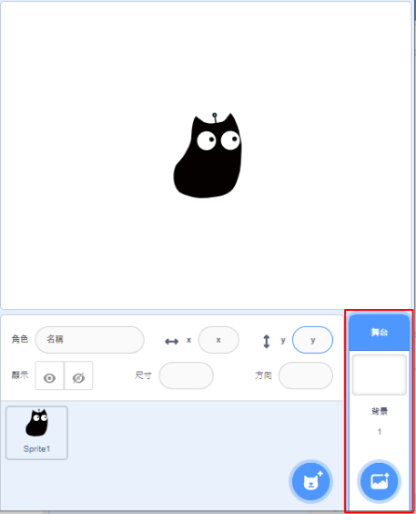

### 1. 背景選擇

Select backdrops here.

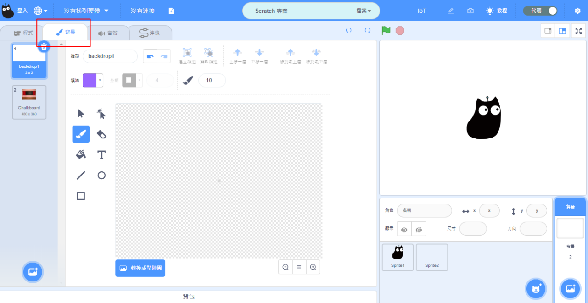

### 2. Adding backdrops

Add backdrops via this menu.

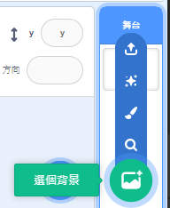

#### 2.1 Premade Backdrops

Select from the premade backdrops.

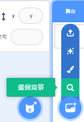

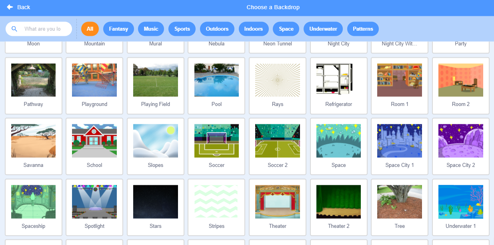

#### 2.2 Drawing a custom backdrop

You can draw a custom backdrop.

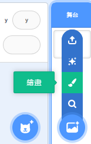

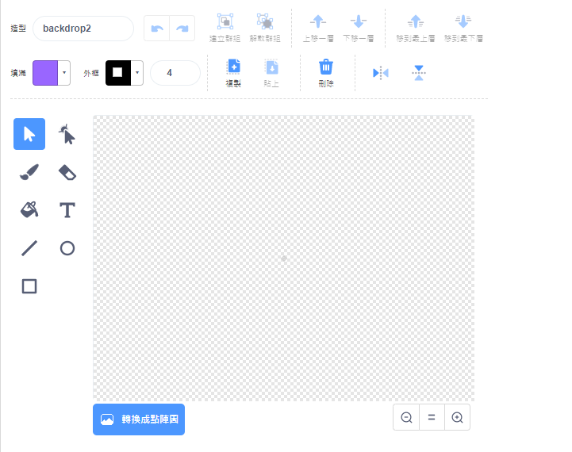

#### 2.3 Surprise

Get a random backdrop.

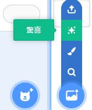

#### 2.4 Upload backdrop

Upload an image to use as a backdrop.

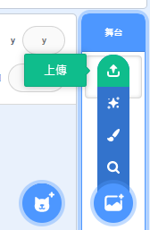