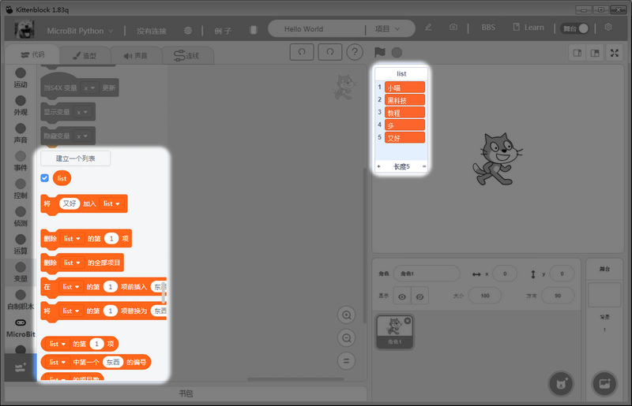

# Export and Import Lists

Lists can be exported as a txt file, vice versa, lists can be created by importing a txt file.

## Introduction

Lists in Kittenblock/Scratch can be exported as txt files or created from a txt file.

## Using this function

We will try exporting a list first.

Create a list.

Add some items to the list.

Right-click on the list and click export.

Open the txt file to see the lists items are stored in this file.

Next we will try importing a txt file to make a list.

Create a txt file and input some items with each item being separated with a new line.

Create a list in KittenBlock.

Right-click on this list and select import.

Select the txt file and the list items will be automatically appended.

