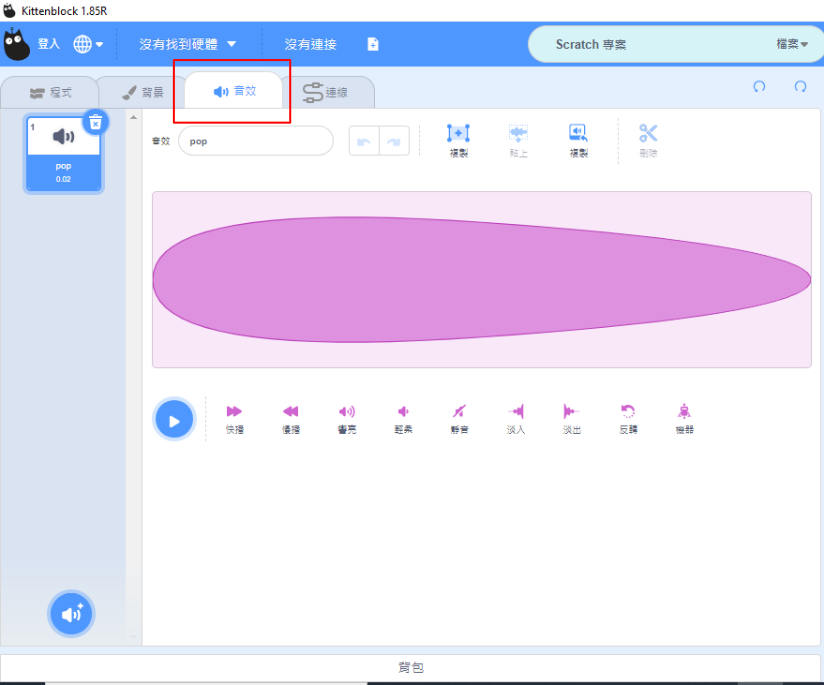
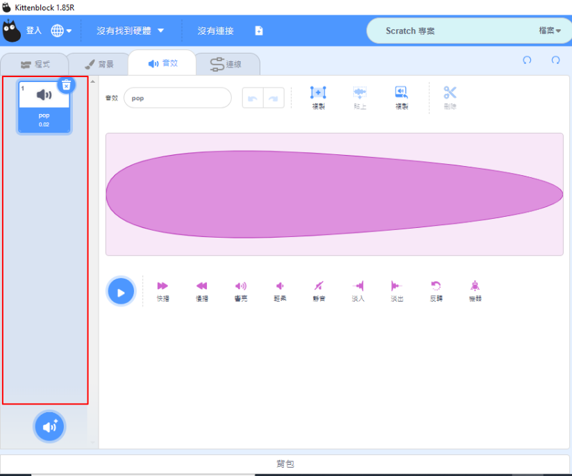
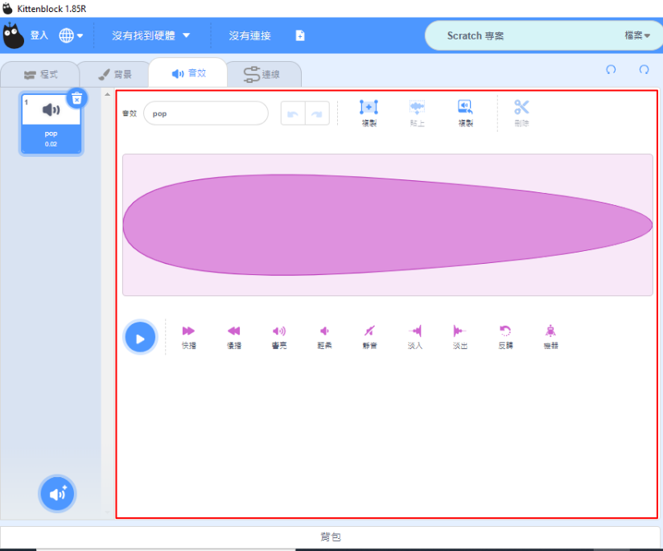
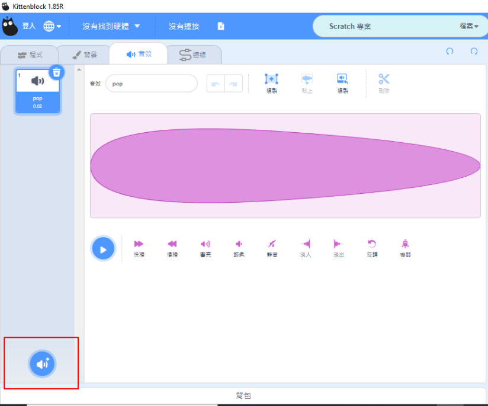
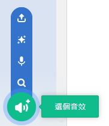
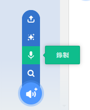
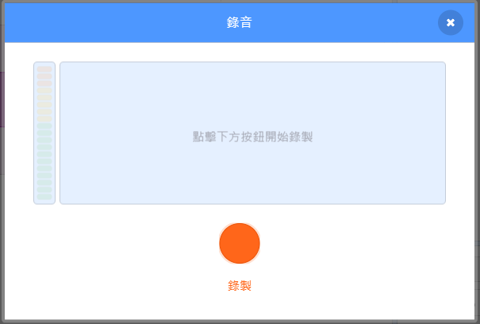
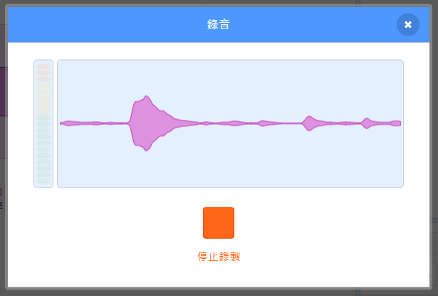
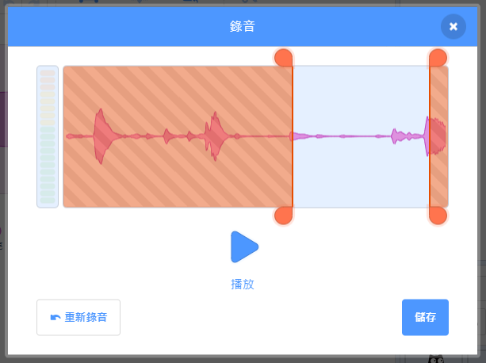
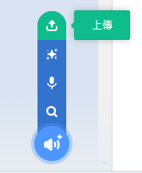

# Editing Sound Effects

Go to the audio tab to open the sound editor.

### 1. Select a sound effect

Select a sound effect from this menu.

### 2. Editing the effect

Trim, change volume or add fading to the sound effect.

### 3. Add sound effects

Add a sound effect from this menu.

#### 3.1 Premade sound effects

Add a premade sound effect.

#### 3.2 Record a sound effect

Sound effects can be created by recording.

#### 3.3 Surprise

Get a random sound effect.

#### 3.4 Upload a sound effect

Upload a custom sound effect.

