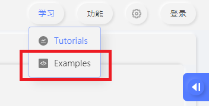

# KittenCode Quick Demo

Serveral demo programs are included with KittenCode so users can easily test KittenCode's features.

### 1. Open examples menu

### 2. Select any example

### 3. Import sample code

### 4. Run the program to see the results

