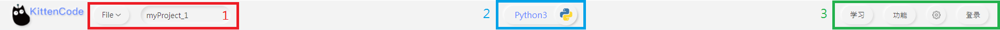
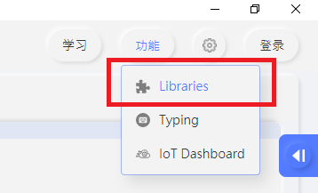

# KittenCode 

## Main Interface

1. General: Rename/save current project, Switch Python Mode, Options
2. File System: View project files and hardware file system
3. Coding Area: Python Editor
4. Execution: Execute program, flash to board, REPL console

## General

1. Files: Rename project, save or open projects
2. Mode switching: Switch between Python and MicroPython
3. Features: Settings, Python add-on manager

### Python Add-on manager

1. Install Python Add-on
2. Select download source

### Hardware Mode

Choose the hardware

Connect the hardware to start MicroPython

## Files

1. Create files and folders
2. Choose and open files

## Coding Area

1. Switch tabs
2. Coding Area
3. Zooming and searching

## Execcution

1. Execute program
2. REPL Console