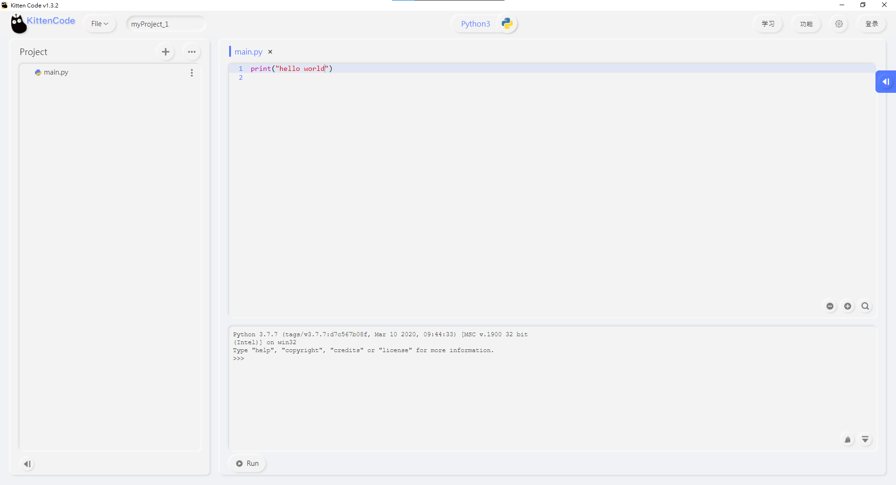
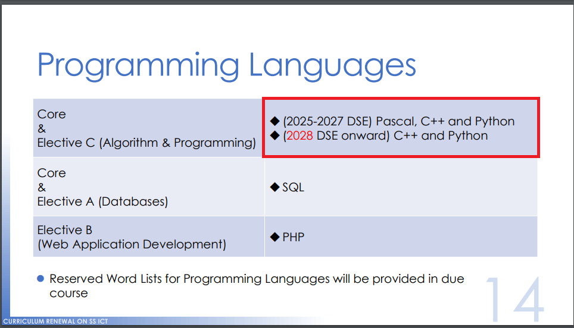

# KittenCode介紹

KittenCode is Kittenbot's Python IDE intended for STEM education for secondary and tertiary educations.

KittenCode can support Python programming and MicroPython specifically for KittenBot's hardware.

## Download KittenCode

[Download KittenCode]()

## Special Features

- Supports REPL mode
  - Instant execution of python code
  
- Supports MicroPython
  - Supports MicroPython for Micro:bit, KOI, Futureboard, Meowbit
  - Real-time interaction with hardware or flash the program onto the board
    
- Supports third-party add-ons
  - Use pip install to install any Python add-ons you like
    
- Clean and Easy-to-use UI