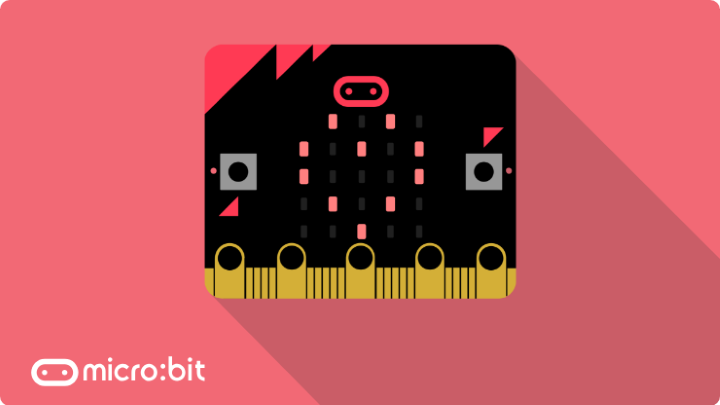
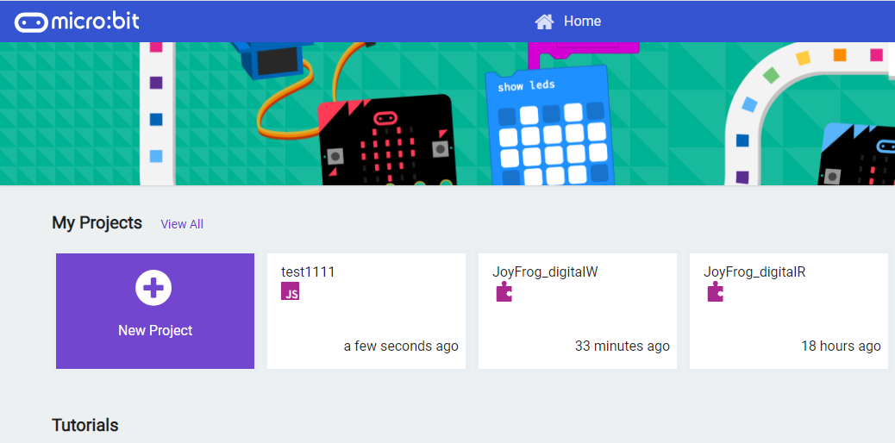
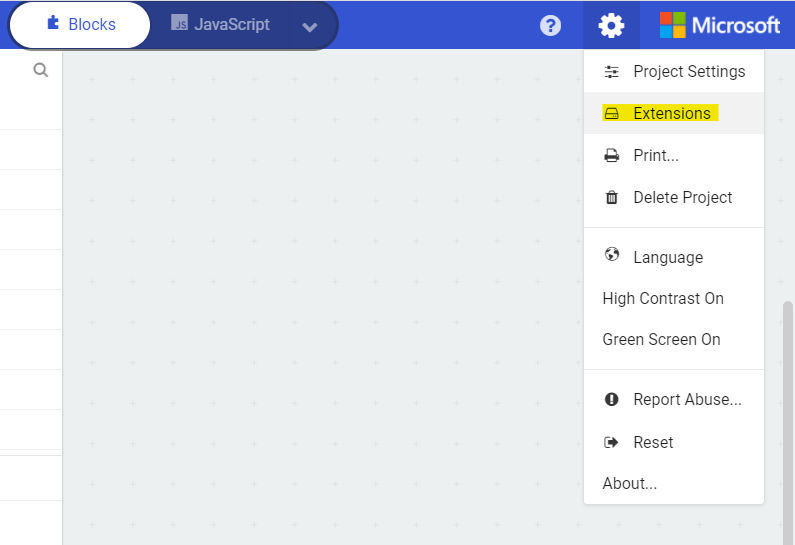
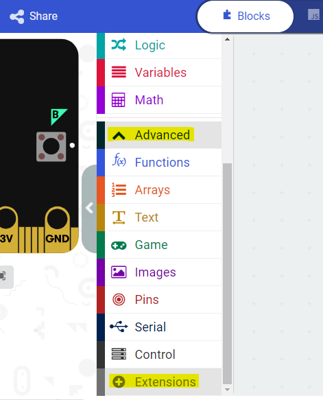
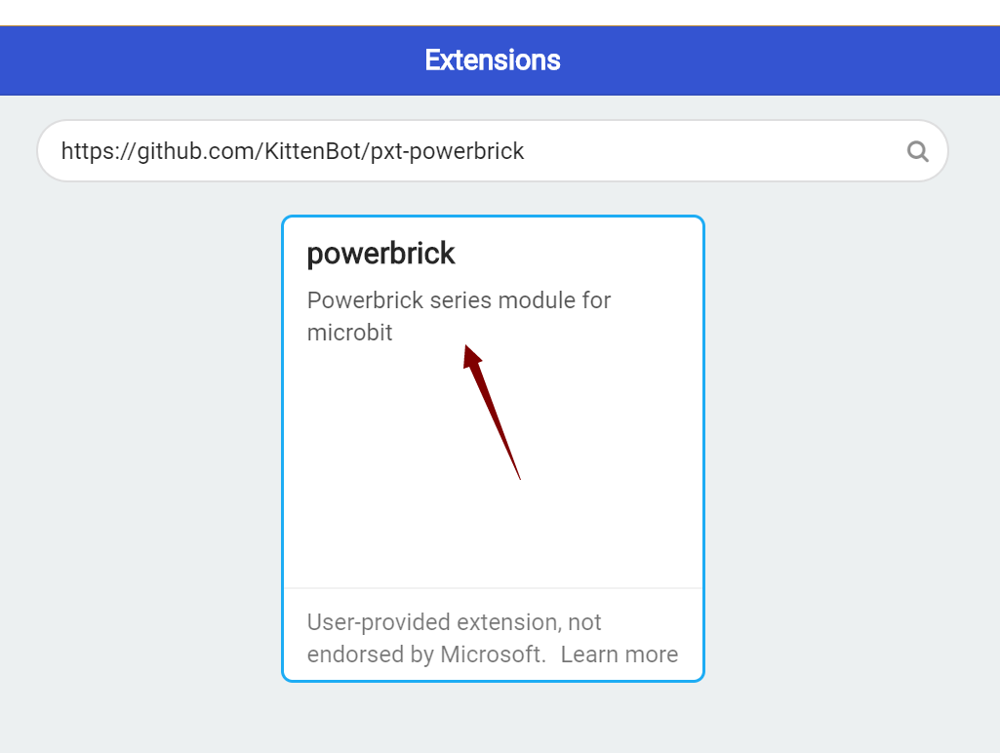
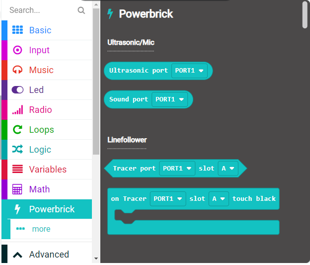

# KittenBot & MakeCode

## Quick Start

MakeCode is the recommended programming platform for using kittenbot products.

MakeCode: 

[https://makecode.microbit.org/](https://makecode.microbit.org/)

## KittenBot Products on MakeCode

Open MakeCode's webpage and create a new project.

### Loading Extensions

Most Kittenbot products require an extension to function properly.

#### This tutorial demonstrates loading the extension for PowerBrick.

    Each Kittenbot product may require a different extension, please refer to each products' page to find the link to extension.

Select "Extensions" from the settings menu.

Alernatively, open up the Advanced menu and select Extensions.

Copy and paste the following link into the search bar.

### https://github.com/KittenBot/pxt-powerbrick

The extension will then be loaded, new programming blocks are added.

