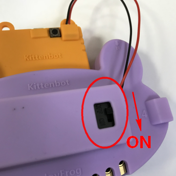
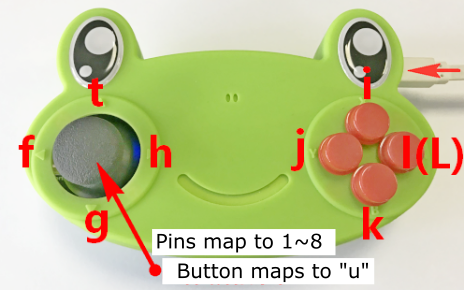

# JoyFrog Micro:bit Controller

Kittenbot JoyFrog Micro:bit Controller Green(HKBA8027A)

Kittenbot JoyFrog Micro:bit Controller Purple(HKBA8027B)

JoyFrog is a Micro:bit expansion board by Kittenbot, it is designed to add input devices including an analog joystick and 4 buttons, making it ideal in acting as a remote control for robots.

It can also be programmed using Kittenblock to act as a micro controller.

## Package Contents

- Joyfrog Controller x1
- Microbit Battery Box x1

## Special Features

- Controller Mode: Can be used as a game controller in KittenBlock or Scratch.
- Expansion Board Mode: Can be used as an expansion board for Micro:bit, provide game-like controls for Micro:bit.
- 3 pin and 4 pin PH2.0 connectors allows JoyFrogs to use Kittenbot modules.
- Game Controller: Can be used as a normal game controller in computer games.

## Specifications

- Dimensions: 128mm x 80mm x 35mm    
- Main Chip: GD32F350C8T6   
- Clock Speed: 108MHz   
- Flash Memory: 64K   
- RAM: 8K   
- Voltage: 3.3V   
- Power Input: Micro USB(5v)/3v(AAA x2, JST Connector)

## On-board devices

- 2 Axis Analog Joystick with button
- 4 Buttons
- InfraRed Trasmitter and Receiver (Able to decode NEC codes)
- Edge Connector with 8 IO Pins
- Buzzer
- Buzzer Toggle Switch (Switch between buzzer or headphones)

## IO Ports

- Microbit 40PIN Slot x1
- GVAB 4PIN PH2.0 Connectors x2
- GVS 3PIN PH2.0 Connectors x2
- 3.5 Audio Jack x1
- NRF24L01 8PIN 2.4G Wirelessx1

## 支援軟件

- Kittenblock

    [Kittenblock](../../KittenBlock/index)
    
- MakeCode

    [MakeCode](../../Makecode/index)
    
## Breakdown Diagram

1. InfraRed Receiver
2. 3.5mm Audio Jack
3. Buzzer Toggle Switch
4. Reset Button
5. DFU Mode Button
6. 4Pin connector
7. Joystick
8. IO Pins Contacts (1~8, GND)
9. Microbit 40PIN Slot
10. Main Chip
11. Buzzer
12. 4 Buttons
13. 4Pin I2C connector
14. MicroUSB Port
15. InfraRed Transmitter
16. 3Pin connector
17. 3Pin connector

## Installing a Battery Box

By installing a Micro:bit Battery Box, there is no need to connect a USB power at all times~

## JoyFrog 2 Player Mode

Considering students may create multiplayer games with KittenBlock or Scratch, JoyFrog has a 2 player mode which allows users to use 2 JoyFrogs with the same computer.

Press and hold X and connect JoyFrog to a computer, there will be 2 long beeps, this means the JoyFrog is in player 2 mode.

Key mappings for player 2 mode:

