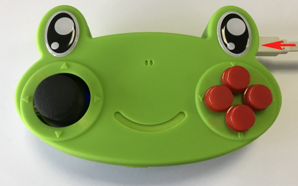

# JoyFrog Controller Coding with Kittenblock

## Kittenblock Coding Tutorial

Connect JoyFrog to a computer with a USB cable.

Select JoyFrog from the Hardware selection menu.

The programming blocks for JoyFrog will be added.

Click the Exclamation Mark Icon and select your device.

A melody will sound when JoyFrog is connected to Kittenblock.

#### Using the buttons and the joystick.

The buttons and the joystick input is mapped to individual keyboard keys.

The edge connectors are mapped to the number keys.

#### Making a Piano:

We can make a basic piano using the edge connectors.

Try connecting different conductive objects to create your own unique keyboard!

    The notes correspond to numbers 1~8.

You can connect earphones or speakers to the 3.5mm audio jack.

#### InfraRed Trasmission and Receive:

Transmitting and receiving an infrared signal.

    The infrared signals are in a hexadecimal format.

#### Digital read and write:

Reading and writing digital values.

#### Analog read and write:

Reading and writing analog(PWM) values.

