# JoyFrog Controller Coding with MakeCode

## MakeCode Coding Tutorial

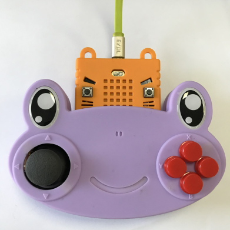

#### Load JoyFrog Extension: github.com/KittenBot/pxt-joyfrog

[Loading Extensions](../MakeCode/powerBrickMC)

#### Blocks for JoyFrog:

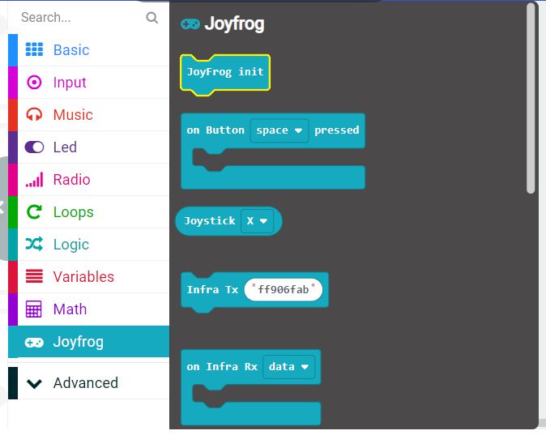

#### Using the Analog Stick:

Showing the value of the stick's position.

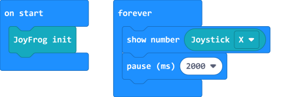

[Sample Code Link](https://makecode.microbit.org/_Ty95YCWwUC3s)

#### Using the buttons:

Each button can be individually triggered.

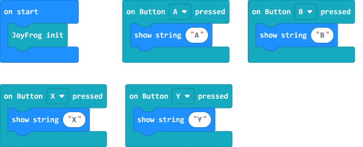

[Sample Code Link](https://makecode.microbit.org/_THaPh5RTVRRt)

#### Using the IO pins.

The Edge Connectors on JoyFrog can be used like a piano.

Try Connecting different conductive objects to create your unique piano!

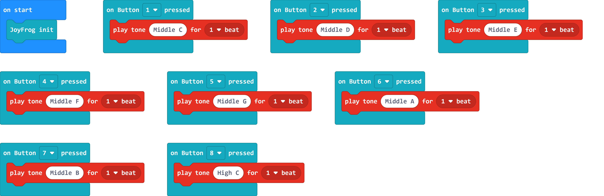

[Sample Code](https://makecode.microbit.org/_79zhcpKDT9o0)

You can connect earphones or speakers to the 3.5mm audio jack.

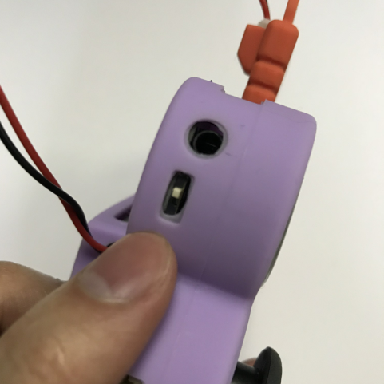

#### Transmitting an InfraRed signal:

Trasmitting an InfraRed signal on button press.

    The infrared signals are in a hexadecimal format.

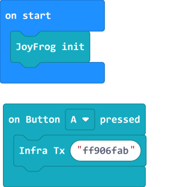

[Sample Code Link](https://makecode.microbit.org/_Wvp6vxiPMLWr)

#### Receiving an InfraRed signal:

Displaying the received signal.

    The infrared signals are in a hexadecimal format.

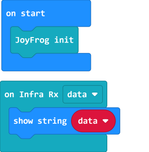

[Sample Code Link](https://makecode.microbit.org/_bhK8e9f7WVcy)

#### Analog Read:

Reading analog values.

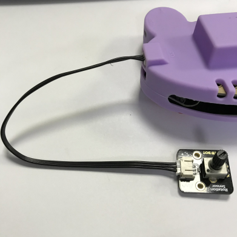

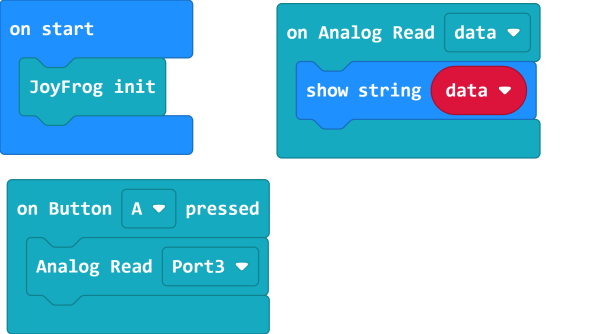

[Sample Code Link](https://makecode.microbit.org/_HLtdh2Ha6KMp)

#### Analog(PWM) Write:

Writing analog(PWM) values.

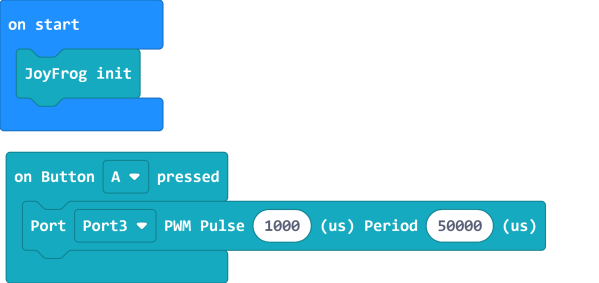

[Sample Code Link](https://makecode.microbit.org/_1y8ET7e7A8TF)

#### Digital Read:

Reading digital values.

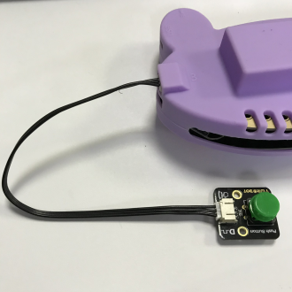

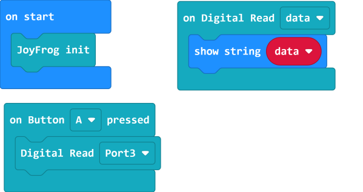

[Sample Code Link](https://makecode.microbit.org/_Dd71FegibTs3)

#### Digital Write:

Writing digital values.

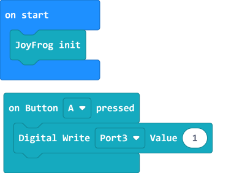

[Sample Code Link](https://makecode.microbit.org/_UKU0K75uYcyL)