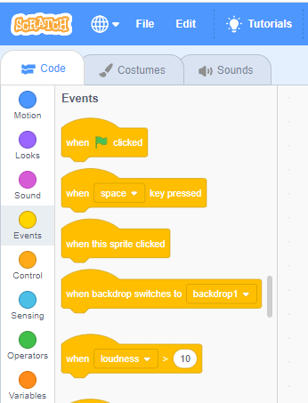
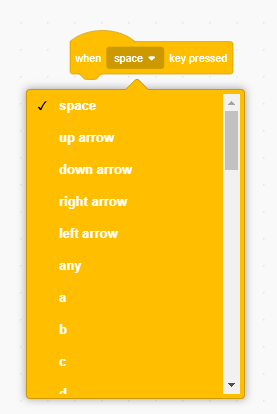
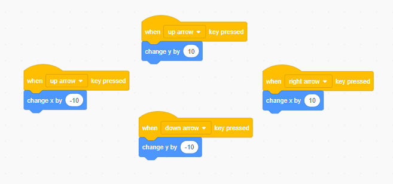
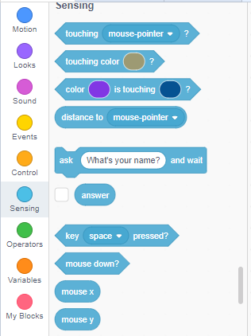
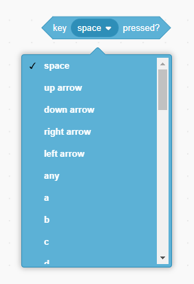
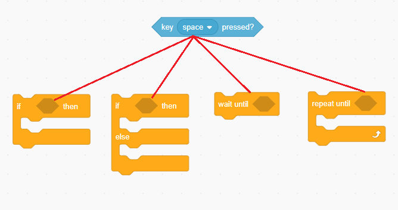
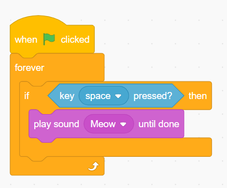

# JoyFrog Controller Coding with Scratch

## Scratch Coding Tutorial

Connect JoyFrog to the computer with a USB cable.

Open Scratch.

JoyFrog can be used with the keyboard events.

JoyFrog is mapped to the following buttons. (Pressing the joystick triggers the Space Bar)

Sample Program:

We can also use these blocks in Sensing tab.

The blocks are used in this way.

Sample Program:

