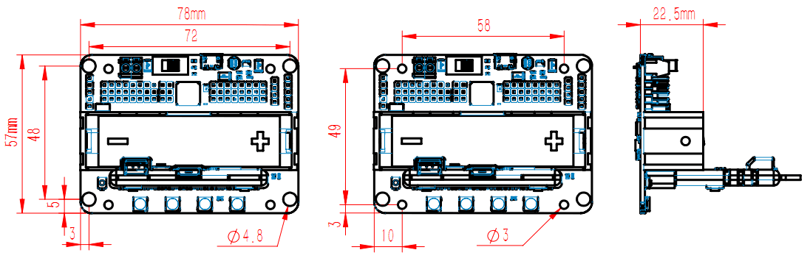
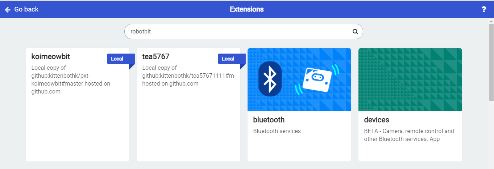

# Robotbit

**Robotbit (Version 2.2)**

Suitable for school-based STEM education/ Training Institutes/ Enthusiasts

**Must be used with Micro:bit**

## Purchasing Options

__Online Shop__----------→[Robotbit v2.2](https://kidslab.boutir.com/i/SXu22lAAA)

## Package Contents

- RobotbitV2.2 X 1   

- Robotbit Base X 1   

- 18650 Li-ion Battery X 1 (Optional)                  

   

## Special Features  

- Able to power a lot of actuators, DC motor x 4 or Stepper motor x 2 and Servo Motor x 8.

    [Power Demostration](https://youtu.be/jVWFA1n4N74)

- Extends the IO pins of the Micro:bit into Dupont connectors, supporting most electronic modules found on the market   

- Simplifies the power delivery system

    - Has a 18650 Li-ion battery compartment to provide a convenient and stable power source; 
    
    - Can connect to external power that accepts up to 6V power, increasing the driving power even more.

- Robotbit Base: Provides protection as well as pin holes compatible with Lego Technic pins  

       

    [Installing the Base](https://youtu.be/FhimDxoAsj4)   

- Built-in buzzer allows the Micro:bit to make sounds

- 4 programmable RGB LEDs, adds lighting effects to your projects     

### Robotbit Demo Video:                                                                                                             
   
[](https://youtu.be/4tjt9Iy68sY)

## Dimensions and Weight:

- Dimensions: 78mm x 57mm x 23mm   
- PCB Thickness: 1.5mm   
- Hole Diameter(Small): 3.0mm   
- Hole Diameter(Big): 4.8mm   
- Weight: 37.5g   



## Specifications:

- 18650 Voltage: 3.7V   
- USB Input Voltage: 5V
- External Input Voltage:5V (Supports up to 6V, 3A)
- VM Maximum Output: 1A(Under 18650 Battery)

## Programming Platform 

Hardware Support: Micro:bit, Meowbit   

Programming Platform: Kittenblock(Based on Scratch 3.0) / Microsoft Makecode / Python(Mu editor) 

### Microsoft MakeCode


### 

#### Search for "Robotbit" in the extensions page  

   
       


#### The Robotbit extension is added


### KittenBlock

 

#### 1. Open Kittenblock and connect the Micro:bit with a USB cable   


#### 2. Connect KittenBlock with Micro:bit                                                                                                                                                                                                                                                                                                                                                                                                                                                                       
 
 

#### 3. The extension for Robotbit will be loaded automatically 
                                                                                            
 

### Python   

Robotbit can be programmed with Python.

Switch to "Coding Mode" to view and edit MicroPython code.

   
 


## Breakdown Diagram
                                                                                                                                                                                                                                                                                                                                                                                                            
  

1. External Power Input

2. Power Switch   

3. Power Indicator   

4. Battery Level Indicator   

5. MicroUSB Charging Port   

6. 2 Motor Ports for a total of 4 DC Motors or 2 28BYJ Stepper Motors

7. Buzzer Toggle Jumper   

8. 8 IO Pins(Corresponds to P0-P2, P8, P12-P15)   

9. 5V Output Pins   

10. Buzzer

11. Servo Ports for 8 servos   

12. I2C Port

13. 18650 Li-ion Battery Holder  

14. Battery Indicator  

15. Micro:bit slot   

16. Programmable RGB LED x 4                         


17. Servo Driver   

18. Motor Driver   

19. Mounting Holes   

20. Lego Technic Pin Holes   

## Robotbit Details


### 18650 Battery Holder                           

### 

Please be careful with the polarity! Install battery according to the label on the holder. 

For safety, the battery is not activated when it is installed for the first time. Press the Battery Activate Button or connect a USB power supply to activate the battery.

(This procedure should be done after each battery install)  

### 18650 Power Switch                                                                                                                                                                                                                                                                                                 


Push the switch to ON position(Towards the green connector) to power the board. (18650 Battery is needed)  

### Micro USB Charging Port                                                                                                                                                                                       
      


The Charging Port can charge the 18650 battery with any 5V USB power supply, any USB port on computers or phone chargers will work.
It takes about 2.5 hours to fully charge a battery with a 5V1A supply, the Charging Indicator will light up green when it is fully charged.   
**It is recommended to disconnect the power after fully charging. Please read the battery usage guidelines included in the box.** 

```
Attention: This port is for charging only! Not for downloading programs!
```

### Power Indicators                                                                                                                                                                                                                                                         
   
   

Led(3) is a Power Indicator, it lights up when Robotbit is powered on.  
Led(1) is a Charging Indicator, it lights up when the battery is being charged.
Led(2) is a Battery Level Indicator, it lights up when the battery is fully charged.

### Micro:bit Slot                                                                                                                                                                                                                                   
  
  

Used to install Micro:bit.

Correct orientation: The A and B buttons of the Micro:bit should face outwards.                                                                                   
   
   

If installed incorrectly, just reinstall it in the correct way. Micro:bit / Robotbit won't be damaged.

### Programmable RGB LEDs                                                                                                                                                                                                          
   
   , 8 servos with a total current of less than 3A is supported.

  

### Motor Ports                 


A total of 4 DC motors can be used, alternatively 2 stepper motors can be used, the total current must be less than 2A. Do not use high current motors to avoid damaging the Robotbit. 

A mix of motors can also be used.(2 DC Motors with 1 Stepper Motor)

### Buzzer and Jumper                                                                                                                                                         
   
   

- By default,the buzzer jumper is connected to enable the buzzer by connecting it to Pin 0.  

- Removing the buzzer allows usage of Pin 0.  

- The buzzer can be programmed using the Music coding blocks on MakeCode. 

### Micro:bit IO Pins                                                                                                                                                 


The IO pins of the Micro:bit(P0-P2, P8, P12-15) have been adapted into standard Dupont connectors compatible with most Arduino modules.      
P0-P2 supports both Analogue and Digital modules. P8, P12-P15 are only for Digital input and outputs.             
The pins have a voltage of 3.3V, for modules that need a 5V power, use the 5V pins next to the servo ports.

### I2C Port                                                                                                                                                                                                                   
      


Supports I2C modules, has a voltage of 3.3V.

### 2PIN External Power Port                                                                                                                                                                            
   
   

- Pay attention to the polarity when connecting.

- DC 5V power is supported by this port, it is recommended to use 5v power with more than 2A when using high torque motors and servos.         

- Under battery power, the VM port outputs 3.7V; Under external power, the VM port outputs 5V.  

## Robotbit Quick Start Guide 

### Install the Battery                                                                   

### 

### Insert the Micro:bit

### 

### Activate the Battery

### 

### Turn on the Power

### 

## Robotbit & MakeCode

Robotbit improves the functions of Micro:bit on multiple aspects, Kittenbot has developed an extension for Robotbit so that users can easily make use of these functions.

Please refer to the following document for details:

[Robotbit & MakeCode](./robotbitMC)

## Commonly Asked Questions

### Robotbit does not turn on after installing battery and switching on the power.

Please check if the battery has been activated via the activator button.  
Please check if the battery has been installed correctly.  
Please check if the battery is charged. 

----------

### What is the function of the battery activator?

The battery activator serves as a protection mechanism. In case of accidents such as over current or short circuit, the protection circuit will be activated to cut off the power to prevent damage. Pressing the activator will reset the circuit to its working state.

----------

### I can't find my Micro:bit or Robotbit when connecting it to my computer.

The USB port on the Robotbit is only for charging the battery, not for communicating with a computer.

----------

### Will I destroy the Robotbit if I install the battery in the wrong way?

No, Robotbit was designed to prevent damage in this case. However please still be careful when installing the battery.

----------

### Will I destroy the Robotbit by inserting the Micro:bit in the wrong way?

No because Micro:bit will not be powered in this case.

----------

### How do I use Pin 0?

Pin 0 is used by the buzzer by default, remove the buzzer jumper to use Pin 0 as normal.

----------

### Micro:bit has more than 8 IO pins, where are the other ones on the Micro:bit?


Although Micro:bit has close to 20 IO pins, a lot of them are used by the Micro:bit's built-in devices such as the LED matrix.

Although these occupied pins can in fact be used, it may be confusing and difficult for beginners. The 8 remaining free pins accessible with the Robotbit is more than enough for most projects.
     
If more IO pins are required, consider using IOBit, another expansion board made by Kittenbot.

----------

### Can the Servo Ports be used as IO Ports?

No, because the 8 servo ports are controlled by a servo driver, they are not IO pins.

----------

### What is the use of VM port on the Motor ports?

The VM port is only used by stepper motors, DC motors only need to use A+A- or B+B-者B+B-.

----------

### Can the board be placed on a metal or wet surface?

No, doing so will cause a short circuit and damage the board. Please install a Base to prevent short circuit.

[Base Installation](https://youtu.be/FhimDxoAsj4)

----------

### What kind of current is supported by the external power input?

The external input supports a maximum current of 6V3A.

----------

### I can't reproduce the results from the tutorials.

There may be slight mistakes in your wiring or your program, check each carefully.  

### The Robotbit seems to be broken, is there a warranty?

Each Robotbit has been tested to be in working order before they are packaged. Please check if the problem is caused by your program or your wiring, if you are certain that the Robotbit is damaged, please contact the supplier. 

If the board is evaluated to be damaged by not man-made damage, the supplier will offer a replacement for boards that are within 1 year of their purchase according to the receipt.

--------

### **Robotbit Version Changelog**

Due to popular requests, Robotbit has experienced two updates since it was launched in 2017.

From V1.2 in 2017, it was updated to V1.3 and then updated again to V2.0 in 2018.

Changes to the Robotbit V2.0:

#### 1. Increasing the number of IO pins  

V1.3 only had 3 IO pins.
V2.0 increased the number of IO pins to 8.

#### 2. Improving the battery discharge mechanism

Now, charging will not cause the battery to heat up yet charging performance is not affected.

#### 3. Improving the power switch

The new switch can completely cut off power to the board, thus solving the problem where the battery discharges while power is switched on.

#### 4. Adding an external power input   

Under the external power, high current motors or servos like MG995 can be used. With a 5V3A power, 4 MG995 servos can be used.    

#### 5. Improving the VM port 

Increasing the output of VM port to 3A.

#### 6. Upgrading to an independent battery protector chip.  

Upgrading the battery protector chip with a high cost version to improve safety in discharging.

#### 7. Adding a battery activator switch. 

The battery activator serves as a protection mechanism. In case of accidents such as over current or short circuit, the protection circuit will be activated to cut off the power to prevent damage. Pressing the activator will reset the circuit to its working state.

#### 8. Upgrading the buzzer.   

The buzzer's position and volume has been adjusted.   

#### 9. Upgrading the Micro:bit slot.

Reduces the wear on the edge connector of the Micro:bit, also making it easier to insert and pull out the Micro:bit.  

#### 10. Adding a 5V output   

Adding a 5V output to make Robotbit compatible with even more electronic modules.

#### 11. Improving the power indicators   

