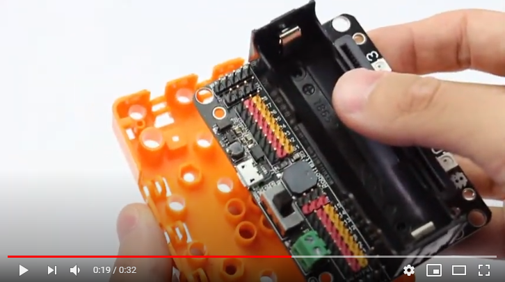

# Robotbit Base

Each Robotbit comes with a base, not only does using this base protect the bottom of the Robotbit from short circuiting, it also provides mounting holes for Lego Technic pins or screws, allowing more choices for building your robots.

## Installing the Robotbit Base:

## Robotbit Base Explaination

#### Pay attention to the orientation of the base!!
#### The indents must align with the charging ports and the power switch of the Robotbit!!

