# Robotbit Coding with KittenBlock

Robotbit can be programmed with KittenBlock.

Refer to this page for introduction with Kittenblock: [Kittenblock Introduction](../KittenBlock/index)

## Kittenblock Coding

Connect the Micro:bit to your computer with a USB cable.

Click select hardware and choose MicroBit Python from the menu.

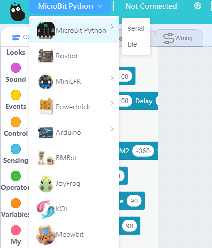

Press this exclamation mark(!).

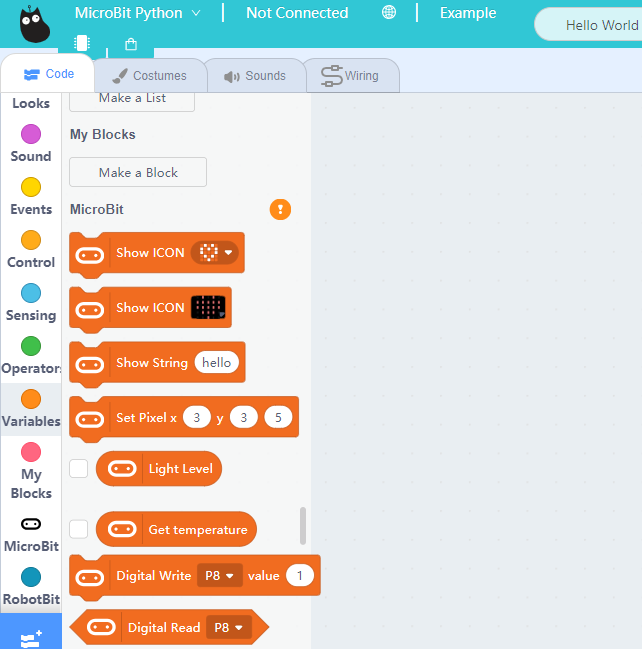

Click this button to connect the Micro:bit.

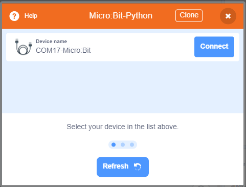

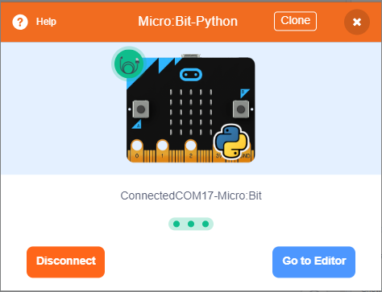

Micro:bit will display a heart icon after connecting to Kittenblock.

If the Micro:bit does not show a heart icon, 

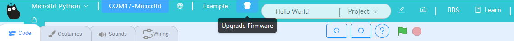

#### The blocks for Robotbit will be added

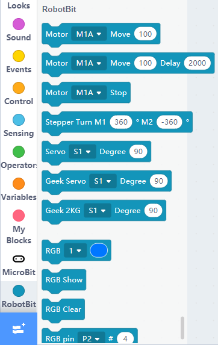

### 1. Programming Motors

For information about DC motors by Kittenbot, please visit: [Kittenbot Actuators](../../motors/index)

#### Sample Program:

Connect 2 DC motors to the M1A and M1B port of the Robotbit.

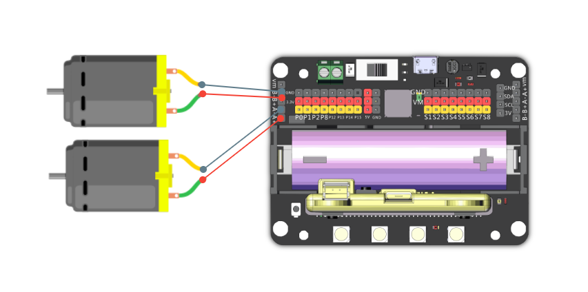

    The speed of motor ranges from -255 to 255.

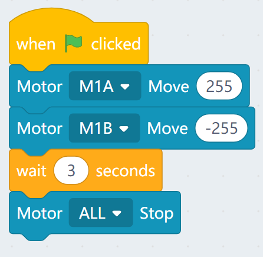

### 2. Programming Servos

For information about servos by Kittenbot, please visit: [Kittenbot Actuators](../../motors/index)

#### Sample Program:

Connect a servo to the S1 port of Robotbit.

    Connect the orange wire from the servo to the yellow wire of the Robotbit.

    Typical servos have a rotation range of 0-180.
    
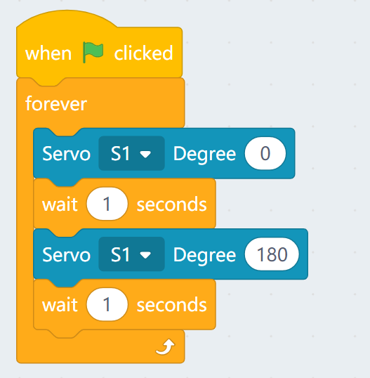

### 3. Programming Stepper Motors

For information about DC motors by Kittenbot, please visit: [Kittenbot Actuators](../../motors/index)

#### Sample Program:

Connect Stepper Motors to the M1 and M2 port of the Robotbit, with the red wire connecting to the VM port.

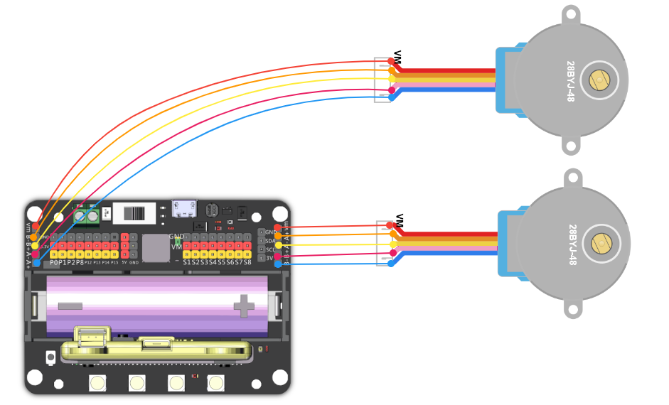

    Stepper Motors have a rotation range of -360 to 360.

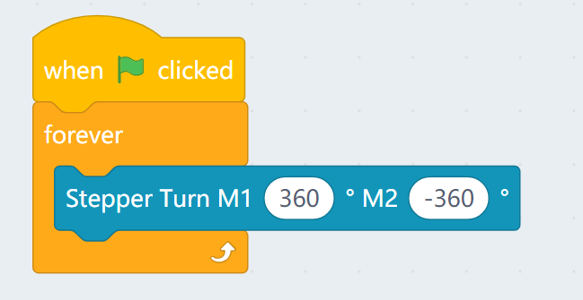

### 4. Programming the buzzer

Do not remove the buzzer jumper when using the buzzer.

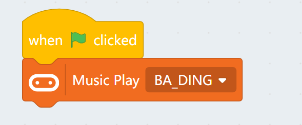

### 5. Programming the built-in LED strip

    Remember to add a "Show" block to display the effect.

#### 5.1 Lighting up all lights

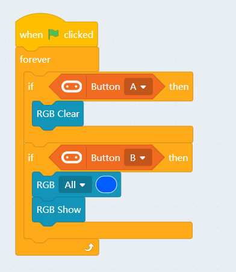

#### 5.2 Customizing color with RGB

    RGB value has a range of 0-255.

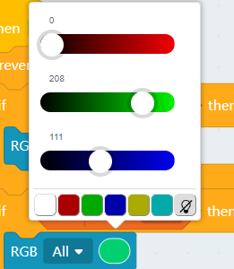

#### 5.3 Lighting up individual lights

    The lights are labelled 0-3. (As labelled on the Robotbit)
    

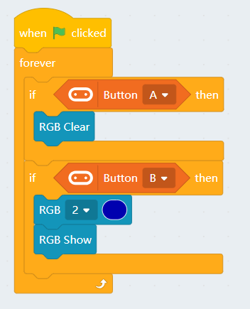

### 6. Programming the IO Pins

The blocks for the IO pins are found in the menu for Micro:bit.

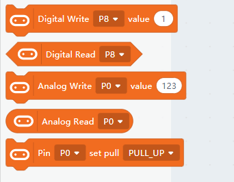

    Pin 0-2 can be used as analog pins while P8, P12~P15 can only be used as digital pins.
    Analog values have a range of 0 to 1023, digital values have a range of 0 to 1.
    

#### 6.1 Reading values from pins

    Pin 0 is occupied by the buzzer by default, the jumper should be removed when using this pin.

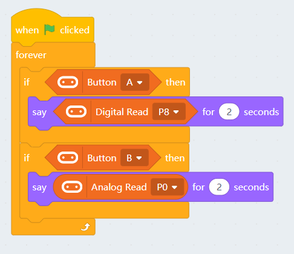

#### 6.2 Writing values to pins

    Pin 0 is occupied by the buzzer by default, the jumper should be removed when using this pin.

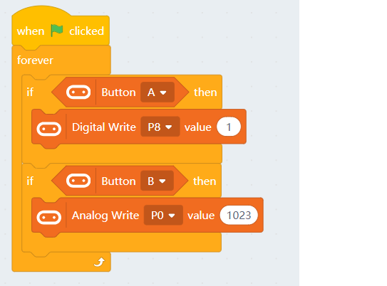