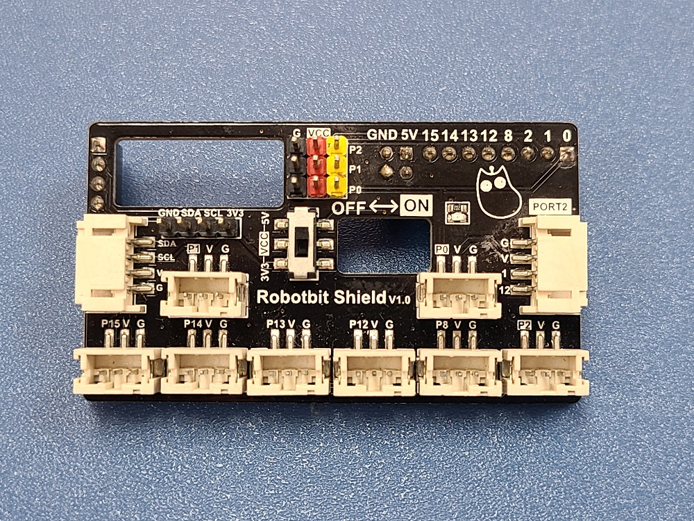
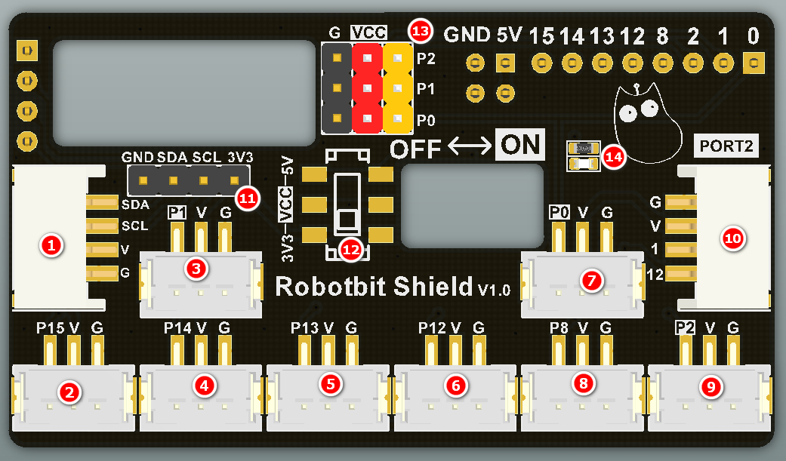
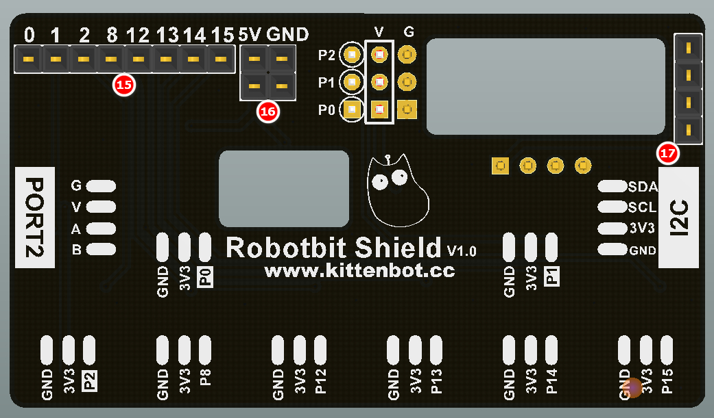

# Robotbit Shield

The Robotbit Shield is designed to facilitate the use of modules with a PH2.0 connector by adapting the Dupont connectors into 3PIN and 4Pin PH2.0 connectors, removing the need to use a conversion cable.

 

## Installing the Robotbot Shield

 

## Robotbit Shield Breakdown Diagram

 

1: PH2.0 4PIN I2C Port           

2~9: PH2.0 3PIN Ports                    
   
10: PH2.0 4PIN Port, identical to Port 2 of Armourbit  
                 
11: Dupont 4PIN I2C Port                    
 
12: Voltage Selector, switches the voltage at pin 0-2 to be 3.3V or 5V 
               
13: Dupont 3PIN Port, VCC voltage can be switched by the selector
                       
14: Power Indicator                       

 

15: 8PIN Female Connector, connects to the IO pins on the Robotbit
     
16: 2x2 5V Female Connector, connects to the 5V pins on the Robotbit
      
17: 4PIN Female Connector, connects to the I2C pins on the Robotbit
    
    Attention: All PH2.0 ports have a voltage of 3.3V

