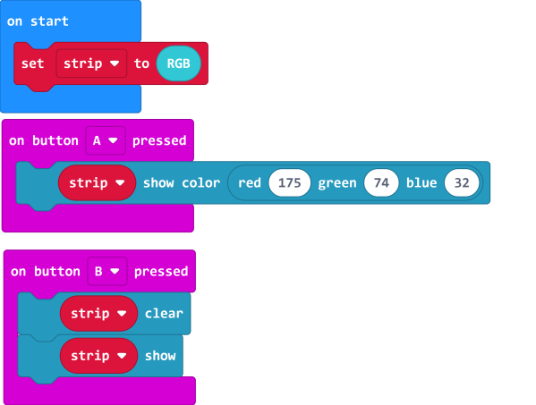
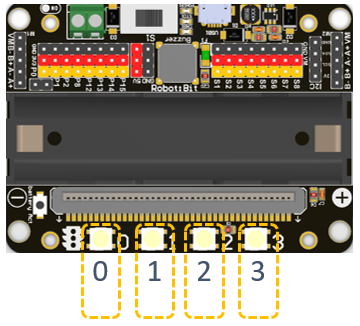

# Robotbit Edu Coding with MakeCode

Robotbit Eu can be programmed using Microsoft MakeCode.

## Makecode Coding

### Loading the extension for Robotbit

#### 1. In the extensions page, search for "KittenBot" or "Robotbit".

Robotbit Edu and its extension has been officially approved by Microsoft.

 
         

#### 2. In Offline MakeCode by Kittenbot, the Robotbit extension can even be loaded without access to the internet.） 

#### The blocks for Robotbit Edu is added

### 1. Programming Motors

For information about DC motors by Kittenbot, please visit: [Kittenbot Actuators](../../motors/index)

#### Sample Program:

Connect 2 DC motors to the M1A and M1B port of the Robotbit Edu.

    The speed of motor ranges from -255 to 255.

### 2. Programming Servos

For information about servos by Kittenbot, please visit: [Kittenbot Actuators](../../motors/index)

#### Sample Program:

Connect a servo to the S1 port of Robotbit Edu.

    Connect the orange wire from the servo to the yellow wire of the Robotbit.

    Typical servos have a rotation range of 0-180.

### 3. Programming Stepper Motors

For information about DC motors by Kittenbot, please visit: [Kittenbot Actuators](../../motors/index)

    The programming blocks were designed for Kittenbot's 28BY-48-5V stepper motor, using other motors may result in reduced accuracy.

#### Sample Program:

Connect Stepper Motors to the M1 and M2 port of the Robotbit Edu, with the red wire connecting to the VM port.

    Stepper Motors have a rotation range of -360 to 360.

### 4. Programming the built-in LED strip

The programming blocks for the LED strip are found in the Neopixel tab.

   

    Remember to add a "Show" block to display the effect.(Except show color.)

#### 4.1 Lighting up all lights

#### 4.2 Customizing color with RGB

    RGB value has a range of 0-255.

#### 4.3 Customizing color with HSL.

    HSL consists of a hue value with the range 0-360, a sturation and brightness value with the range 0-100.

#### 4.4 Lighting up individual lights

    The lights are labelled 0-3. (As labelled on the Robotbit)
    

#### 4.5 Adjusting the brightness.

    The brightness level has a range of 0-255.

### 5. Programming the IO Pins

The blocks for the IO pins are found in the Pins tab.

    Pin 0-2 can be used as analog pins while P8, P12~P15 can only be used as digital pins.
    Analog values have a range of 0 to 1023, digital values have a range of 0 to 1.
    

#### 5.1 Reading values from pins

    Pin 0 is occupied by the buzzer by default, the jumper should be removed when using this pin.

#### 5.2 Writing values to pins

    Pin 0 is occupied by the buzzer by default, the jumper should be removed when using this pin.

