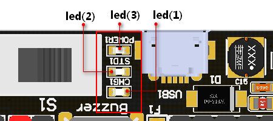

# Robotbit Edu 


Robotbit Edu is the latest version of KittenBot's popular extension board, Robotbit. Robotbit Edu combines the powerful driving capabilities of Robotbit with the ease of wiring of the Armorbit. By switching to 3Pin PH2.0 connectors, wiring various sensors and modules becomes easier. At the same time, the 8 servo ports and 4 motor ports are preserved to provide Robotbit Edu with abundant drving capabilities.

## Target Users

- School-based STEM Education
- Teaching Institutes
- Users of Micro:bit, Meowbit or FutureBoard
- Makers

## Special Features

- Powerful
    - Up to 8 servos and 4 DC motors or 2 stepper motors can be driven simultaneously
- Easy Wiring
    - GPIO Ports have been adapted into PH2.0 connectors to prevent incorrect wiring
- Base Shell
    - Provides protection and compatibility with plastic building bricks or M3 nuts
- All-in-one Power
    - Stable power to all connectors
    - Uses 18650 Lithium battery to provide abundant power
    - USB charging port with power indicator LEDs
    - Can also be connected to external power for a maximum of 6V
- Safety Circuits
    - Onboard circuit prevents over discharge or charge for Lithium batteries with protection during short circuits
- Built-in Light Feature
    - An RGB LED has been built-in
- Supports multiple controllers
    - Supports Micro:bit, Meowbit or FutureBoard
  
## Product Specifications

- Dimensions: 78 x 57 x 23 mm
- Weight: 37.5g
- Hole(Small) Diameter: 3.0mm
- Hole(Large) Diameter: 4.8mm
- Power: 5V USB \ 3.7~4.2V Lithium Battery
- Vin External Input: Maximum 6V3A
- Operating Voltage: 3V/5V, 18650 battery outputs 1A maximum

## Exploring the Details


1. PH2.0 GPIO Ports x8
    - PH2.0 to Dupont cables are available for purchase for use with conventional sensor/modules
2. I2C Port x1
3. Serial Connection Port x1
4. Motor Ports x4(Maximum 2 stepper motors)
5. Servo Ports x8
7. RGB LED x1
8. 18650 Battery Compartment
9. VIN External Power Input Connector
10. USB Charging Port

### 18650 Battery Compartment


Install the battery according to the polarity shown inside the battery compartment.

After installing the battery for the first time, Robotbit would not power on because the battery hasn't been activated. Please press the battery activating button to activate the battery to resume normal operation.(This procedure may be required after reinstalling the battery)

### Power Switch


Power on Robotbit by pushing the switch towards the green Vin port, the power LED will light up.

### Micro USB Charging Port


Robotbit is able to charge the 18650 Lithium battery when using USB chargers with at least a 5V 1A output.
18650 takes approximately 2.5 hours to be fully charged, the charging indicator LED will turn green when fully charged, although Robotbit has overcharging protection, it is recommended to unplug the charger after the battery is fully charged.
Please also take some time to read the included Lithium Battery Usage Tips included with the Robobit.

```
Attention: For charging only, not for data communication
```
### Power Indicator LEDs                                                                                                                                                                                                                                                        
   


Led(3): Power LED, lights up when power is switched on
Led(2): Charging indicator, lights up when charging a 18650 battery
Led(1): Lights up when 18650 battery is fully charged

### Main Controller Slot                                                                                                                                                                                                                               


Install the Main Controller with the back side facing the battery compartment.

Robotbit Edu has support for Micro:bit, Meowbit and Futureboard.

### RGB LED


A programmable RGB LED connected to Pin 16 of the Robotbit Edu.

### 8 Servo Ports


- The Robotbit Edu has a servo driver chip to drive 8 servo motors simultaneously connected to the I2C port.


      ```
      Attention: The servo ports are for connecting servos only and not for GPIO purposes.
      ```
  
- When powered by 18650 batteries, a maximum of 8 9G servos can be driven with a total current of less than 2A. Using large servos such as MG995 maybe have adverse effects like burning out the Robotbit.

- When powered by Vin External Power, servos with a total current of less than 3A can be driven.

### DC Motor ports x4 OR Stepper Motor Ports x2          


When powered by 18650 batteries, 4 TT Motors or 2 stepper motors can be simultaneously driven(Total current < 2A). Large current motors such as 540 motors should not be used with Robotbit to avoid burning out. 

DC motors and stepper motor can be used at the same time.(2 DC motors and 1 stepper motor)

### 3Pin GPIO Ports                                                                                                                                              


The unoccupied Micro:bit pins P0-P2, P8, P12-P15 are adapted to PH2.0 ports to make wiring to different modules and sensors easier.


3Pin PH2.0 to Dupont wires are available to purchase for use with conventional modules and sensors.

### I2C and Serial Ports


I2C Port is adapted to a 4Pin PH2.0 port to allow easy connection with I2C modules.

Serial Port is adaped to Dupont connectors for connection with modules needing 2 GPIO pins, the pin out is arranged to align with KOI or WifiBrick.

### 2PIN External Power Input Port                                                                                                                                                                           


- Be careful of the polarity when connecting a power source.

- The external port supports a maximum of 6V 3A, power with at least 5V 2A is recommended to satisfy the needs for high torque servos.

## MakeCode Programming Tutorial

Robotbit Edu is programmed the same way as Robotbit V2.2, please refer to the following chapter to learn more about MakeCode programming with Robotbit Edu.

[MakeCode Programming with Robotbit Edu](./robotbitMC.md)

## Kittenblock Programming Tutorial

Robotbit Edu is programmed the same way as Robotbit V2.2, please refer to the following chapter to learn more about KittenBlock programming with Robotbit Edu.

[KittenBlock Programmign with Robotbit Edu](./robotbitKB.md)

## Frequently Asked Questions

### Robotbit does not turn on after installing battery and switching on the power.

Please check if the battery has been activated via the activator button.  
Please check if the battery has been installed correctly.  
Please check if the battery is charged. 

----------

### What is the function of the battery activator?

The battery activator serves as a protection mechanism. In case of accidents such as over current or short circuit, the protection circuit will be activated to cut off the power to prevent damage. Pressing the activator will reset the circuit to its working state.

----------

### I can't find my Micro:bit or Robotbit when connecting it to my computer.

The USB port on the Robotbit is only for charging the battery, not for communicating with a computer.

----------

### Will I destroy the Robotbit if I install the battery in the wrong way?

No, Robotbit was designed to prevent damage in this case. However please still be careful when installing the battery.

----------

### Will I destroy the Robotbit by inserting the Micro:bit in the wrong way?

No because Micro:bit will not be powered in this case.

----------

### How do I use Pin 0?

Pin 0 is used by the buzzer by default, remove the buzzer jumper to use Pin 0 as normal.

----------

### Micro:bit has more than 8 IO pins, where are the other ones on the Micro:bit?


Although Micro:bit has close to 20 IO pins, a lot of them are used by the Micro:bit's built-in devices such as the LED matrix.

Although these occupied pins can in fact be used, it may be confusing and difficult for beginners. The 8 remaining free pins accessible with the Robotbit is more than enough for most projects.
     
If more IO pins are required, consider using IOBit, another expansion board made by Kittenbot.

----------

### Can the Servo Ports be used as IO Ports?

No, because the 8 servo ports are controlled by a servo driver, they are not IO pins.

----------

### What is the use of VM port on the Motor ports?

The VM port is only used by stepper motors, DC motors only need to use A+A- or B+B-者B+B-.

----------

### Can the board be placed on a metal or wet surface?

No, doing so will cause a short circuit and damage the board. Please install a Base to prevent short circuit.

[Base Installation](https://youtu.be/FhimDxoAsj4)

----------

### What kind of current is supported by the external power input?

The external input supports a maximum current of 6V3A.

----------

### I can't reproduce the results from the tutorials.

There may be slight mistakes in your wiring or your program, check each carefully.  

### The Robotbit seems to be broken, is there a warranty?

Each Robotbit has been tested to be in working order before they are packaged. Please check if the problem is caused by your program or your wiring, if you are certain that the Robotbit is damaged, please contact the supplier. 

If the board is evaluated to be damaged by not man-made damage, the supplier will offer a replacement for boards that are within 1 year of their purchase according to the receipt.

