# Newbit Arcade Shield

With the improved capabiliies of Micro:bit V2, it is now possible for Micro:bit V2 to run MakeCode Arcade games. To support this feature, KittenBot has developed the Newbit Arcade Shield to provide a screen and input buttons so that Micro:bit V2 can be used for game programming. The shield can also act as a remote controller as well.

## Product Specifications

Dimensions: 115 x 65 x 17.5 mm
Weight: 35g
Power: Micro USB(5V)/Lithium Battery Pack(3.7V)
Onboard Resources: 160*128 TFT Screen, Directional Buttons *4, AB Buttons, 3Pin 金手指, Micro USB供電/充電接口, JacDac接口, 電源指示燈

## Product Details

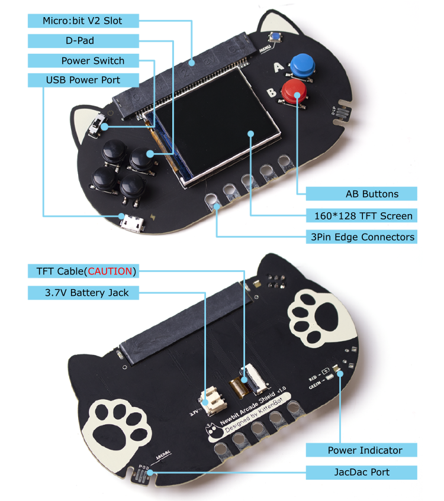

## Programming Tutorial

### Navigate to Microsoft MakeCode Arcade

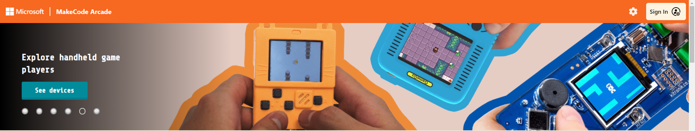

[Microsoft MakeCode Arcade](https://arcade.makecode.com/)

### Open a New Project

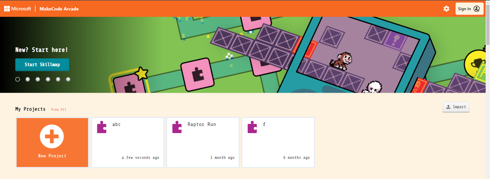

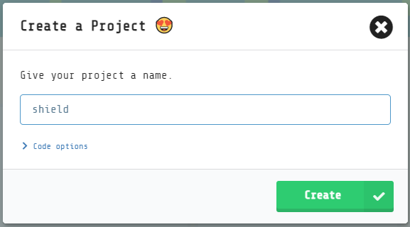

### Open the "About" Menu

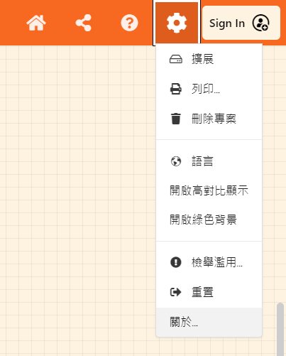

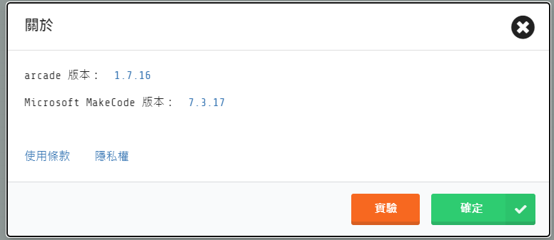

### Click "Experiments"

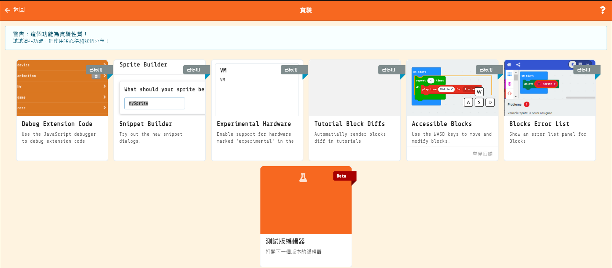

## Enable"Experimental Hardware"
## This setting only needs to be enabled once, it will remain turned on afterwards

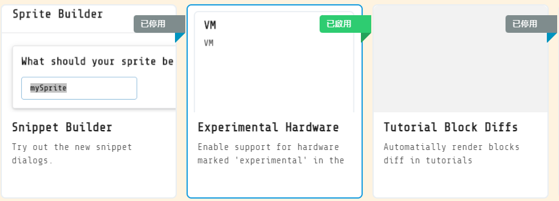

## Open the Hardware Menu

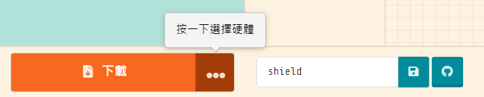

## Select "N3"

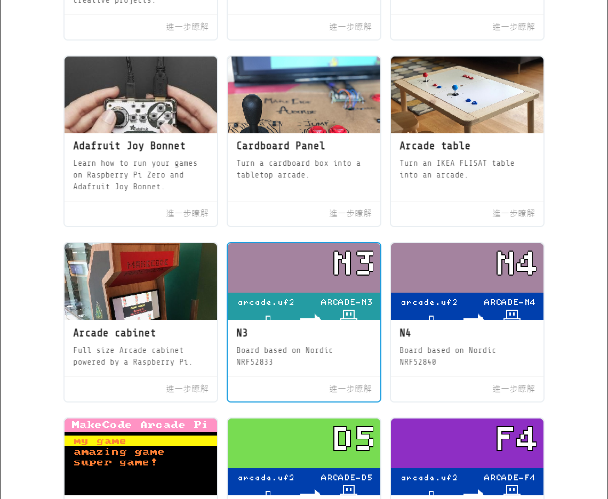

## Download the hex file to Micro:bit

## Turn on the Power

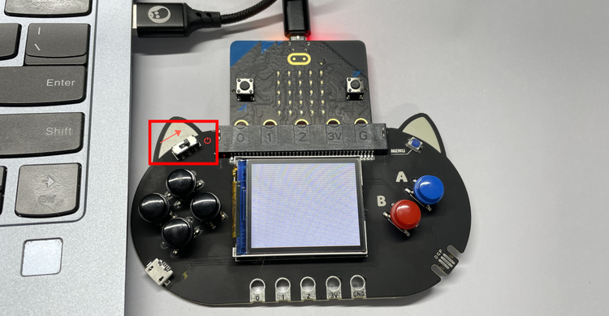
