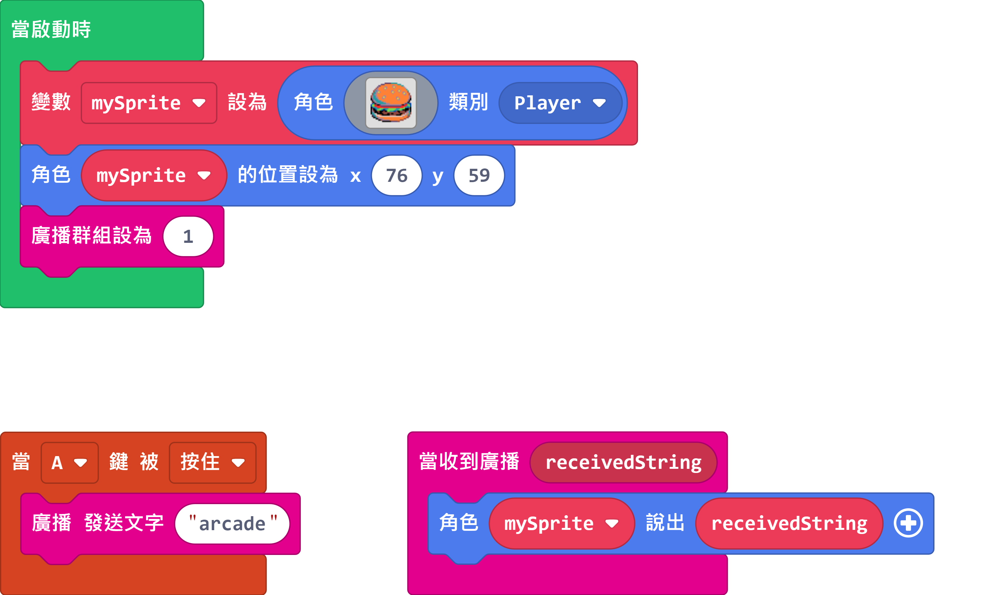
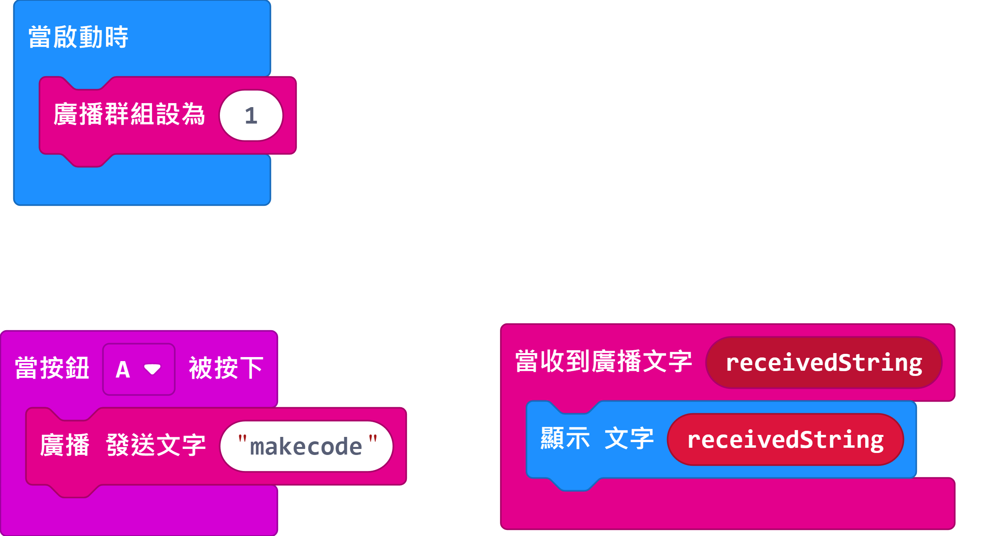

# Using Newbit Arcade Shield as a remote controller

The Newbit Arcade Shield can be used as a remote controller with Micro:bit's 2.4GHz radio.

## MakeCode Arcade Sample Program

[Sample Program](https://makecode.com/_Wfb9qX4JeXLU)

## MakeCode Sample Program

[Sample Program](https://makecode.microbit.org/_V7eEK0PzLC2p)

