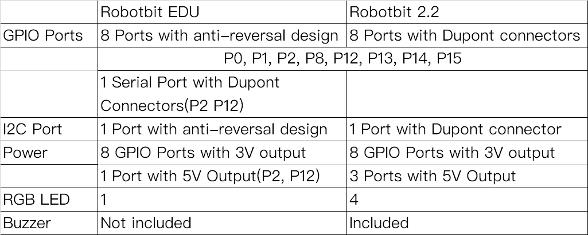
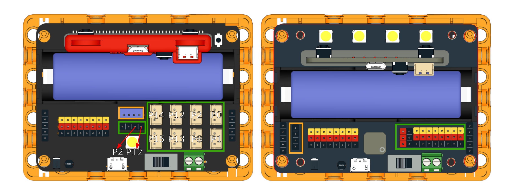
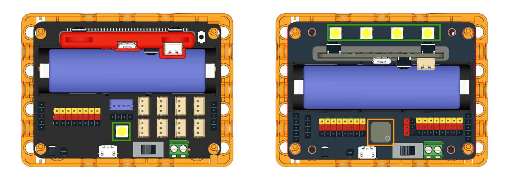

# Robotbit EDU and Robotbit 2.2 Differences

This article will highlight the differences between Robotbit EDU and Robotbit 2.2.

## All Differences

## Differences Explained

### Difference 1: Port Design

Green: IO Ports

Orange: I2C Port

Robotbit EDU adopts the anti-reversal design to make wiring different modules easier.

Robotbit 2.2 adopts the Dupont connector design to allow more flexibility in wiring modules.

### Difference 2: Onboard Features

Green:  RGB LED

Orange: Buzzer

Robotbit EDU has 1 RGB LED.

Robotbit 2.2 has 4 RGB LEDs and a buzzer.

