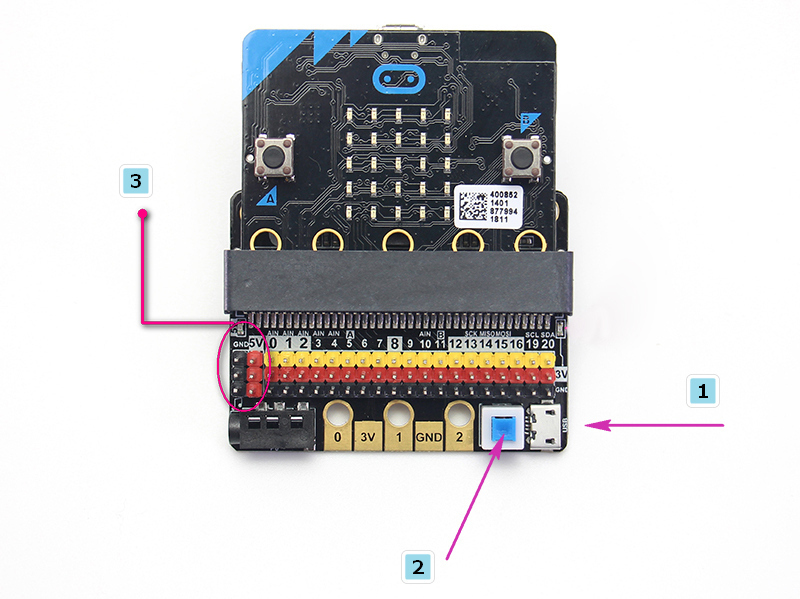
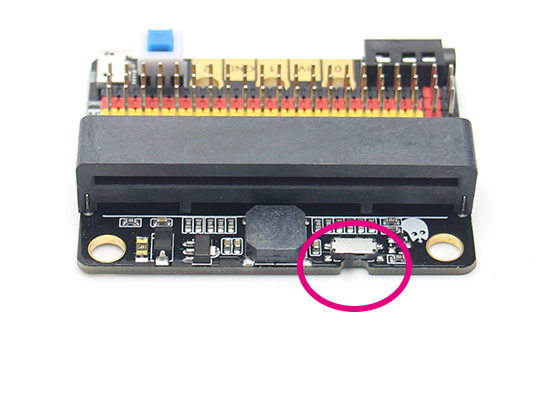

# IOBit Expansion Board

IOBit(HKBC8009A)

IOBit is a basic expansion board designed for Micro:bit, as the name suggests, IOBit makes the all IO pins of the Micro:bit accessible.

## Product Details

IOBit is a low cost expansion board for Micro:bit, it extends all the IO pins of the Micro:bit into Dupont connectors for easy access. IOBit is equipped with a buzzer and a 3.5mm audio jack for making sounds with Micro:bit. It also has a power port to supply 3V or 5V power to your hardware. The edge connectors of the Micro:bit is preserved for users familiar with using crcodile clips.

## Special Features

1. Converts the edge connectors pins of the Micro:bit to the standard 3 pin format. The singal, vcc and gnd pins can be distinguished by their colors.
2. Equipped with short circuit protection and a resettable fuse, avoiding dangers such as short circuiting because of incorrect connection.
3. Preserves the 3 pin edge connector of the Micro:bit, allowing users who are used to this system to use the board.
4. 2 pin holes compatible with standard Lego Technic pins allow easy integration of the expansion board to your robotic projects.

## Specifications

- Dimensions: 56.8x44x12 mm
- Power Input: USB 5V/Micro:bit Battery Box 3V
- Power Output: 3.3V~5V, maximum 1A

## Built-in devices

- 3 Pin IO Edge Connector
- Buzzer and toggle switch
- 3.5mm audio jack
- 5V USB Port
- Power switch

### 5V Input

1. Plug in a USB power supply
2. Press the power switch
3. The power indicator will light up
4. The 5V pins can now be used.

### P0 Buzzer Toggle

Pin 0 is occupied by the buzzer, use this switch to togglebuzzer on or off

## Demo Video

## Precautions:

1. Do not use high current devices, large servos or motors with this board, as this may result it damaging the Micro:bit.
2. The 5V power supply is able to run multiple small servos as long as the total current is less than 1A.
3. Using Pin 0 requires the buzzer to be switched off or the buzzer may buzz erratically.
4. Since Pin 3 to Pin 11 are used by Micro:bit's LED Matrix, the matrix needs to be turned off or it may light up erratically.
5. Do not connect to a USB power with current exceeding 1A.