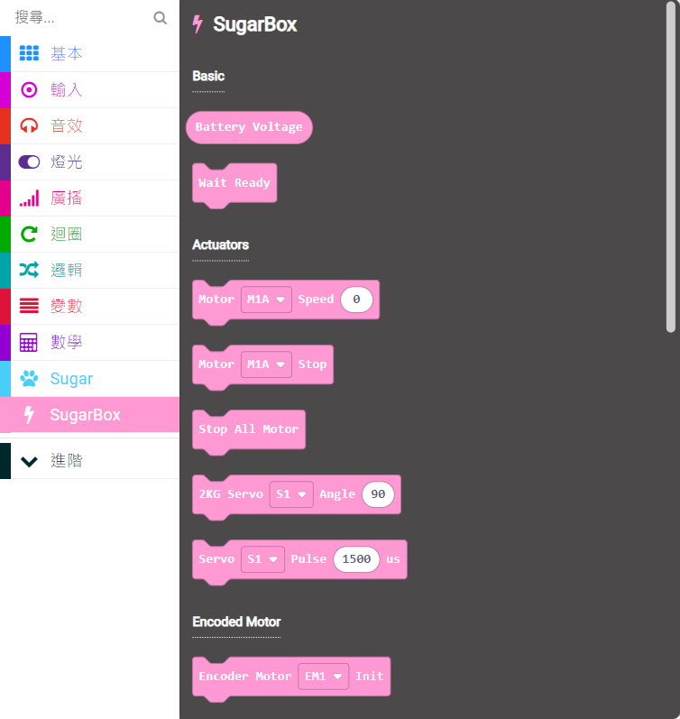
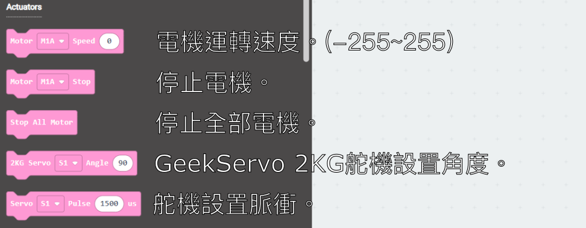
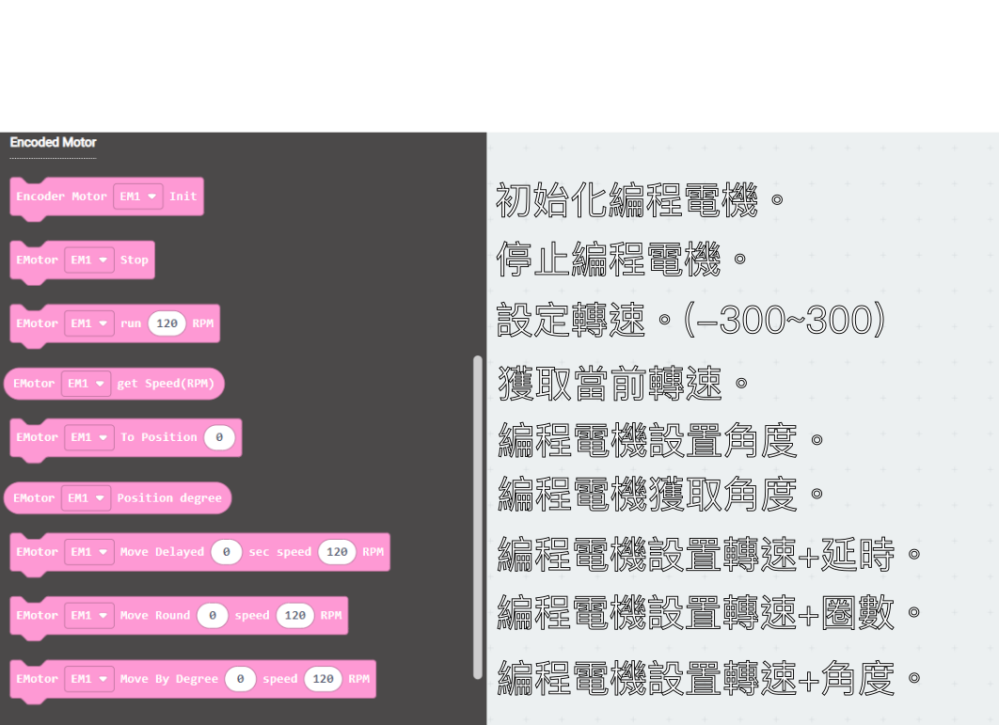
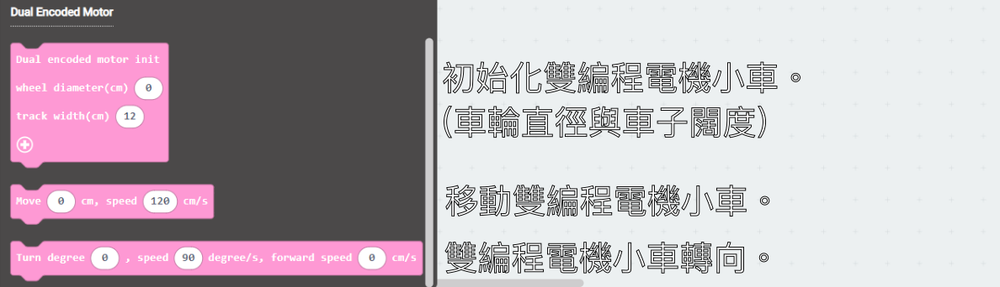

# MakeCode Programming with MakeCode

## Import Sugar Extension

### Search for sugar in the search bar (Kittenbot products has been verified by Microsoft)

### Extension URL

Sugar extension: https://github.com/KittenBot/pxt-sugar

### [Importing Extensions](../../Makecode/powerBrickMC)

### Programming Blocks for SugarBox

### MakeCode Programming

## Extension Version and Updates

There may be updates to extensions periodically, please refer to the following link to update/downgrade your extension.

[Makecode Extension Update](../../Makecode/makecode_extensionUpdate)