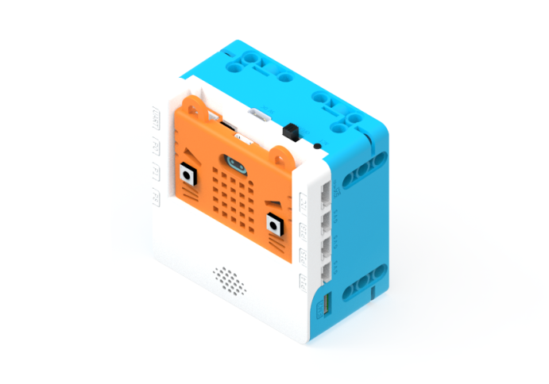
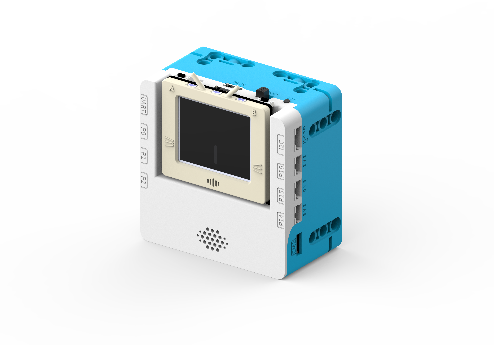
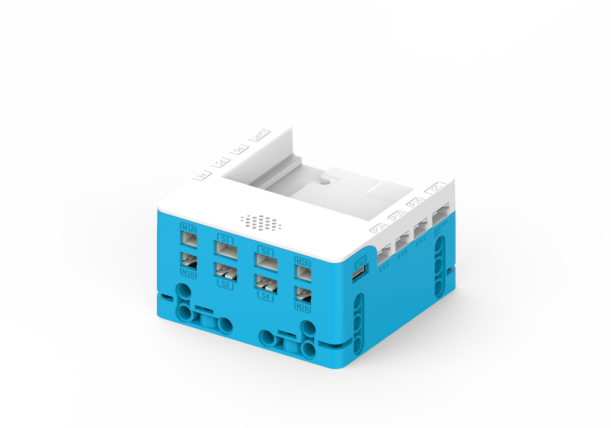
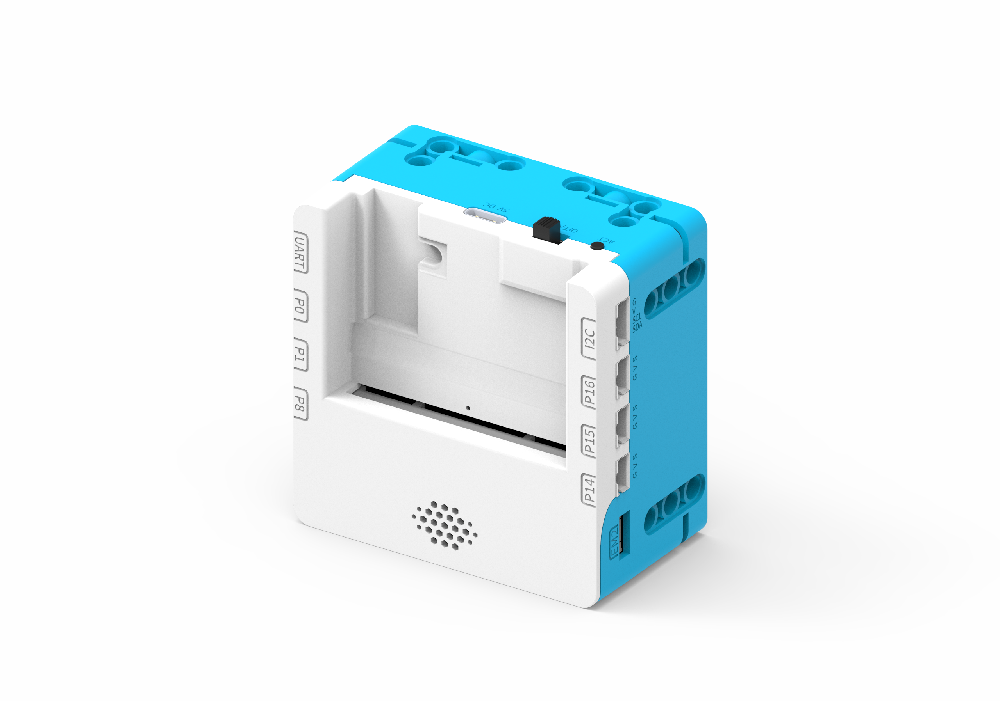
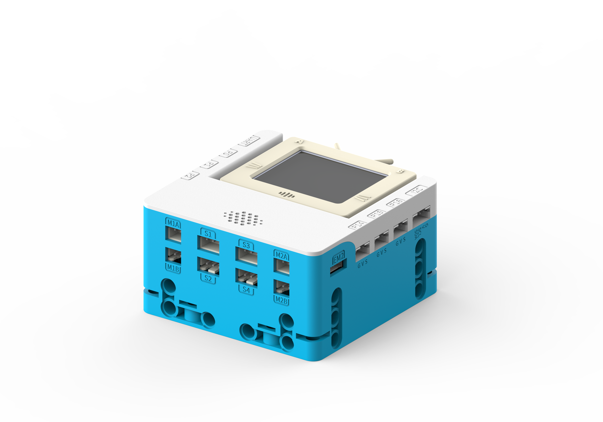

# SugarBox

SugarBox is the latest expansion box developed by KittenBot, it is designed for FutureBoard and Micro:bit. Its most special feature is the power source, SugarBox utilizes 2 18650 batteries to provide abundant power and long operating hours.

As the name suggests, SugarBox is designed to work with the Sugar series of sensors via the use of 6 3Pin PH2.0 GPIO ports.

SugarBox is capable of driving 4 DC motors and 4 servos, with the addition of 2 brand new encoded motor ports, SugarBox has huge driving capabilities.

SugarBox has a new power monitoring system, allowing control boards to communicate with the system via I2C to obtain information such as Voltage and Battery Capacity. When using with FutureBoard, sound effects can even be played via the built-in speaker.

SugarBox is fully encased by hard ABS shell, not only does it look appealing, it also provides full and complete protection. Pin holes are found on 5 sides to allow easy integration with use case applications.

## Special Features

- Powerful Driving Capabilities
    - The 4 DC motors, 4 servos and 2 encoded motors are powered by sufficient and stable 5V from the 7.4 Lithium batteries
- Full Encasing
    - The hard ABS shell is appealing and provides complete protection
- Compatible with LEGO Pins
    - Pin holes on 5 sides of the shell to provide many mounting options
- Long Battery Life & Abundant Power
    - The 2 18650 Lithium batteries provide 7.4V of power and a total of 5200mah for long-lasting operations
- Built-in Speaker
    - Sound effects can be played when using FutureBoard
    
## Product Specifications

- Dimensions: 72 x 72 x 40 mm
- Power: 7.4V 18650 by Lithium-Ion Battery *2 or 5V by USB Type C
- Operation Voltage: GPIO Maximum 3.3V 1A, Motor/Servo Ports Maximum 5V 2A
- Onboard Resources: 6 3PIN GPIO Ports, I2C Port, UART Port, 4 Servo Ports, 4 DC Motor Ports, 2 Encoded Motor Ports, 1W Speaker, Power Monitoring Circuit, Power/Charging LED, USB Type C Charging Port, Short Circuit Protection Circuit
- Supported Controller: Micro:bit, FutureBoard
- Programming Platform: MakeCode，KittenBlock

## Product Showcase

