# IoT Platform x MIT AI2

IoT use cases are usually paired with a mobile application, by using MIT AI2, we can easily build an app for using IoT use cases.

## MakerCloud x MIT AI2

MakerCloud has an official extension for using their platform with MIT AI2, please refer to their official documentation for details.

[MakerCloud Official Documentation](https://learn.makercloud.io/zh_TW/latest/ch4_connect/ai2/connect_ai2/)

## Other IoT Platform x MIT AI2

### Most platforms supporting MQTT will support MIT AI2, ThingSpeak is used as an example in this article.

Download a 3rd party MQTT extension for AI2.

[Download Extension](https://ullisroboterseite.de/android-AI2-PahoMQTT-en.html)

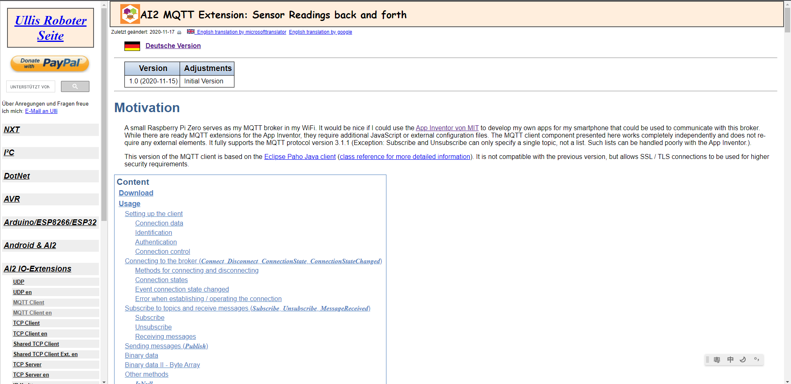

Download the file from Download section.

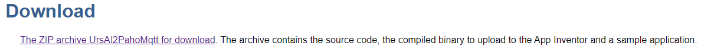

Extract the aix file.

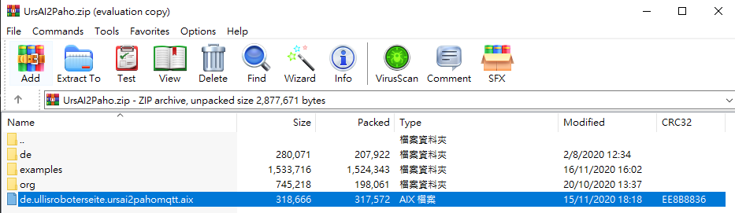

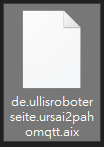

Go to MIT AI2, open a new project.

[MIT AppInventor 2](http://appinventor.mit.edu/)

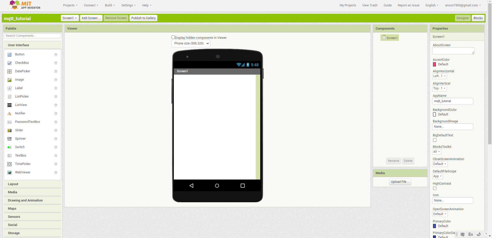

Find "Import Extension" from the left hand side menu.

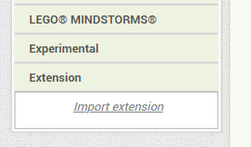

Upload the aix file.

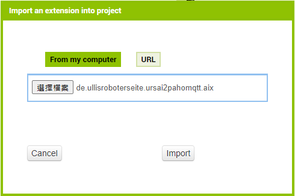

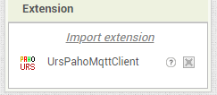

Drag the component into the screen.

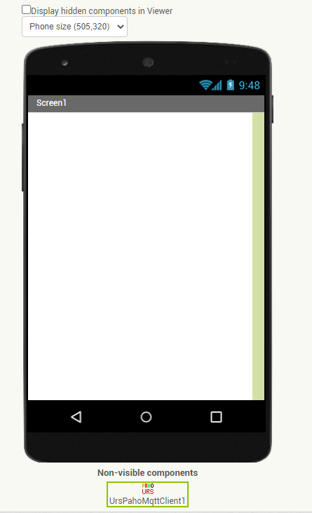

In the properties of the MQTT component, enter the MQTT host in the Broker field. 

Fill in other parameters according to the requirements of your IoT platform.

For ThingSpeak, fill in mqtt.thingspeak.com for broker and your ThingSpeak clientID for clientID.

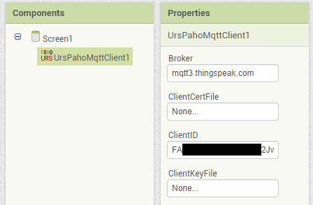

Enter UserName and UserPassword if required, for ThingSpeak, enter the user name and password here.

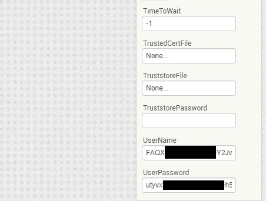

## Connecting to your chosen platform

Build the following program to test if you can connect to the IoT platform.

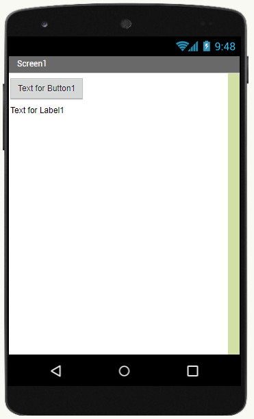

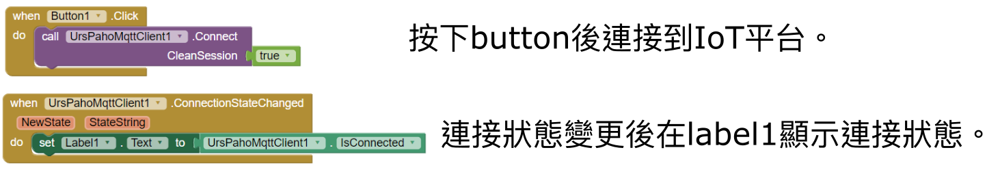

After pressing the button, the text should change to "true", this indicates a connection to the IoT platform has been established.

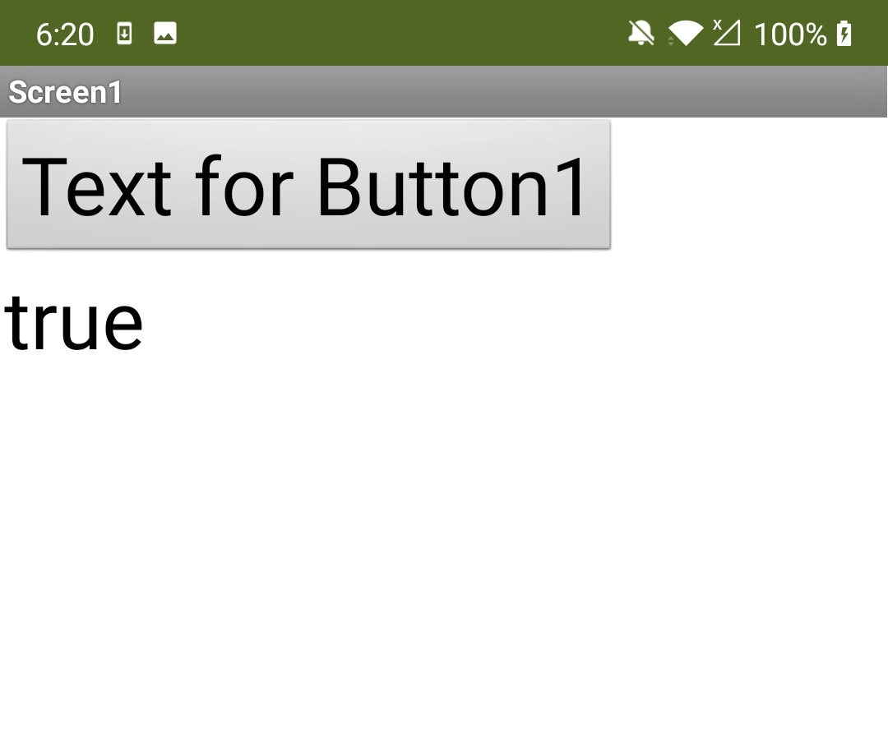

## Publishing messages on AI2

Try sending a random number to the platform.

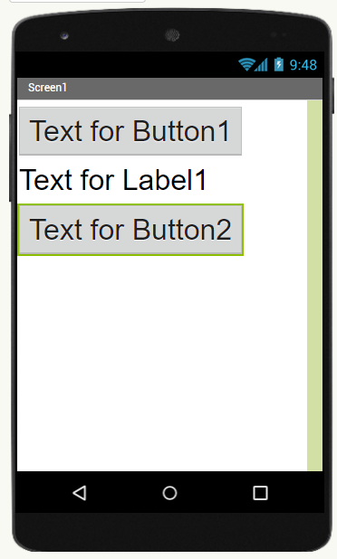

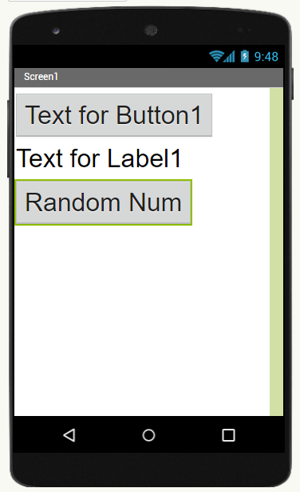

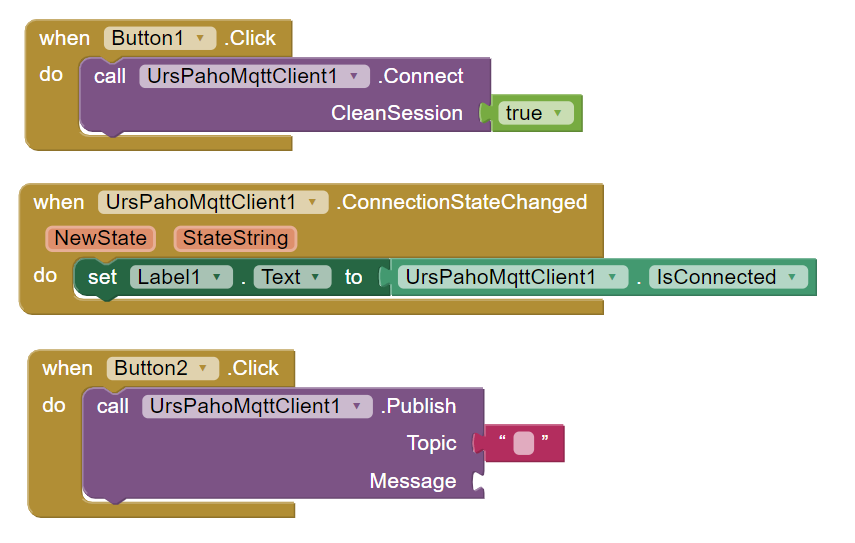

Enter the topic name, ThingSpeak is used as the example in this article.

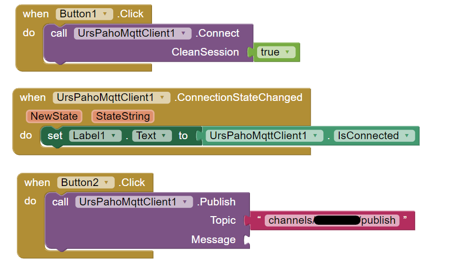

Attach a string element to the message parameter.

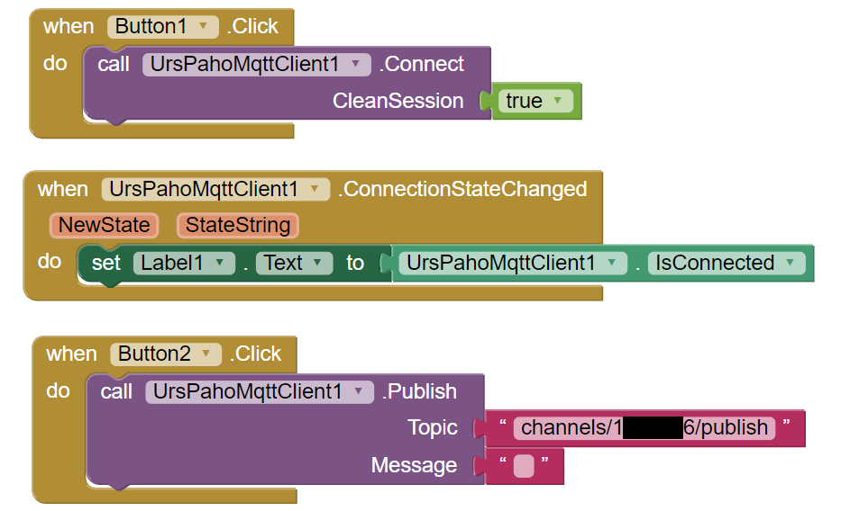

For ThingSpeak, join the 2 strings containing the field number and the data.

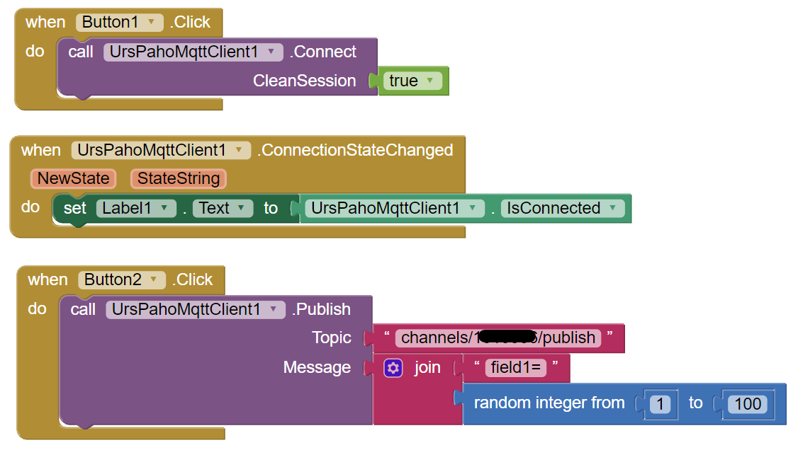

Try the program, you should be able to see the data on ThingSpeak.

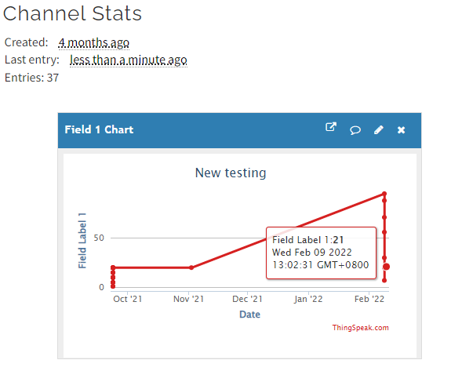

## Subscribing to MQTT on AI2

We can also subscribe and listen to MQTT data.

Build the following program to read MQTT data.

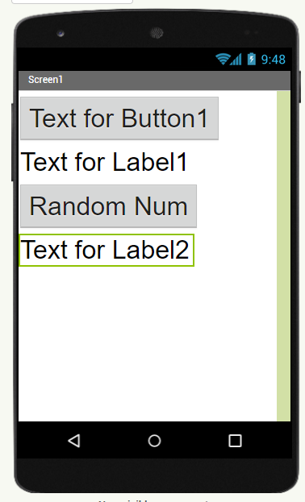

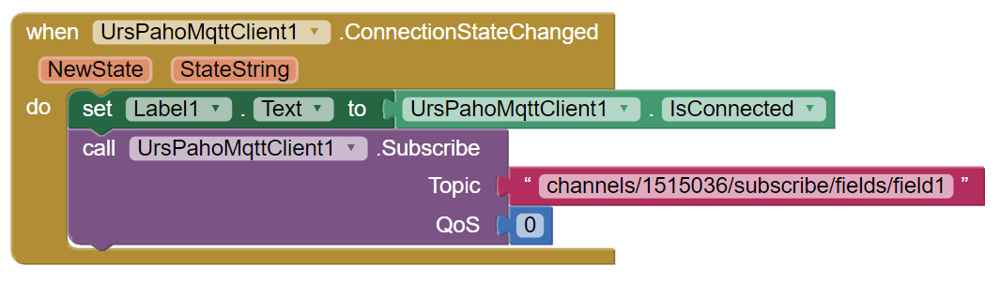

Use the following block to trigger an action after a message is received.

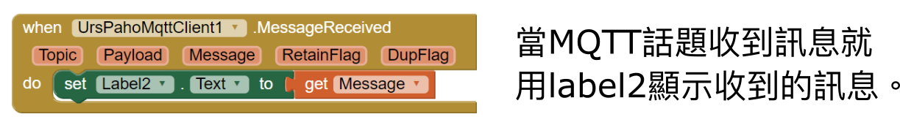

Try the program, you should be able to see the data on ThingSpeak and on your app.

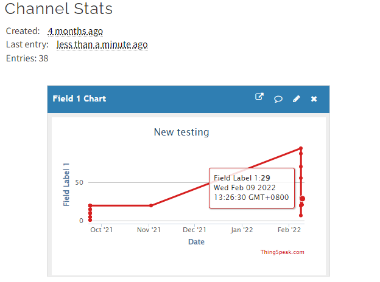

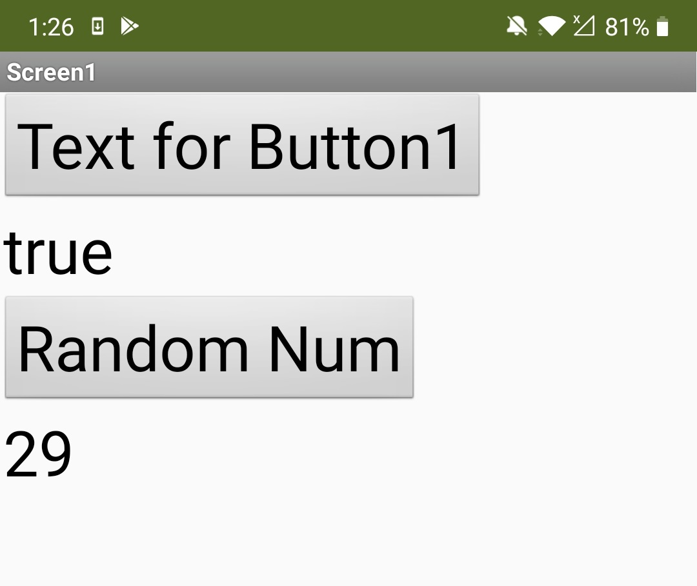

## Download Sample Program

The above program is available to download.

[AI2 Sample Program Download](https://drive.google.com/file/d/1g0Bf8zQGRk6PEBNDGzEWxrBTcfsoehhQ/view?usp=sharing)