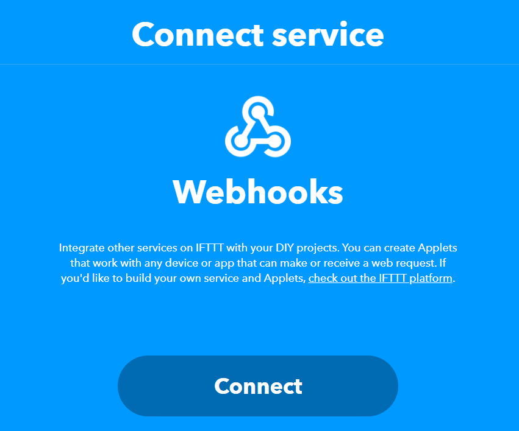
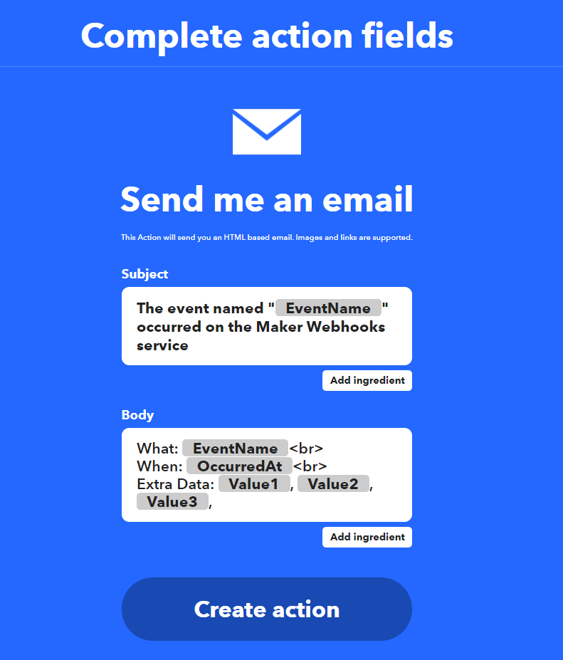
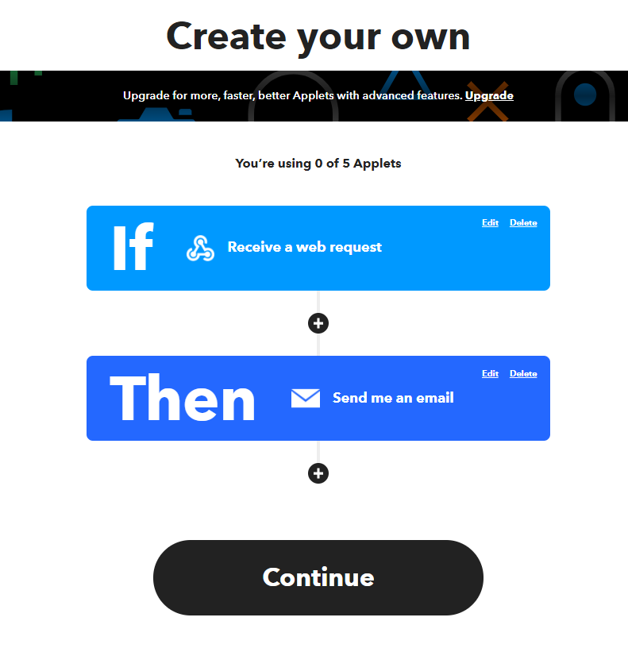

# ThingSpeak x IFTTT

ThingSpeak can also be configured to use IFTTT.

## ThingSpeak Official Tutorial

ThingSpeak provides an official tutorial.

### [ThingSpeak Official Tutorial](https://uk.mathworks.com/help/thingspeak/use-ifttt-to-send-text-message-notification.html?requestedDomain=)

## ThingSpeak x IFTTT

### The following content is written by KittenBot HK, please refer to official tutorial if any differences are found.

### Set Up IFTTT

Register and log in to an IFTTT account.

Create a new applet.

Search for webhooks in the "If this" section.

Select "Receive A Web Request".

Press connect if prompted.

Enter an event name.

Move on to "Then That" section.

In this tutorial ,we will use IFTTT to send an email. But there are many other applications supported too, please feel free to explore on your own.

Select Send Me an Email.

We have to activate this service for the first time when using this service.

Follow the instructions to activate email service.

You can modify the email contents, but we will use default settings for this tutorial.

Press Continue.

### Set up ThingSpeak

Navigate to the Apps tab.

Select ThingHTTP in actions.

Create a new ThingHTTP.

Enter a name for this action.

Switch to IFTTT page.

Go to "My services".

Select Webhooks.

Choose Documentation.

Enter an action name.

Copy this link and paste into the URL field.

Save the ThingHTTP.

Choose React from the apps.

Create a new React.

Enter the conditions for this trigger and select the ThingHTTP you want, tick "Run action each time condition is met" if you want to trigger the action everytime the condition is met.

Try publishing data to your ThingSpeak channel, you should receive an email if the conditions are met.

