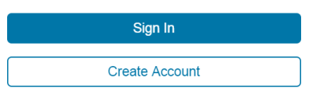
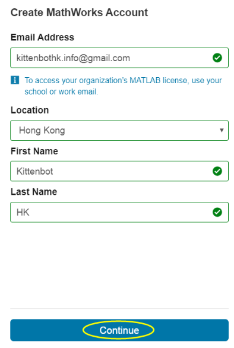
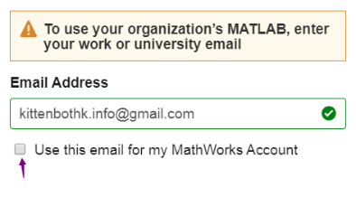
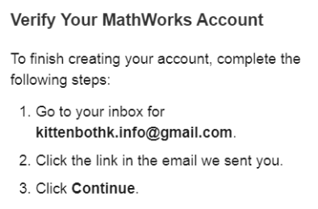
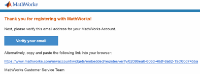
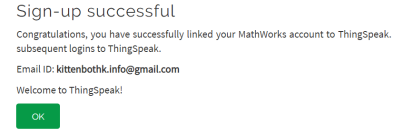
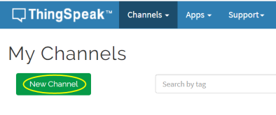
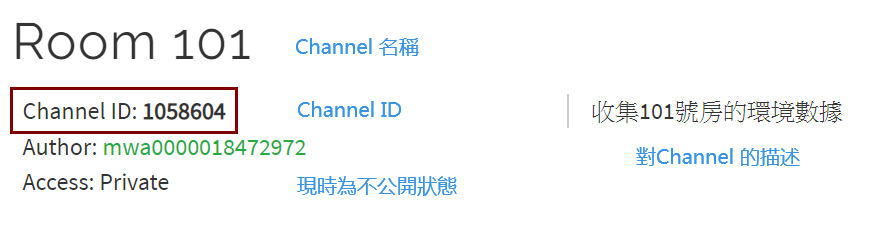
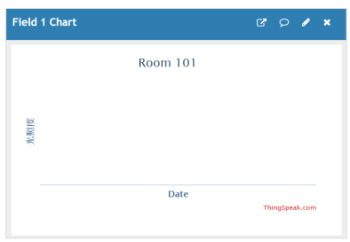
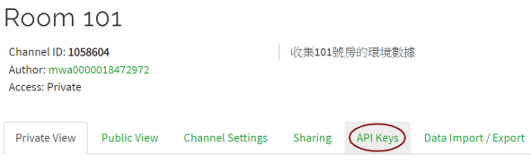

(IoT Platform Introduction)

# ThingSpeak

## Introduction

[ThingSpeak](https://thingspeak.com/)

ThingSpeak is a IoT analysis platform managed by Mathworks, through the internet, data can be collected and uploaded to ThingSpeak using Rest API or MQTT protocol, the data is analyzed and represented as real time graphs.

Of course, ThingSpeak can be used to exchange data by uploading data from device A and then downloading that data from device B.

ThingSpeak is a popular platform for both beginners and professionals. ThingSpeak is available as a free version or as a paid version, the free version is a great platform for beginners.

[ThingSpeak Licensing](https://thingspeak.com/pages/license_faq)

## Account Registration

An account is needed for using ThingSpeak.
 
We can create a free account here.

 

Select "Create Acconut" or click "Sign In" if you already have an account.   

 

Fill in the information and click "Continue".

 

Tick this option.

 

Activate the account by following the given steps.

Do not close this page.

 

Verify your email to continue.

 

 

Go back to the page and click "Continue".

 

Create a password.

 

After that, the sign up process is finished.

 

## Using the ThingSpeak platform

This is the main page after signing in to the platform. For beginners, we just need to know about **Channels** and **Profile**.

Their functions will be explained in the sections below.

In the **Support** page, documentation and technical support can be found.

## Set up a channel

You can create your own channels for uploading and downloading data, free accounts can create up to 4 channels.

Click New Channel

 

There are some information we need to provide when creating a channel.

We need to understand "Fields" first.

Fields are the attributes or the kinds of data that you are collecting. For example when we are monitoring the climate of a location, we may have fields including temperature, precipitation, humidity.

Fields can help us analyze data by representing our findings in a graph.

**Example**: Brightness, temperature, humidity, ambient noise are the fields we need when collecting environmental data of a classroom.

 

**Attention:** Each channel is limited to a maximum of 8 fields.

We can save our channel after finishing.

[More channel settings:](https://ww2.mathworks.cn/help/thingspeak/channel-settings.html)

## Channels

When we enter a channel, we are greeted with this page.

We can see the details of our channel.

1. An unique Channel ID used to access this channel.

2. Accessibility. Channels are defaulted to be Private, meaning only you can access this channel.
    - Changing it to Public would allow others to access this channel.
    - Free accounts are allowed up to 3 Public Channels.

   

3. Our data will be shown in these charts.

   e.g. Field 1 Chart = Brightness

    

The channel can be edited in the Channe Settings page.

  

We can return to this channel page from other pages with the following steps.

 

## Publish & Subscribe

**Publish** and **Subscribe** are important concepts in IoT applications. 

In a nutshell, Publish means uploading data to the platform, while Subscribe is to download the data from the platform.

 

#### Publish

Publish data to a channel requires the **Write API Key**. This information should be kept a secret.

Our Write API Key for this channel can be found here.

 

 

#### Subscribe

Subscribing to a channel requires the **MQTT API Key** of the channel owner's account. This information should be kept a secret.

Go to My Profile.

 

The MQTT API Key is found here.

 

ThingSpeak is powered by MathWorks and full features can be accessed with a paid account. Enthusiasts can know more about these powerful features by reading the documentation.