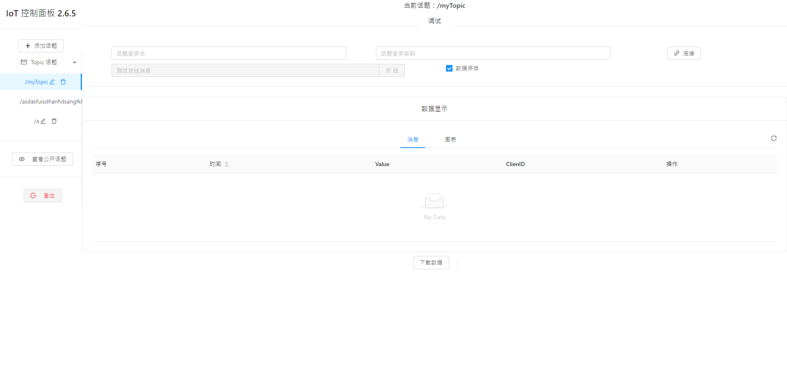
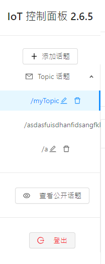
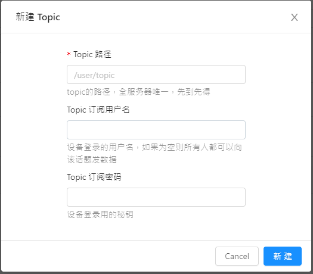
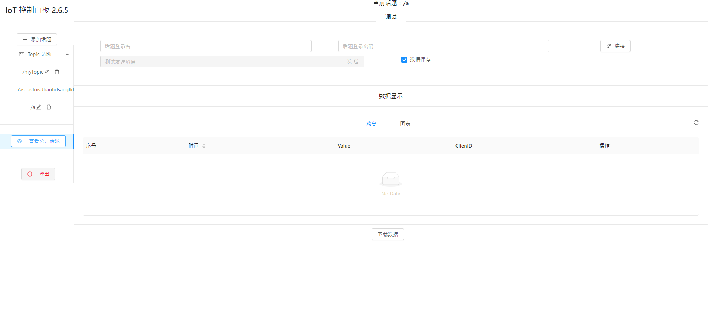
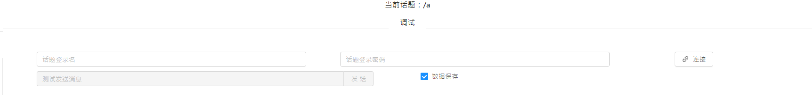
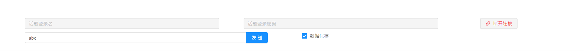
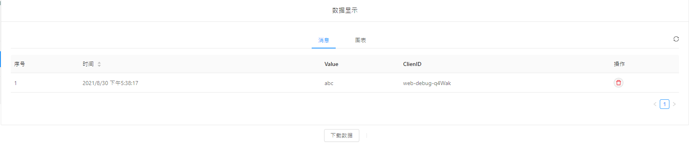
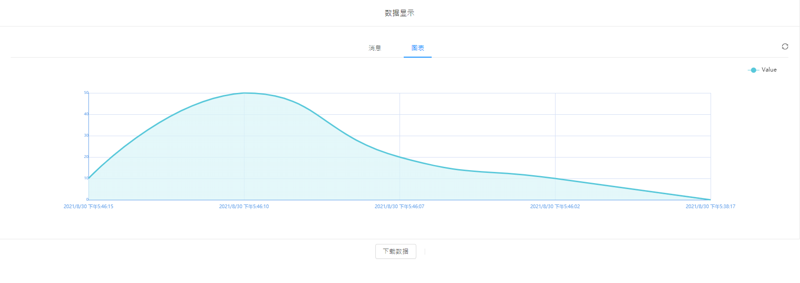
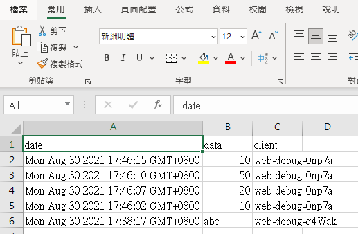

# KittenBot IOT Platform

In order to allow more users to experience IoT usage, KittenBot is now providing a free IoT platform for its customers.

### [Kittenbot IOT Platform](https://iot.kittenbot.cn/)

## Applying for an Account

KittenBot IOT Platform is completely free of charge, however users will need an account to access the platform.

If you wish to gain access to KittenBot's IOT Platform, please Whatsapp KitttenBot HK.

[WhatsApp KittenBot HK](https://api.whatsapp.com/send?phone=85296480090&text=你好,我想申請免費Kittenbot物聯網平台登入)

## Platform Introduction

KittenBot has made into consideration that most IoT platforms require a subscription, and free platforms usually come with many limitations. KittenBot is now providing a basic IOT platform for free so that users can easily implement and experience IoT applications.

### Platform Functions

- Access the IoT Platform via a browser
- Custom Topic Name
- Uploading data to topic
- Manual publishing of data
- Auto-generation of charts

## User Interface

### 1: Topics Menu

The menu on the left are for Topics.

You can add a new topic by clicking the Plus Icon.

As the platform is shared by many users, please choose a unique name for your topic, for example /testing or /hello may be taken already.

Username and password is optional, the topic is set to public if username and password is blank, meaning anyone can access the topic with topic name. Setting the username and password allows only people who know the username and password to access your topic.

### 2：Topic Page

This is the page for each topic.

You can manually publish message here.

New topic messages are automatically updated and displayed here.

In the chart tab, a chart is generated based on numerical data in the topic.

The data can be downloaded as a CSV file.

## Makecode Coding with Kittenbot IoT

[Makecode Coding](../MakeCode/mc_kittenbotiot.md)