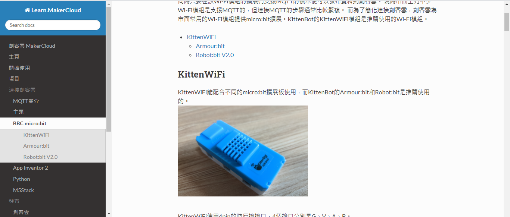

(IoT Platform Introduction)

# MakerCloud

## MakerCloud Introduction

 

MakerCloud is an IoT platform designed for educational purposes developed by Scale Innotech.

As a platform focused on educational purposes, it has an easy to use interface that even primary school students are able to easily master this platform. It also supports many powerful features besides MQTT data transfer, such as creating charts, GPS tracking and IFTTT or Webhooks, making it easy to develop IoT applications.

[MakerCloud Official Website](www.makercloud.io)

## MakerCloud Official Tutorials

Scale Innotech provides official tutorials for their MakerCloud platform.

MakerCloud Tutorial: <https://learn.makercloud.io/zh_TW/latest/>

 