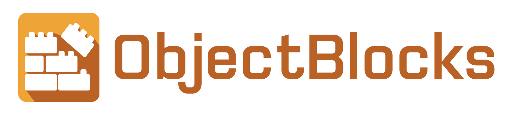

# ObjectBlocks

## ObjectBlocks Introduction

ObjectBlocks is the IoT Platform developed by Coding101, it has a clear and easy to use interface with powerful features.

[ObjectBlocks Official Site](https://www.objectblocks.cc/)

## MakeCode Programming with ObjectBlocks

[Makecode Programming](../MakeCode/objectblock.md)
