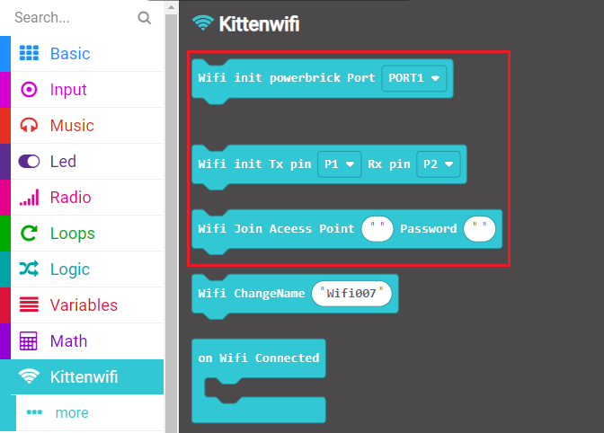
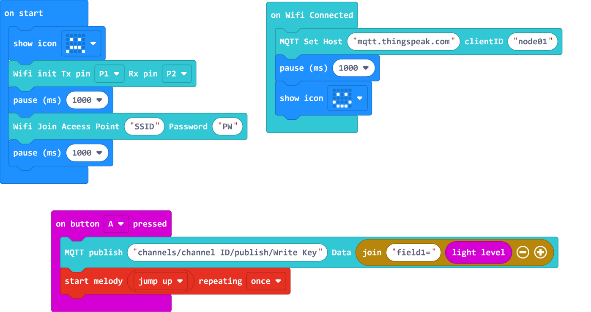
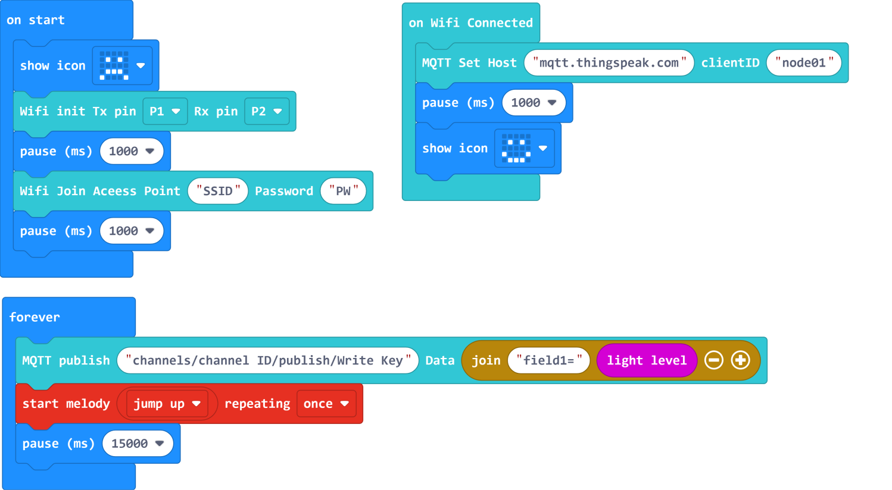
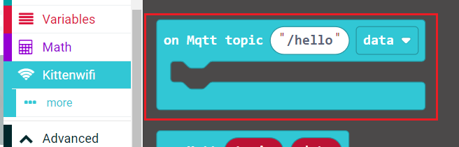
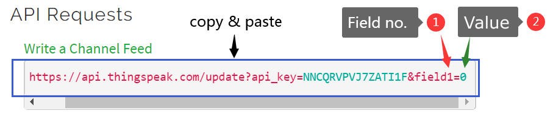

(MakeCode Coding)

# Makecode Coding and Thinkspeak


## Foreword

When the IoT platform and hardware are ready, we can start coding with the Micro:bit.

The program can be divided into 3 parts:

1. Connecting to the Internet.

2. Connecting to the IoT Platform.

3. Main program.(Publish/Subscribe)

- Robotbit was used when creating this tutorial, for Armourbit users, please refer to the instructions to modify the program.

Navigate to MakeCode's page before continuing.

[MakeCode](https://makecode.microbit.org)

## Extensions Required

Wifibrick: **https://github.com/KittenBot/pxt-kittenwifi**

Robotbit: **https://github.com/KittenBot/pxt-robotbit**

Powerbrick: **https://github.com/KittenBot/pxt-powerbrick**

 [Loading Extensions](../../../Makecode/powerBrickMC)

### 1. Connecting to the Internet

---

This section is about connecting the Wifibrick to the internet.

Select KittenWifi from the menu.

These blocks are needed to connect to the internet.

 

Create the following program.

 

The figure above used the block for Robotbit, if you are using an Armourbit, just change the block to this one.

 

1. Choose the correct Tx and Rx pin, the Tx should be the pin connected to the blue wire(A) and the Rx should be the pin connected to the green wire(B).

2. Enter the credentials of your wifi network.

   ```
   The SSID and Password can only contain alplabets and numerics.
   ```
   
Before moving on, it is recommended that you run this program once to ensure the module can connect to the Wifi network.

[Sample Code Link](https://makecode.microbit.org/_Jq53m3M7YHWT)

[**Demo Video**](https://youtu.be/v6yIrGqzqO4)

## Publish Data to Thinkspeak

### 2.1 Connecting to Thinkspeak

------

Connecting to IoT platforms are done with these blocks.

 

Add the following code to your program to connect to the IoT Platform.

Input **mqtt.thingspeak.com** in the host field. For ClientID, just input whatever you want.


### 3.1.1 Publishing to ThingSpeak manually

------

Scenario:

Using the light sensor on the Micro:bit, we want to upload the brightness in our classroom to our channel.

##### STEP 1

Find the block used to publish data from the KittenWifi extension.

 

##### STEP 2

In the **Topic** field, input the details according to this format.

*channels/**channel ID**/publish/**Write Key***

**channel ID** is the unique ID given to your channel.

**Write Key** is the password needed to access your channel.

e.g. **channels/1058604/publish/NNCQRVPVJ7ZATI1F**

If you have forgotten how to find these details, please refer to:

[ThingSpeak Introduction](../IoTplatform/Thinkspeak)

##### STEP 3

Next, we have to prepare the data to be uploaded.

ThingSpeak deals with data with the following format:

fieldNo=value

    Since we are sending data in a string format, we need to use join string to create a payload that ThingSpeak can work with.

Find the following block from the menu.

 

In our scenario, brightness is stored in field1, so we put **field1=** and the **light level** into the "Join String" fields.

The created string is the payload we are going to send, so we can put it into the *Data* field. 

 

After these 3 steps, our program is complete.

 

[3.1.1 Sample Code Link](https://makecode.microbit.org/_7VoDz8XvCDo0)

    You need to input your own network and channel details before using the sample code.

##### STEP 4

In this step, we can use the Micro:bit send data to our channel.

1. Turn on the power and wait for the Wifibrick to successfully connect to the internet.

2. Log in to ThingSpeak and navigate to your channel.

3. Press button A on your Micro:bit to publish data.

4. After a short moment, the data will be shown on your chart.

   

```
Attention 1: Publishing speed maybe affected by network speed or server load, you may need to wait up to a few seconds before the chart updates.
```

```
Attention 2: Free accounts can only publish once every 15 seconds.
```


### 3.1.2 Publishing to ThingSpeak automatically

------

By slightly modifying our program, it can now automatically upload data.



Since our free accounts can only publish once every 15 seconds, we put a 15 second pause before sending data again.

[3.2.2 Sample Code Link](https://makecode.microbit.org/_ism56L9k8g9h)

    You need to input your own network and channel details before using the sample code.

Data will be sent every 15 second after the Wifibrick has successfully connected to the internet.

 

## Subscribing to a ThingSpeak Channel

By subscribing to a channel, we can read its data.

First we need to change our channel to a Public channel.

```
IMPORTANT: Subscribing will not work with private channels!
```

### 2.2 Connecting to ThingSpeak

------

On ThinkSpeak, subscribing to a channel requires both the Channel ID and the MQTT API KEY of the owner.

Because we need to provie the MQTT API KEY when connecting to ThingSpeak, we will use this block to log in.

 

We also need this block to subscribe to our channels.

 

Build the following program:

 

Input the channel details in this format:

- channels/**CHANNEL ID**/subscribe/fields/**field?**

         The ? in field? refers to field number, for example field4.

We are now connected to ThingSpeak and subscribed to our channel.

### 3.2 Reading the Channel feed

------

Receiving data from your channel makes use of this block.

 

- channels/**CHANNEL ID**/subscribe/fields/**field?**

Every time the channel receives new data, the new data is automatically sent to us because we are subscribed to it.

Our program is now complete.

When data is sent to the channel, that data will be displayed on the Micro:bit.

 

[3.2A Sample Code Link](https://makecode.microbit.org/_a310rxagkEyp)

[3.2B Sample Code Link](https://makecode.microbit.org/_AUWFqKYWE7ow)

    The 2 programs are similar, 3.2B repeats displaying the data for 3 times while 3.2A just displays the data once.

### 3.3 Testing our Subscription

We can now send data to our channel and display it on our Micro:bit.

### 1. Using a browser

Navigate to the **API Keys** section on your channel.

 

   Scroll down to **Write a Chanel Feed**.

   

   Copy the entire field and paste it on the search bar of your browser.
    
   Change field number and the data value and press Enter. Here we sent a value 88 to field1 of our channel.

   

   88 should now be displayed on the Micro:bit.

   ```
   ThingSpeak handles data as a string, the values you input may not necessarily be a number, Try inputting "hello" and see the result.   
   ```

### 2. Using Micro:bit and Wifibrick

On another set of hardware, run a publishing program.


---

You are welcome to join our Whatsapp group to share your IoT projects!

 

## Extension Version and Updates

There may be updates to extensions periodically, please refer to the following link to update/downgrade your extension.

[Makecode Extension Update](../../../Makecode/makecode_extensionUpdate)