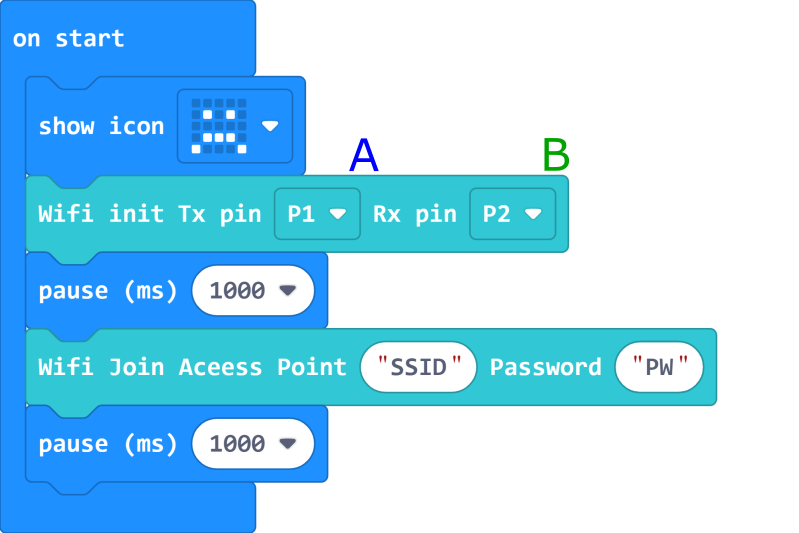
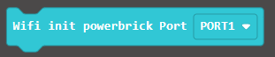
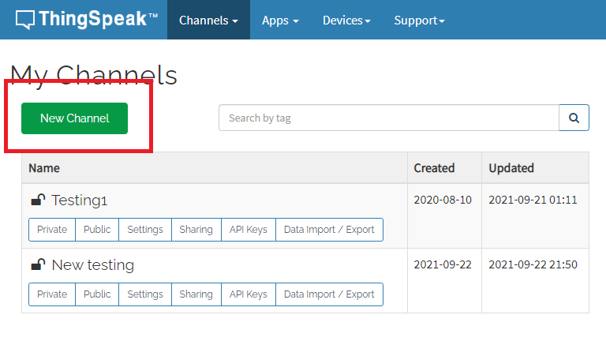
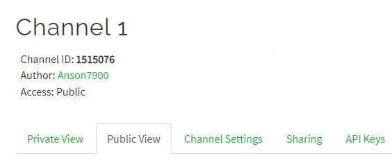
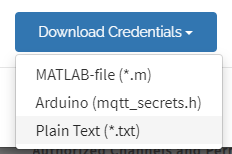
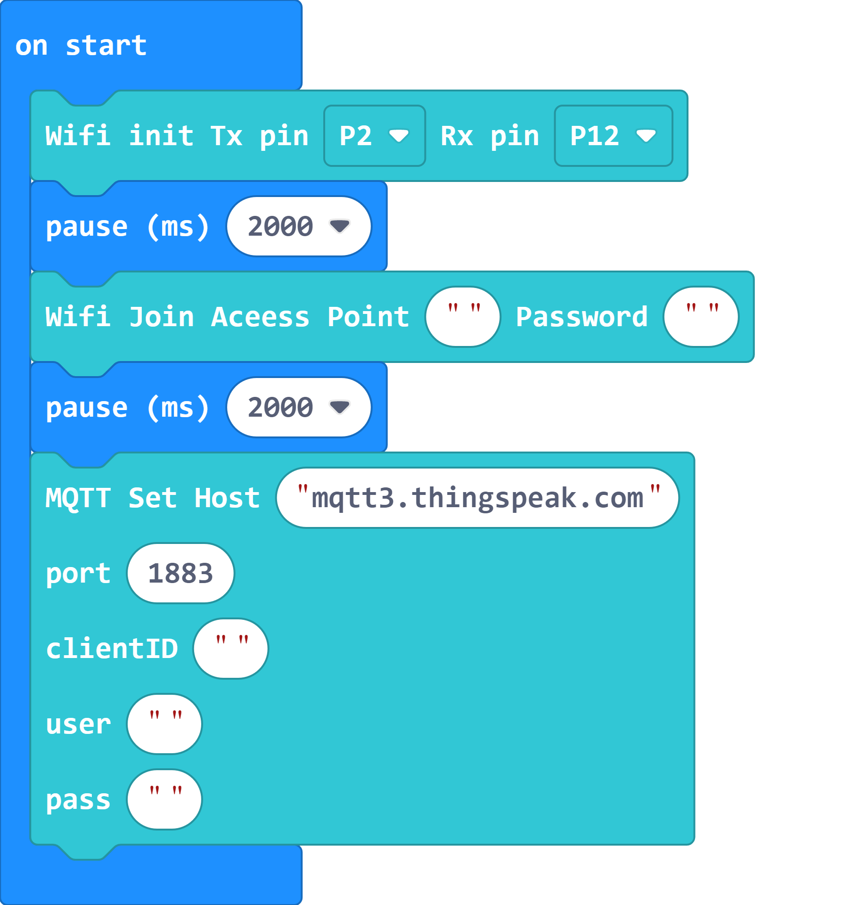
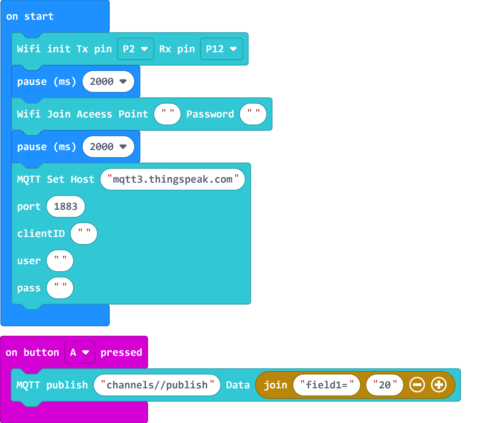

# Makecode Coding and Thinkspeak


## Foreword

When the IoT platform and hardware are ready, we can start coding with the Micro:bit.

The program can be divided into 3 parts:

1. Connecting to the Internet.

2. Connecting to the IoT Platform.

3. Main program.(Publish/Subscribe)

- Robotbit was used when creating this tutorial, for Armourbit users, please refer to the instructions to modify the program.

Navigate to MakeCode's page before continuing.

[MakeCode](https://makecode.microbit.org)

### Importing Extensions

### Search for KittenBot

### Import KittenWifi or KOI depending on your hardware


 [Loading Extensions](../../Makecode/powerBrickMC)

### 1. Connecting to the Internet

---

This section is about connecting the Wifibrick to the internet.

Select KittenWifi from the menu.

These blocks are needed to connect to the internet.

 

Create the following program.

 

The figure above used the block for Robotbit, if you are using an Armourbit, just change the block to this one.

 

1. Choose the correct Tx and Rx pin, the Tx should be the pin connected to the blue wire(A) and the Rx should be the pin connected to the green wire(B).

2. Enter the credentials of your wifi network.

   ```
   The SSID and Password can only contain alplabets and numerics.
   ```
   
Before moving on, it is recommended that you run this program once to ensure the module can connect to the Wifi network.

[Sample Code Link](https://makecode.microbit.org/_Jq53m3M7YHWT)

[**Demo Video**](https://youtu.be/v6yIrGqzqO4)

## Registering a ThingSpeak Account

Follow the instructions to register for a ThingSpeak account.

[ThingSpeak Introduction](../IoTPlatform/Thinkspeak.md)

## Setting Up ThingSpeak Platform

### Create a new Channel

Create a new channel.



Choose a name for your channel.


Other fields can be ignored, click Save Channel.


Open the Sharing tab.


Set the sharing settings to "Share channel view with everyone".


The Access with change to "Public".



### Add a new device

Open the Devices menu, select MQTT.


Add a new device.


Select the channels accessible by this device and click Add Channel.


Click Add Device.


IMPORTANT! These MQTT Credentials are used for connecting to ThingSpeak! Please save or download the credentials as they can't be seen after closing this page.




## MakeCode Coding

### Connecting to ThingSpeak

Build the following program and use these parameters to connect to ThingSpeak.

- Host: mqtt3.thingspeak.com
- ID: ThingSpeak Device Client ID
- Username: ThingSpeak Device Username
- Password: ThingSpeak Device Password



### Publishing to ThingSpeak Channel

We need the Channel ID for publishing. The channel ID is displayed on the Channel page as a 7-digit number.


Build the following program to publish a data to ThingSpeak:

- MQTT Topic: channels/[Channel ID]/publish
- Message: field[field No.]=[Numeric Data]



[WiFiBrick Sample Program](https://makecode.microbit.org/_L71FkV3wkEV4)

[KOI Sample Program](https://makecode.microbit.org/_UzsL7JKtuJi6)

On the ThingSpeak page, you can see the published data.


### Subscribing to ThingSpeak Channel

We can read the channel data by subscribing to the channel.

- MQTT Topic: channels/[Channel ID]/subscribe/fields/field[field No.]

Press A to publish a message to the channel, Micro:bit will display the data received.


[WiFiBrick Sample Program](https://makecode.microbit.org/_JKeC421rpUx2)

[KOI Sample Program](https://makecode.microbit.org/_a0saR4h5E1Fo)

---

You are welcome to join our Whatsapp group to share your IoT projects!

 

## Extension Version and Updates

There may be updates to extensions periodically, please refer to the following link to update/downgrade your extension.

[Makecode Extension Update](../../Makecode/makecode_extensionUpdate)