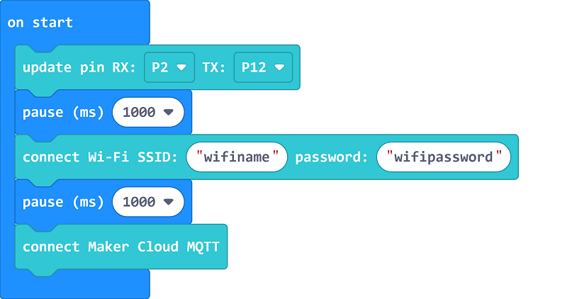
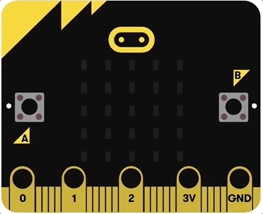
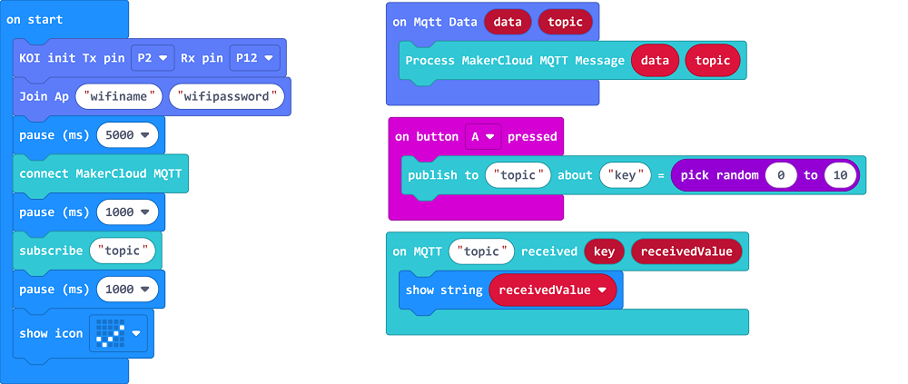

(MakeCode Coding)

# Makecode Coding and MakerCloud

## Foreword:

In this tutorial, you will learn how to use MakerCloud platfrom with a Wifibrick or KOI. A Robotbit will be used for demonstration.

## Step 1: Platform Preparation

Log in to MakerCloud and set up an IoT service.

Navigate to the mainpage and create a project.

    Or use ones that you created previously.

You will be redirected to the main page of your IoT project. Select Create Topic.

Create a MQTT topic.

Navigate to the Internet of Things tab.

The topic name will be automatically generated, this topic name should remain secret as it is the key to access this topic.

The IoT platform is now ready to be used for IoT operations.

## Step 2: Load the extension

We will load an extension so that we can communicate with MakerCloud's server.

Extension for Wifibrick: https://github.com/maxwong-scale/pxt-makercloud-V2

Extension for KOI: https://github.com/scaleinnotech/pxt-makercloud-koi

### [Loading Extensions](../../Makecode/powerBrickMC)

## Step 3: Coding

### 1: Connecting Wifibrick to MakerCloud

Blocks for initiating connection:

As a Robotbit is used in this tutorial, we initiate the Wifibrick with Tx & Rx pins.

Armourbit users can use ports to initialize.

The Micro:bit will display a short animation when connecting to the Wifi.

The Micro:bit will display a short animation when connecting to the MQTT server.

### 2: Publishing to the Topic

Blocks for publishing:

Let's publish a random number to our topic.

Copy and paste your topic name here.

The data we sent will be shown in the real-time data feed.

A chart will also be generated.

We can manually publish data to a topic with this window.

### 3: Subscribing to a Topic

Blocks for subscribing and reading data:

In order to obtain data from a topic, a subscription is required.

In this example, let's subscribe to the same topic we publish data to.

## Sample Program

### Sample Program for Wifibrick

[Sample Code Link](https://makecode.microbit.org/_0yhUt94oTfTD)

### Sample Program for KOI

[Sample Code Link](https://makecode.microbit.org/_2FfTJ1eMaKtV)

## Conclusion:

This concludes the basic usage of the MakerCloud platform with a Micro:bit, for more advanced usage, please refer to the official tutorials.

## Extension Version and Updates

There may be updates to extensions periodically, please refer to the following link to update/downgrade your extension.

[Makecode Extension Update](../../Makecode/makecode_extensionUpdate)