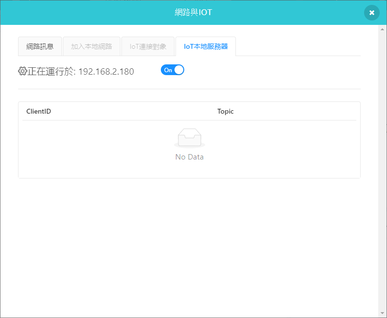
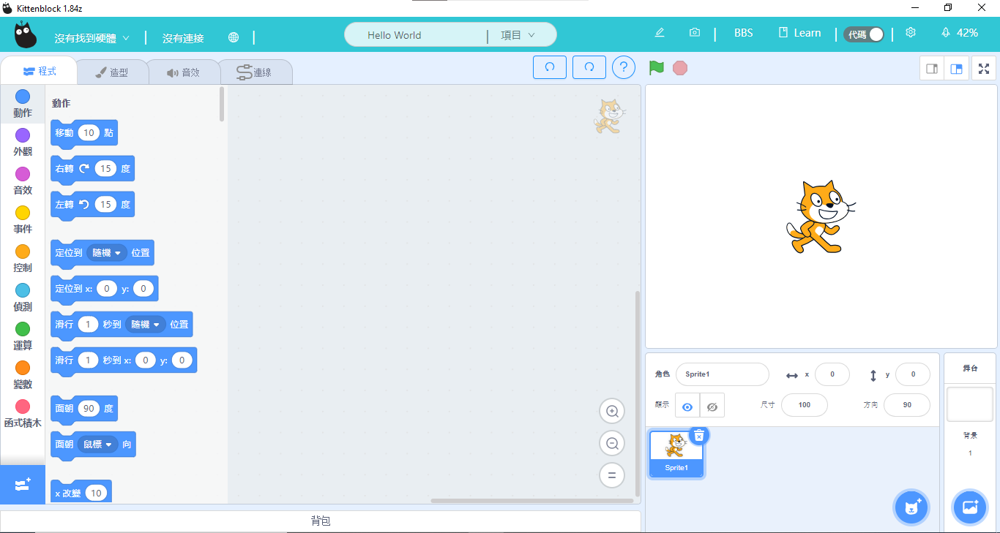
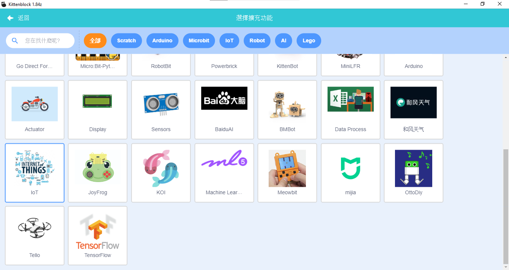
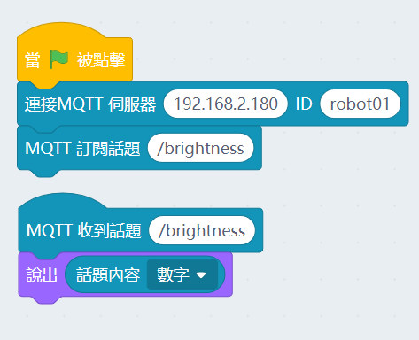
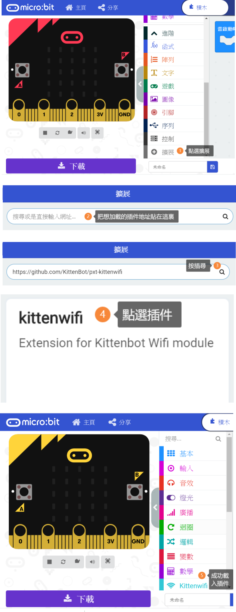
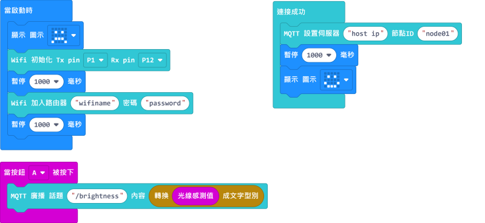
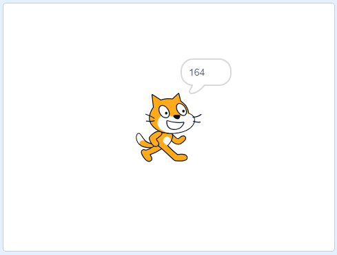
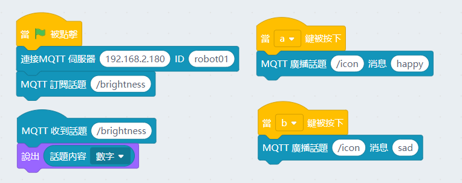
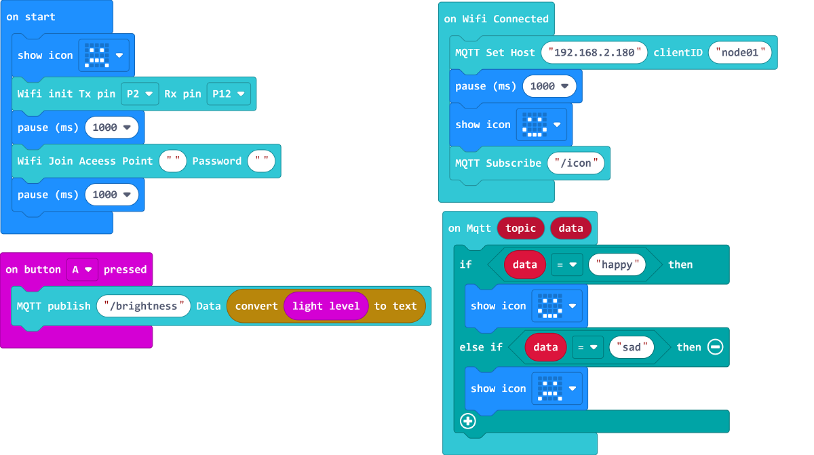
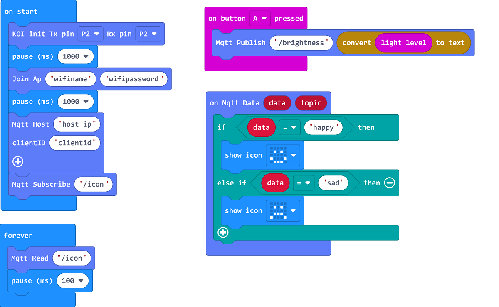

# Makecode X KittenBlock IoT

## Foreword

We will learn how to use WifiBrick and KittenBlock to develope IoT application.

    KOI is also supported.

## Step 1: Setting Up KittenBlock

### The computer must connect to the same network as the WifiBrick.

Activate local MQTT client.

## Step 2: Kittenblock Programming

We will write a simple script in KittenBlock to allow us to send and receive messages.

Import the IoT extension.

Build the following program, fill in the MQTT server address if it is not automaically inputted.

### Programming Wifibrick

Open MakeCode, import WifiBrick extension.

Wifibrick Extension: **https://github.com/KittenBot/pxt-kittenwifi**

Build th following program and fill in the Wifi name and password.

Input the host ip and the topic name of the local IoT client from KittenBlock.

Upload the program and wait for the WifiBrick to finish connection, press A to send the brightness value to local IoT client, the KittenBlock program will display the value.

Return to KittenBlock and modify the program to allow it to send an IoT message to Micro:bit.

Modify the program in MakeCode to allow WifiBrick to read IoT messages.

Subscribe to the same topic that the KittenBlock program is publishing to.

Micro:bit will now show the icon based on the message it receives.

[MakeCode Sample Program](https://makecode.microbit.org/_htm71EcY0JrK)

### Programming KOI

Open MakeCode and import KOI extension.

KOI Extension: **https://github.com/KittenBot/pxt-koi**

KOI is programmed similarly to WifiBrick. But KOI will need a MQTT Read block for getting IoT messages whereas it is automatic on WifiBrick.

Build the following program and enter the Wifi credentials and the host address.

Use the same topics between KittenBlock and KOI.

[MakeCode Sample Program](https://makecode.microbit.org/_draT4U6hEJiA)