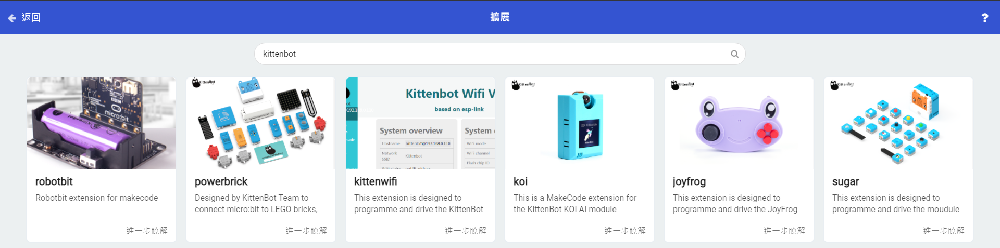
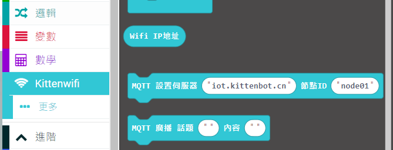
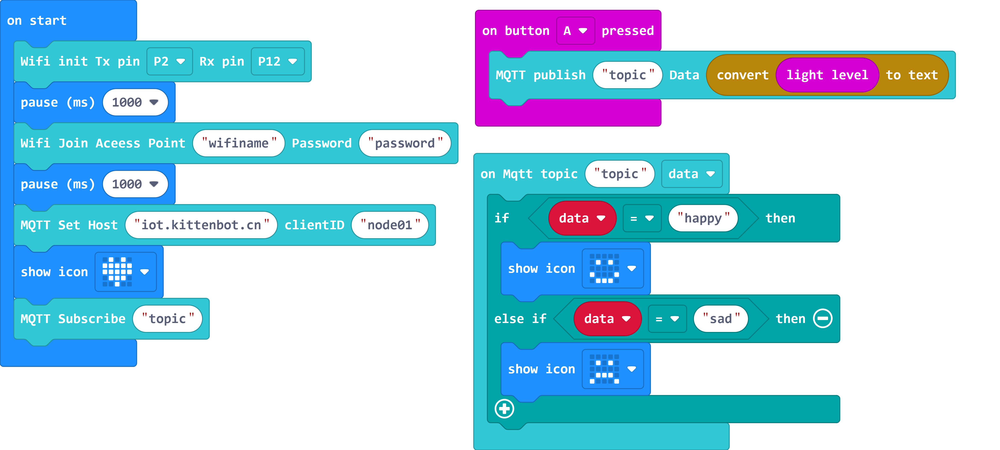
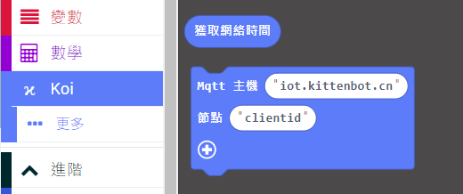
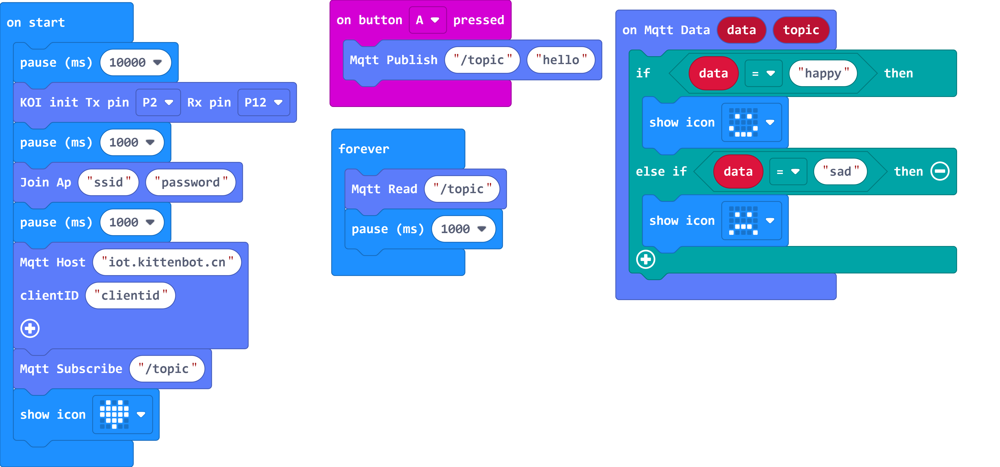

# Makecode Coding and KittenBot IoT

## Foreword

The following tutorial is for WifiBrick and Robotbit, for KOI users, some programs may need adjustments to work on KOI.

## 1: Setting Up KittenBot IoT

Create a new topic on KittenBot IoT.

[Kittenbot IoT](https://iot.kittenbot.cn/)

## 2: MakeCode Coding

### Import Extensions

### Search for KittenBot

### Select KOI or WifiBrick depending on your hardware

### WifiBrick Sample Program

By default, the MQTT host is already set to KittenBot IoT.

Press A to publish a light intensity data to KittenBot IoT.

Manually publish "happy" or "sad" on KittenBot IoT, Micro:bit will display a corresponding icon.

[Sample Program](https://makecode.microbit.org/_D4J7wX7uRhtV)

### KOI Sample Program

By default, the MQTT host is already set to KittenBot IoT.

Press A to publish a light intensity data to KittenBot IoT.

Manually publish "happy" or "sad" on KittenBot IoT, Micro:bit will display a corresponding icon.

[Sample Program](https://makecode.microbit.org/_9xm455btKcPi)