# Makecode Coding and ObjectBlocks

## Foreword

The following tutorial is for WifiBrick and Robotbit, for KOI users, some programs may need adjustments to work on KOI.

## 1: Setting Up ObjectBlocks

Create an account on ObjectBlocks.

[ObjectBlocks](https://www.objectblocks.cc/)

Log in and create a new project.

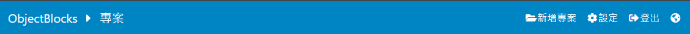

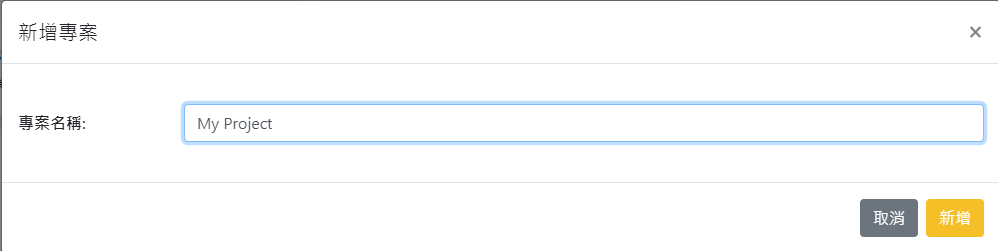

Select Channels from the menu.

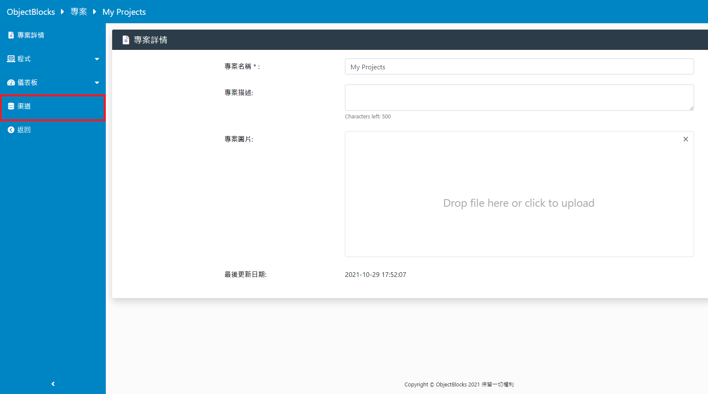

Add a new channel.

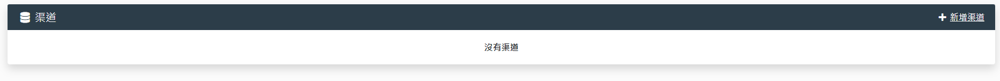

Specify the type to be either text or numeric.

Remember to choose YES for the webhook option.

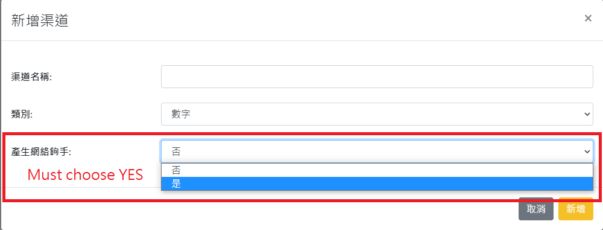

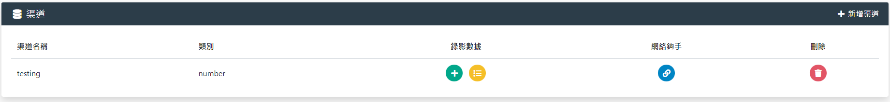

The webhook option contains credentials for accessing your channel, please keep confidential.

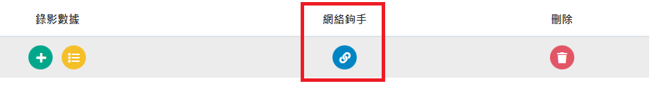

Publishing and subscribing to the channels requires credentials.

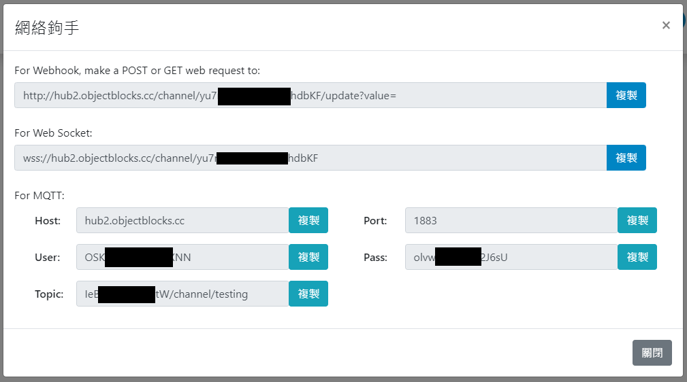

In order to visualize the data on ObjectBlocks, we need to create a dashboard.
Add a new dashboard via the menu.

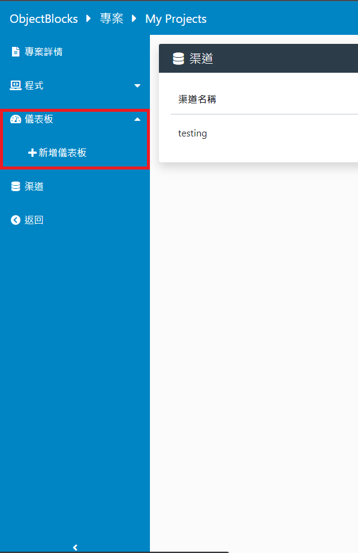

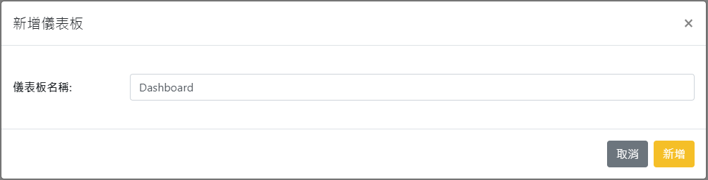

Add a tool.

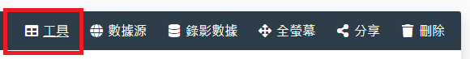

Many kinds of representations are available, for this tutorial, text will be used.

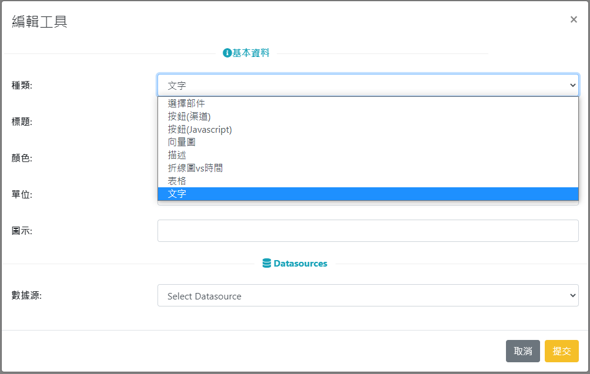

Select the channel we've just created.

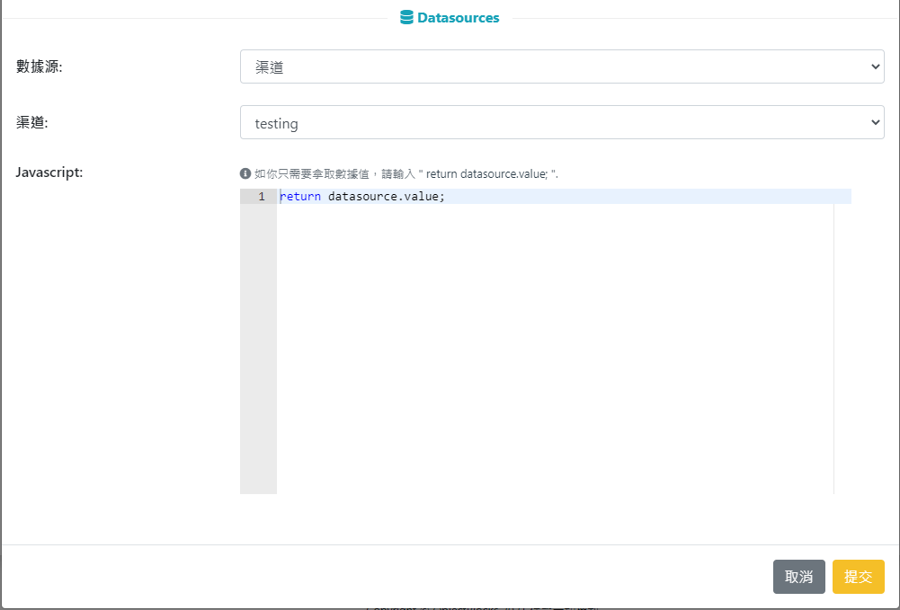

## 2. MakeCode Coding

### Import WifiBrick Extension

Search for Kittenbot and import KittenWifi.

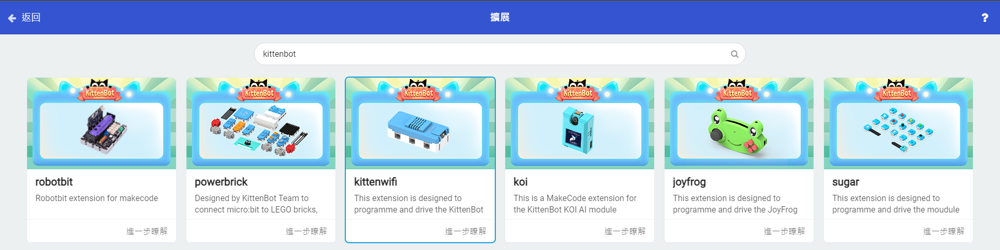

    For KOI user, import KOI.

### 1: Connecting to ObjectBlocks platform.

Fill in the authentication credentials for ObjectBlocks.

MQTT Host: hub2.objectblocks.cc
Node: Does not matter
Username: Your username(Host)
Password: Your password(Pass)

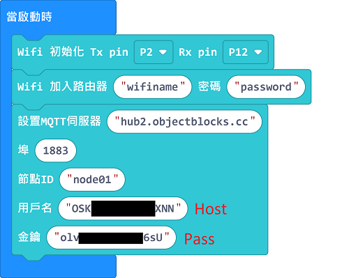

### 2: Publishing to ObjectBlocks

Copy and paste your ObjectBlocks topic into the publishing block.

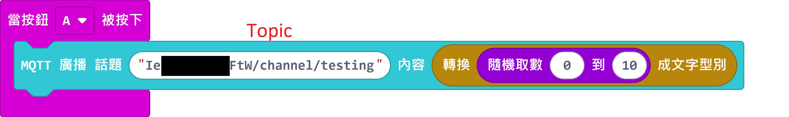

### 3: Subscribing to ObjectBlocks

Copy and paste your ObjectBlocks topic into the subscribing block.

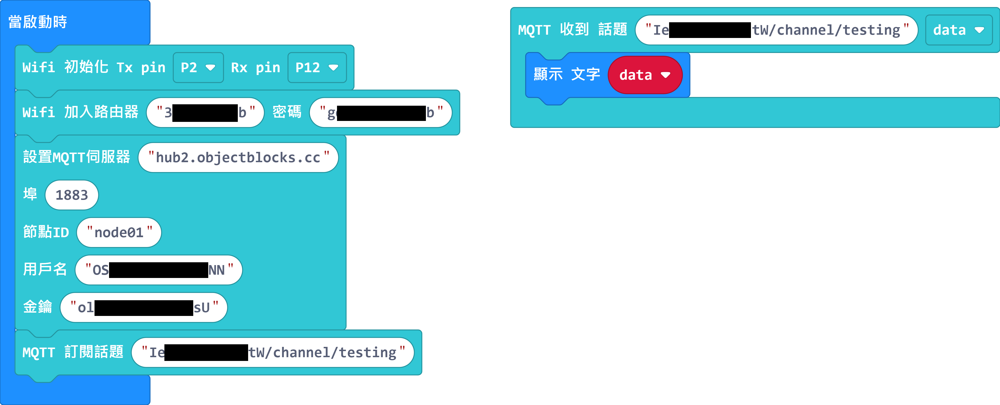

### 4. Final Program

Press A to publish a random number to ObjectBlocks, the number is shown on the Dashboard as well as the Micro:bit.

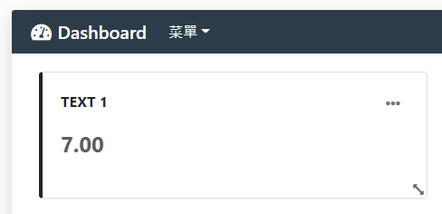

### Sample Program

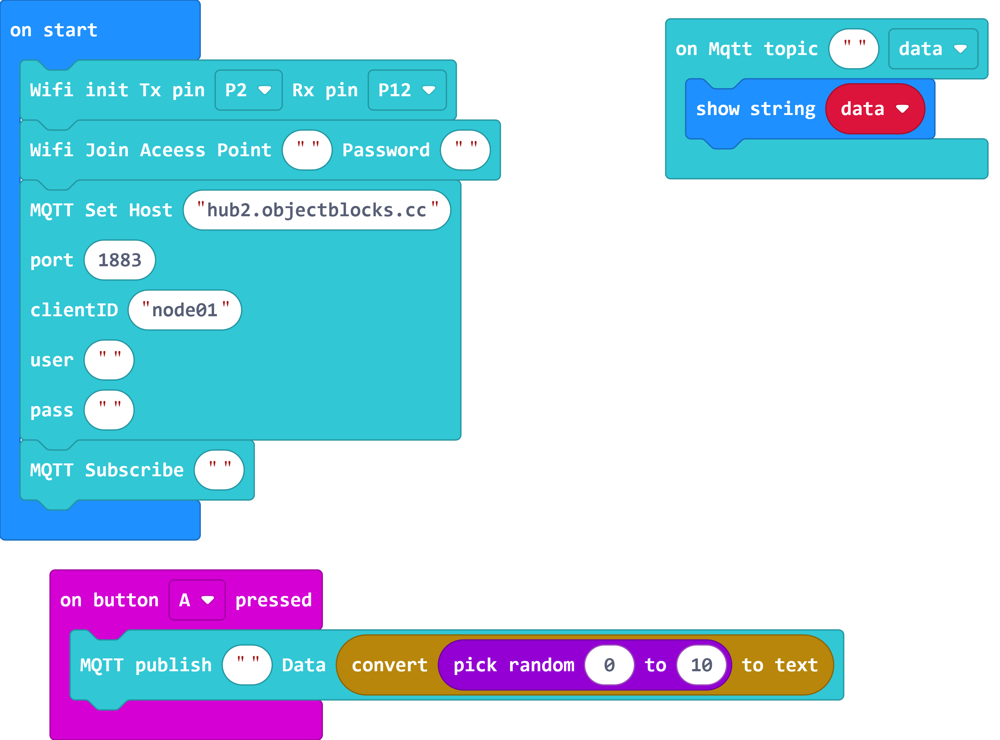

[Sample Program](https://makecode.microbit.org/_3Picjj2KRChw)
