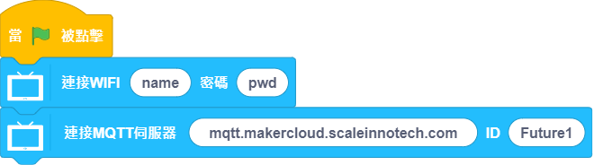
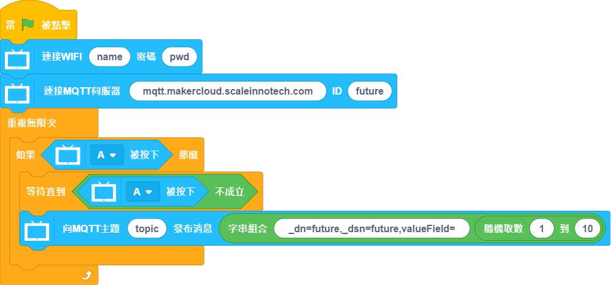
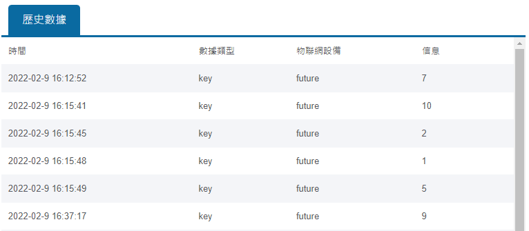
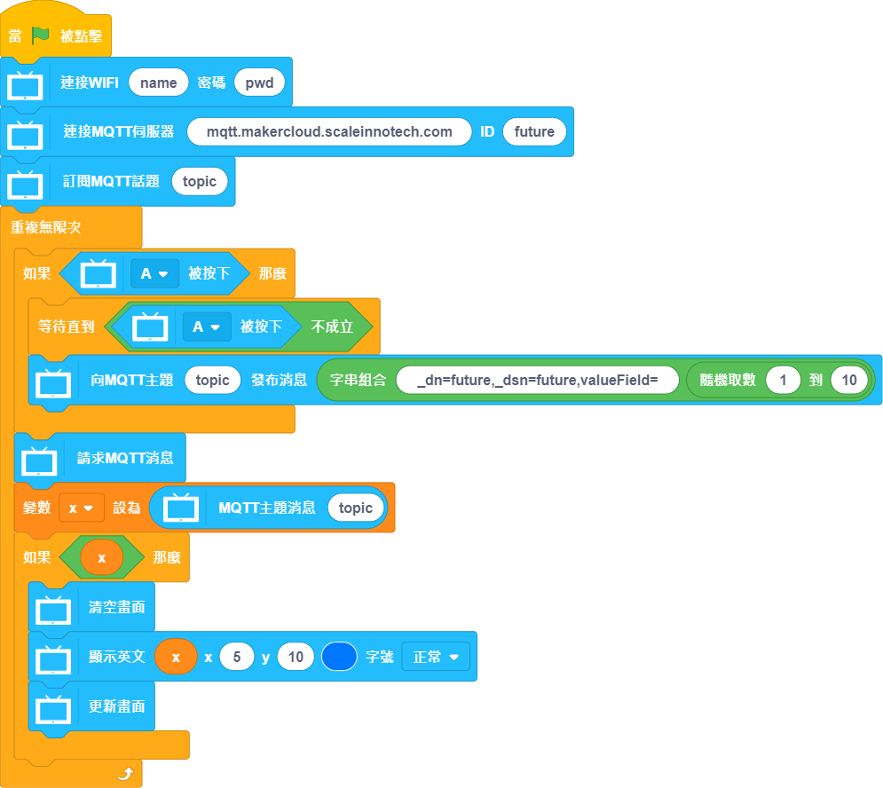
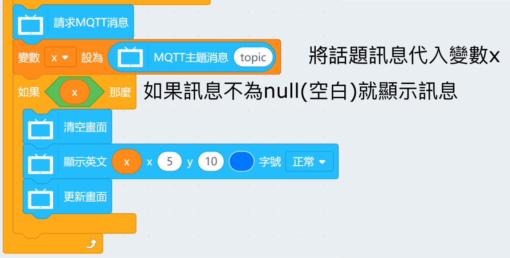
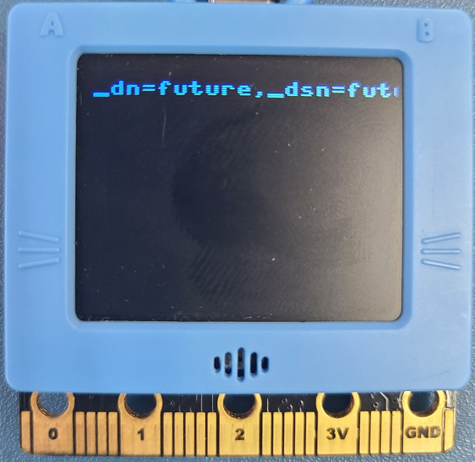
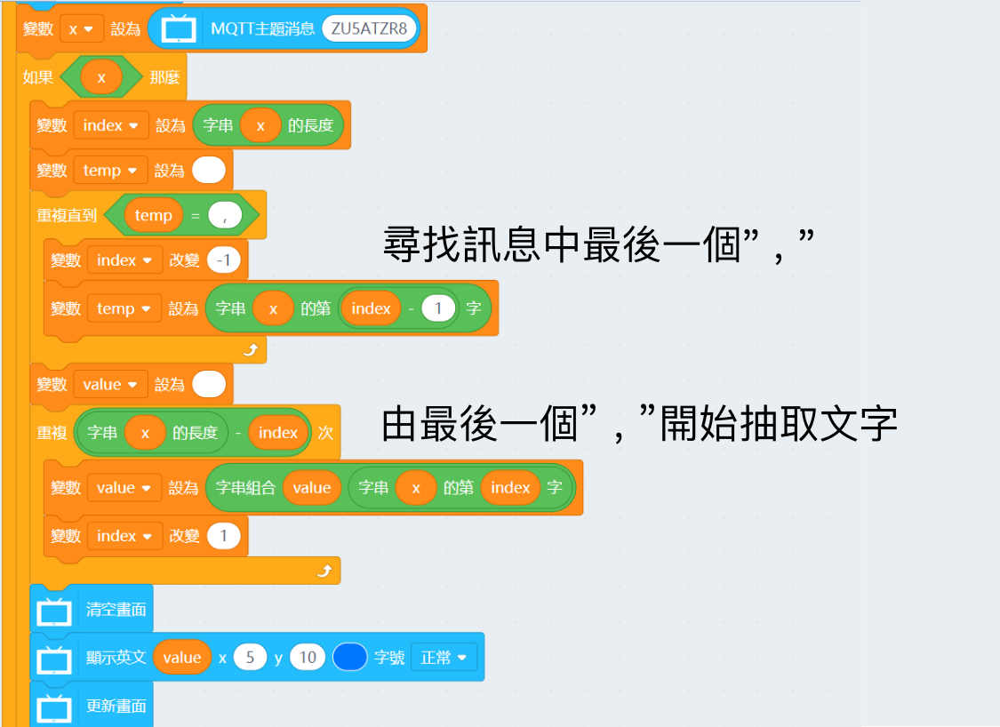
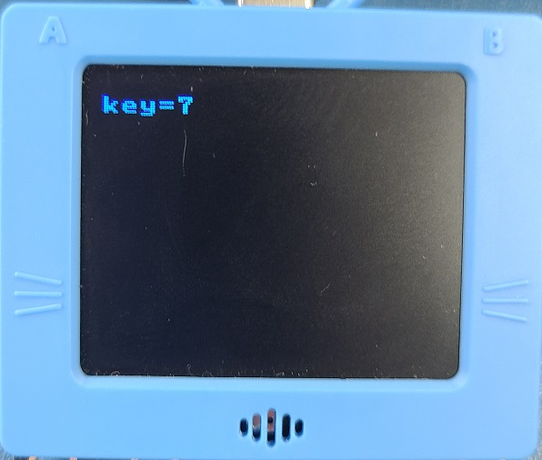
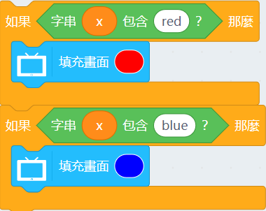

# FutureBoard and MakerCloud

## Setting Up MakerCloud

Follow the instructions to set up MakerCloud platform.

### [UsingMakerCloud](../MakeCode/makercloud.md)

## KittenBlock Programming

### Connecting to MakerCloud

Build the following program to connect to MakerCloud with the parameters.

- MQTT Host: mqtt.makercloud.scaleinnotech.com
- ID: Does not matter

### Publishing to MakerCloud topic

Build the following program to publish data to MakerCloud.

Copy the topic from MakerCloud.

The data published must follow the following format: _dn=[something],_dsn=[something],[valueField]=[DATA]

For example, if you are publishing "John "to a field called name, the data format will be "_dn=future,_dsn=future,name=John"

The published data can be seen on MakerCloud.

### Subscribing to MakerCloud topic

Build the following program to subscribe and read data from MakerCloud.

If the data contains information such as _dn, you can trim off these data with this algorithm.

Alternatively, simply use "include" to check the data.

