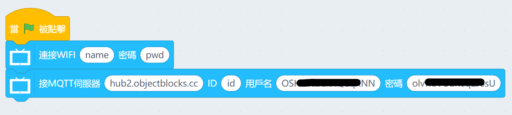
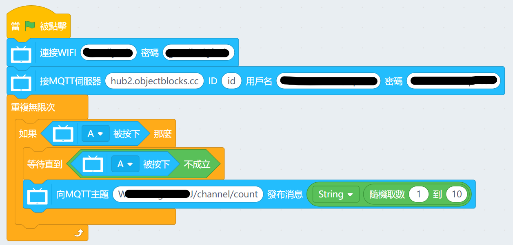
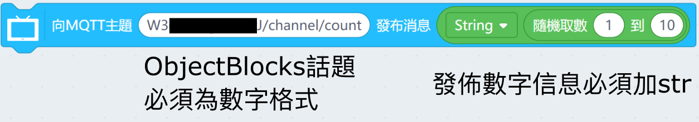
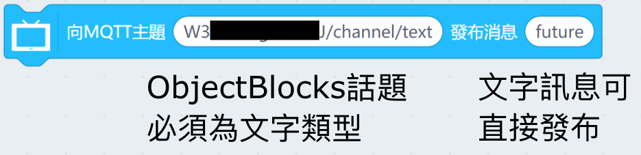
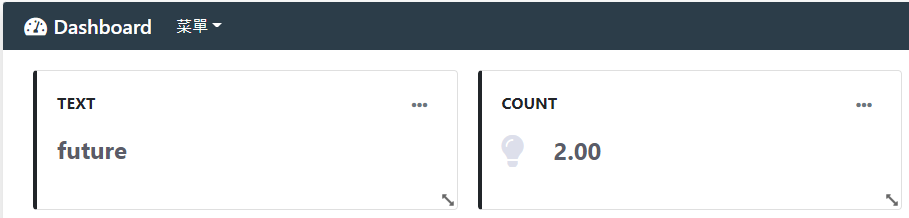
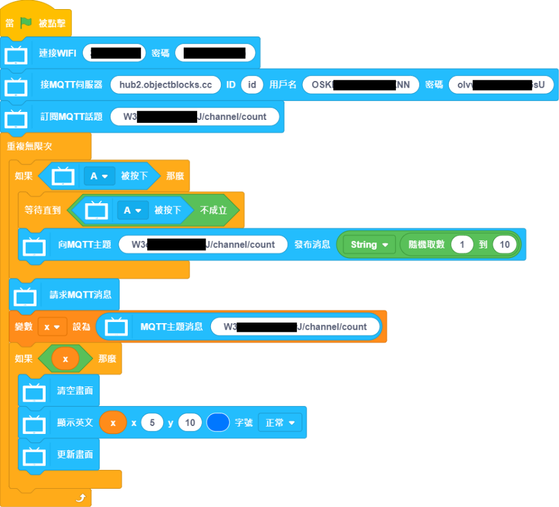
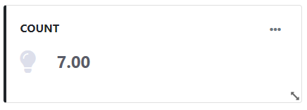
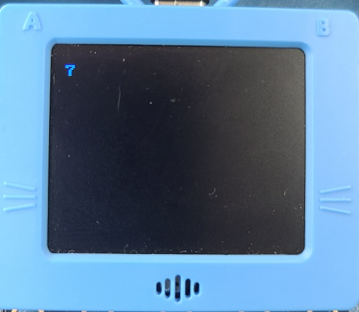

# FutureBoard and ObjectBlocks

## Setting Up ObjectBlocks

Set up ObjectBlocks by following the instructions.

### [Using ObjectBlocks](../MakeCode/objectblock.md)

## KittenBlock Programming

### Connecting to ObjectBlocks

Build the following program to connect to ObjectBlocks.

- MQTT Host: hub2.objectblocks.cc
- clientID: Does Not Matter
- username: Copy from ObjectBlocks
- password: Copy from ObjectBlocks

### Publishing to ObjectBlocks Channel

Build the following program to publish data to ObjectBlocks.

Copy and paste your topic name from ObjectBlocks.

Please note the following differences regarding text or numeric data.

Any published data will be shown on ObjectBlocks.

### Subscribing to ObjectBlocks Channel

Build the following program to read ObjectBlocks channel data.

Copy and paste your topic name from ObjectBlocks.

The data is shown on ObjectBlocks and FutureBoard.

