# FutureBoard and ThingSpeak 

ThingSpeak is free to use, however its settings may be difficult for beginners. This tutorial is suitable for complete beginners to start using ThingSpeak with FutureBoard.

## Registering a ThingSpeak Account

Follow the instructions to register for a ThingSpeak account.

[ThingSpeak Introduction](../IoTPlatform/Thinkspeak.md)

## Setting Up ThingSpeak Platform

### Create a new Channel

Create a new channel.

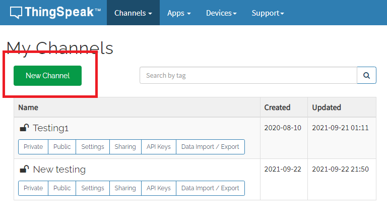

Choose a name for your channel.

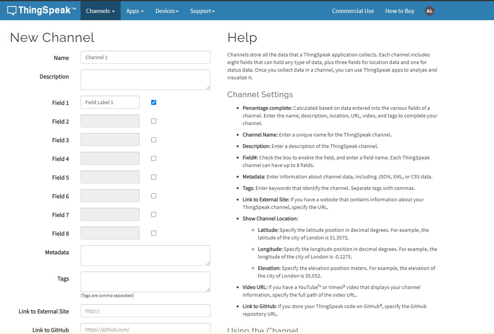

Other fields can be ignored, click Save Channel.

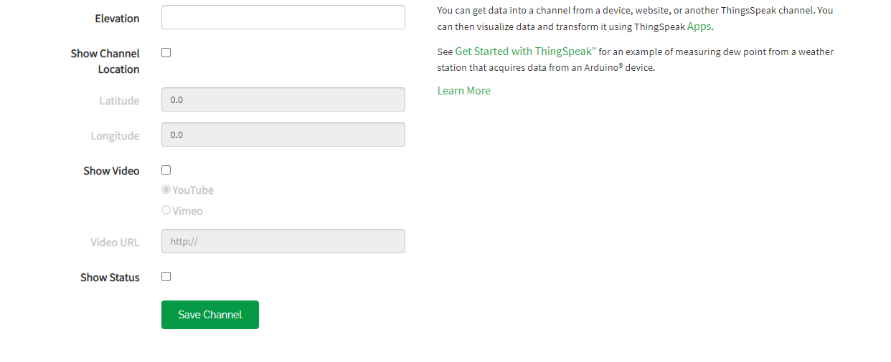

Open the Sharing tab.

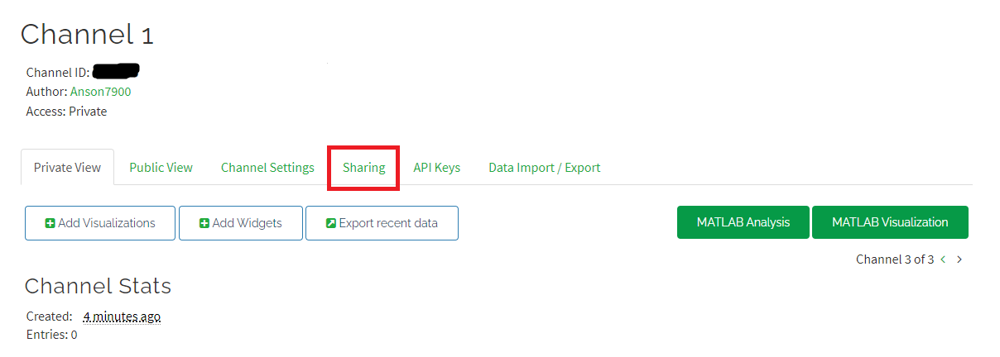

Set the sharing settings to "Share channel view with everyone".

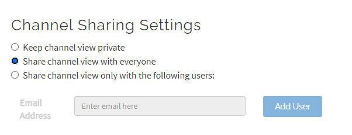

The Access with change to "Public".

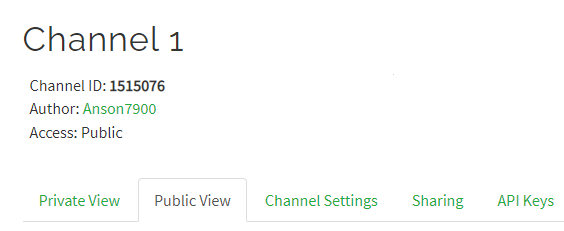

### Add a new device

Open the Devices menu, select MQTT.

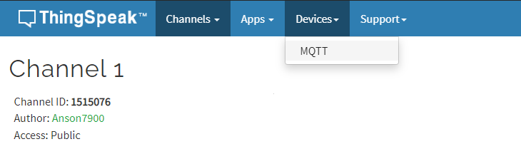

Add a new device.

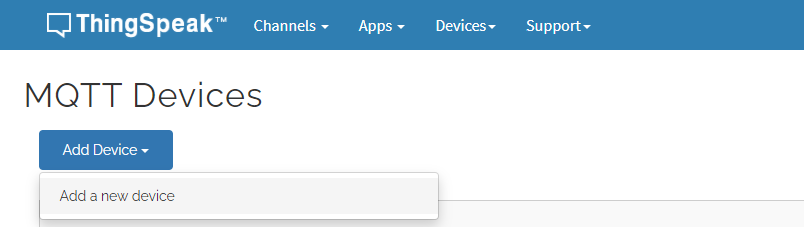

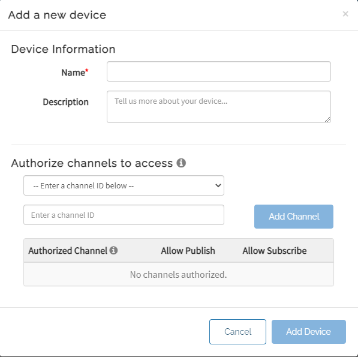

Select the channels accessible by this device and click Add Channel.

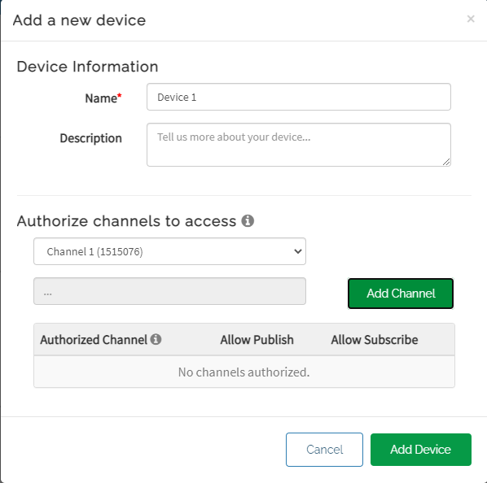

Click Add Device.

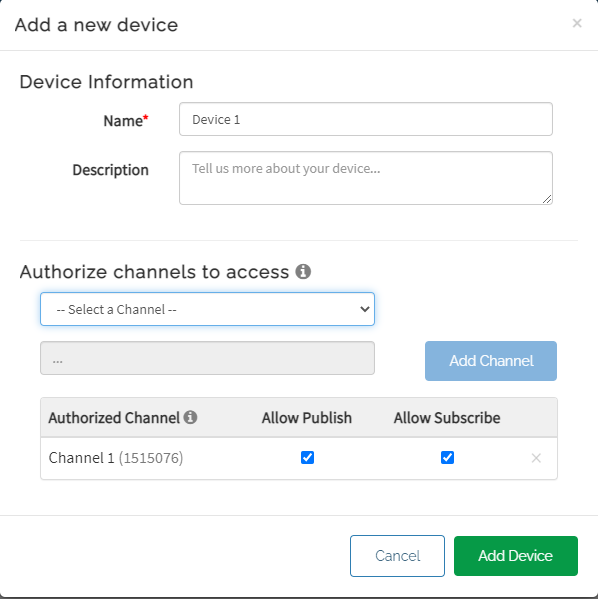

IMPORTANT! These MQTT Credentials are used for connecting to ThingSpeak! Please save or download the credentials as they can't be seen after closing this page.

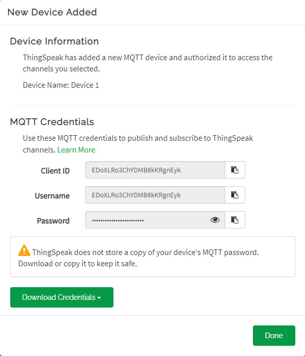

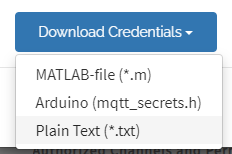

## KittenBlock Coding

KittenBlock is recommending for beginners.

### Connecting to ThingSpeak

Build the following program with the following parameters to connect to ThingSpeak.

- MQTT Host: mqtt3.thingspeak.com
- ID: ThingSpeak Device ID
- Username: ThingSpeak Device ClientID
- Password: ThingSpeak Device Password

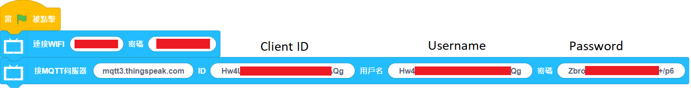

### Publishing to ThingSpeak Channel

We need the Channel ID for publishing. The channel ID is displayed on the Channel page as a 7-digit number.

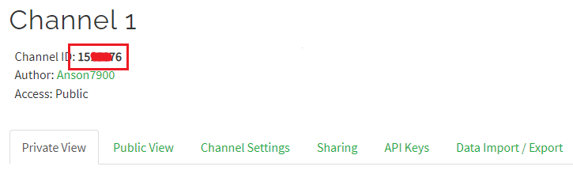

Build the following program to publish a data to ThingSpeak:

- MQTT Topic: channels/[Channel ID]/publish
- Message: field[field No.]=[Numeric Data]

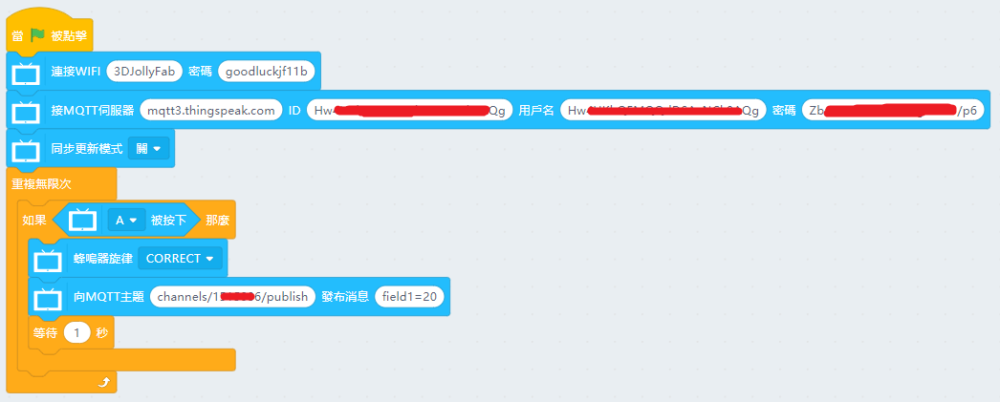

On the ThingSpeak page, you can see the published data.

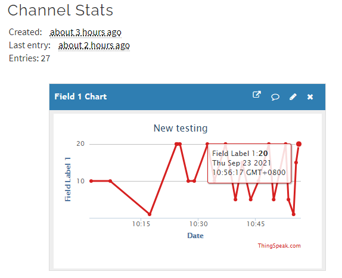

### Subscribing to ThingSpeak Channel

We can read the channel data by subscribing to the channel.

- MQTT Topic: channels/[Channel ID]/subscribe/fields/field[field No.]

Press A to publish a message to the channel, FutureBoard will display the data received.

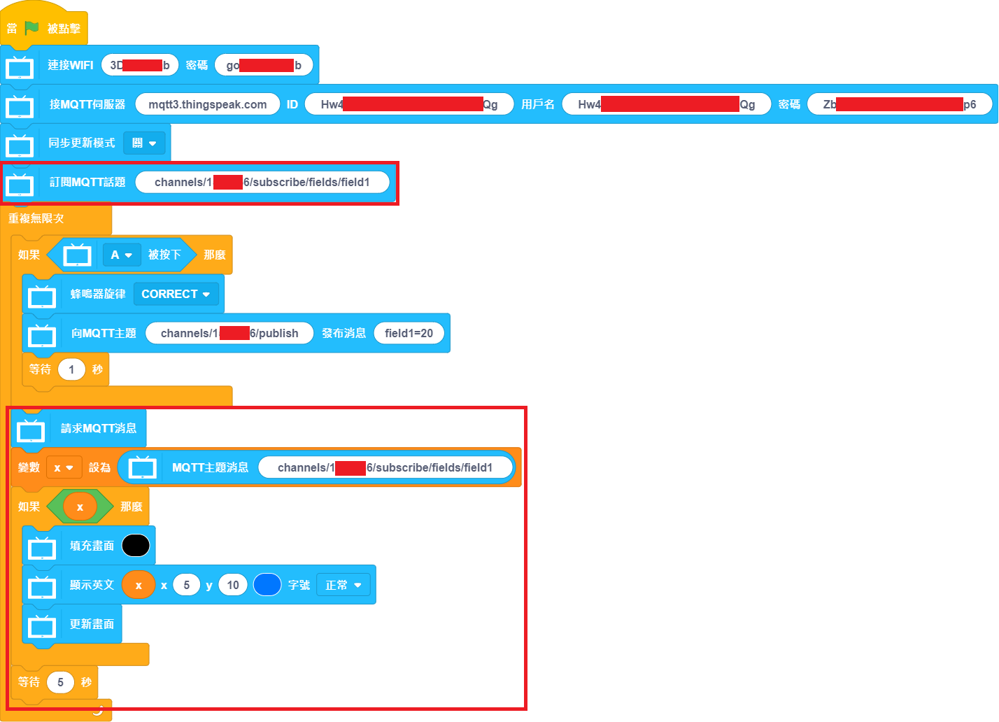