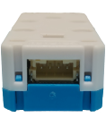
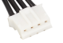
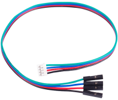
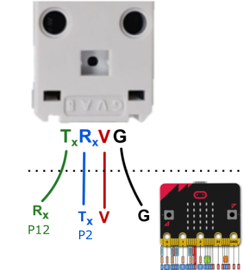

# Wifibrick

Wifibrick (HKBM8012O)

## Introduction

Wifibrick is an expansion module for Kittenbot's Powerbrick.

As the name suggests, this module provides a method for Micro:bit to connect to the internet, allowing it to connect to various IoT platforms such as ThingSpeak, MakerCloud or OneNet.

 

Appearance-wise, it is largely identical to the Temperature and Humidity Module, with the exception of a logo printed on the Wifibrick.

 

## Specifications	

- Voltage: 3.3-5V  
- Current: ~65mA
- Dimensions: 56 (L) x 25 (W) x 20 (H)
- Connector: 4Pin PH2.0
- Supports STA/AP/STA+AP
- Supports Smart Config

 

## Special Features	

- Micro:bit compatible Wifi modules are rare in the market, therefore Kittenbot has developed the firmware and MakeCode extension.

- With a built-in indicator LED, connection status can be read.

- The PH2.0 Cable prevents incorrect connection.

     

- Lego Pin connectors are installed into the sides and the back of the module, making it very easy to integrate into different models.

     

## Pin out Explaination

On the back of the WifiBrick, the pin out is labelled as G, V, A, B.

 

The functions of the 4 pins are as follows:

 

Tx = Transmit(*Tx*) Data

Rx = Receive(*Rx*) Data

## Connecting the module

 

There are numerous ways to connect the Wifibrick to a Micro:bit, it is recommended to use Kittenbot's expansion boards.

Details are as follows:

### Armourbit

Armourbit is an expansion box designed for Micro:bit. Wifibrick can be connected to Armourbit using a 4Pin cable.

 

[Armourbit Details](../functional_module/PWmodules/Armourbit)

The 2 ends of the cable are both PH2.0.

 

Connect Wifibrick to the Port 1(Requires turning off the buzzer) to Port 4 of the Armourbit using the cable.

In this figure, Port 2 is used, this corresponds to P1 and P12 of the Micro:bit.

Wiring Details:

In MakeCode programming, choose Armourbit Port.

### Robotbit Edu

[Robotbit Edu](../../Microbit_eboard/Robotbit_edu/robotbitedu.md)

Using a PH2.0 to Dupont Cable, connect the Dupont pins to the Serial Port on Robotbit Edu.

 

In this figure, Pin 2 and Pin 12 is used.

Select P2 as Tx and P12 as Rx in MakeCode programming.

Wiring Details:

 

### Robotbit 2.2

Robotbit is a popular Micro:bit expansion board by Kittenbot, it supports a wide variety of modules including Wifibrick.

[Robotbit Details](../Microbit_eboard/Robotbit/Robotbitfull)

Using a PH2.0 to Dupont Cable, connect the Dupont pins to G, V and 2 signal pins on the Robotbit.

 

In this figure, Pin 2 and Pin 12 is used.

Select P2 as Tx and P12 as Rx in MakeCode programming.

Wiring Details:

 

### IoBit

IoBit is a basic Micro:bit extension board by Kittenbot, Wifibrick is supported on this board.

The connection method is identical to Robotbit. Using a PH2.0 to Dupont Cable, connect the Dupont pins to G, V and 2 signal pins on the IoBit.

In this figure, Pin 2 and Pin 12 is used.

 

## Programming Tutorials

WifiBrick Programming Tutorials for different platforms are available in the following segment.

[MakeCode Programming](../MakeCode/index.rst)

## WifiBrick Indicator

1. The Red light turns on when Wifibrick is powered on.

2. A Blue light will flash when connecting to the WiFi.

3. All lights will turn off when the above is done.

4. A green light turns on when it is connected to the MQTT platform.

