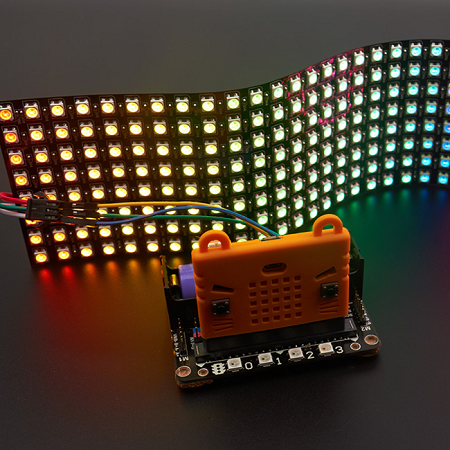
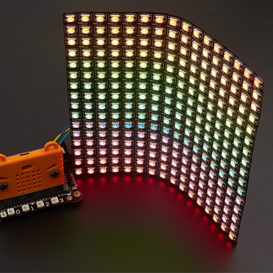
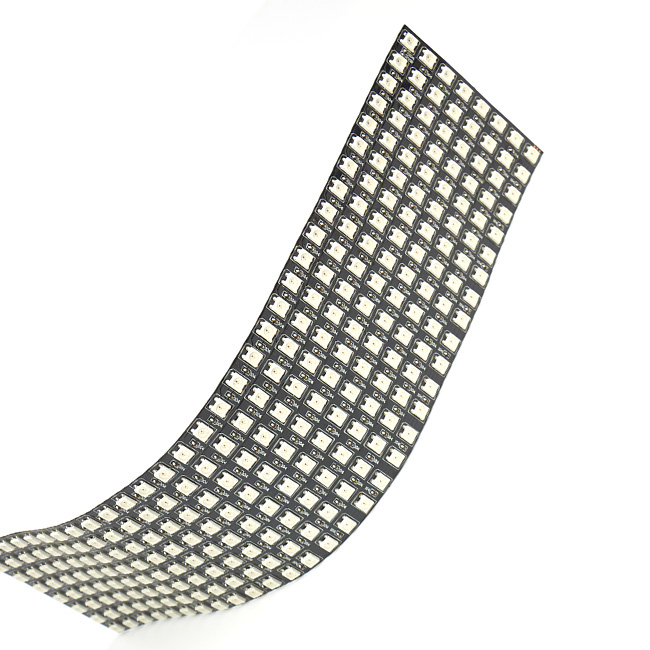
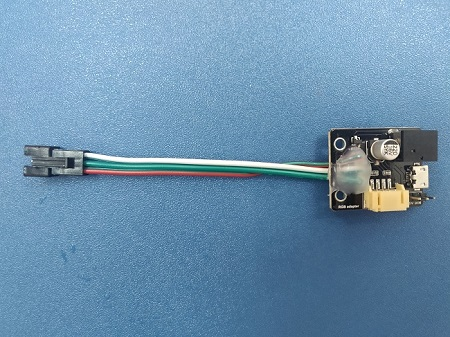
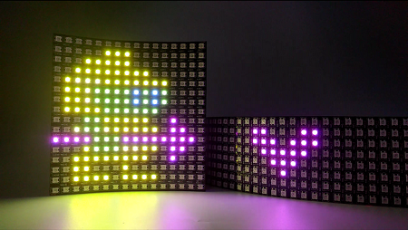

# RGB LED Screen

08x32RGB LED Screen (HKBM8008A) / 16x16RGB LED Screen (HKBM8009A)

## Product Description

This is a soft screen with RGB LEDs, it is easily portable and fexible. Graphical programming is possible with our official extension.

## Product Feautures

- Graphical Programming Interface
- Modularity, supports daisy chaining of multiple screens
- Can be powered externally
- Lightweight
- Flexibility

## Product Information
 
__8x32 RGB LED Screen(HKBM8008A)__

- Dimensions：320mm x 80mm x2mm
- Weight：55g
- Material：Soft copper
- 256 RGB LEDs

__16x16 RGB LED Screen(HKBM8009A)__

- Dimensions：160mm x 160mm x2mm
- Weight：55g
- Material：Soft copper
- 256 RGB LEDs

## Contents：

### 1xRGB LED Screen(16x16 or 32x8)

### 1xAdapter

Each LED screen comes with an adapter. The adpater helps you connect the screen with the Robotbit by providing dupont cables and a 5V USB power input. For prolonged usage, the power connector can replace the 18650 Li-ion battery on the robotbit, sustaining a stable power supply without damaging the Robotbit.

## Product Showcase

## Specifications 

- Voltage：5V
- Current：1A, USB power is recommended for prolonged use
- Wattage: 0.3W
- Material：Soft copper
- Brightness gradient：256
- Lumen：120

