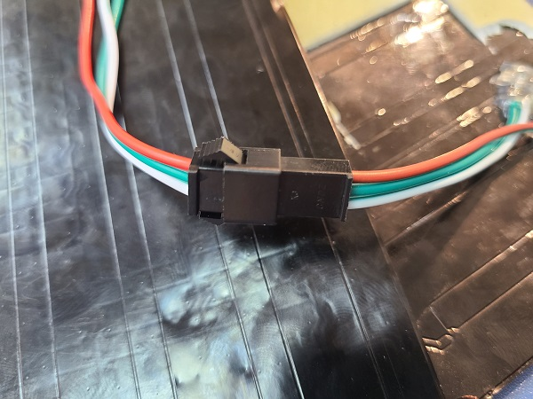
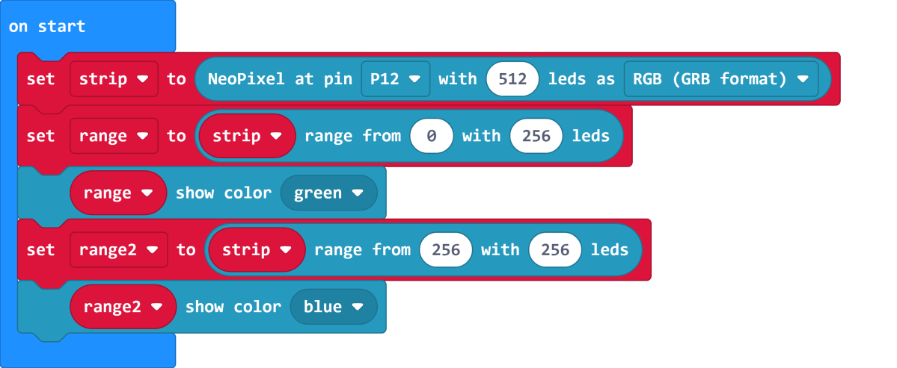
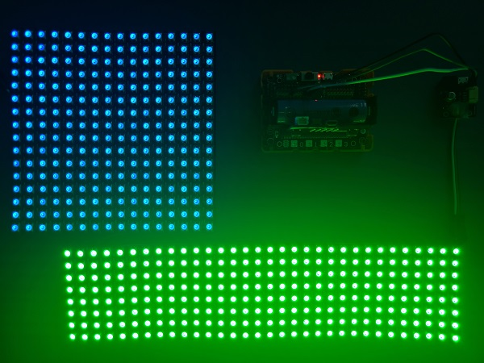
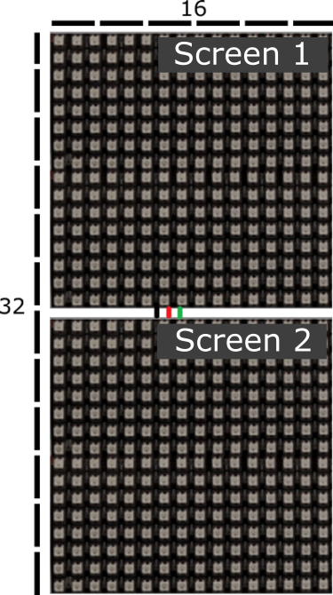
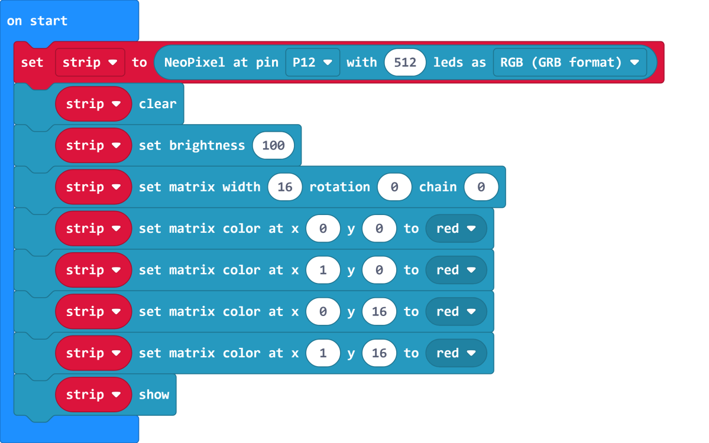
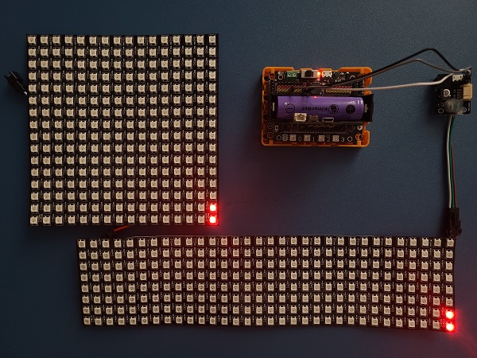
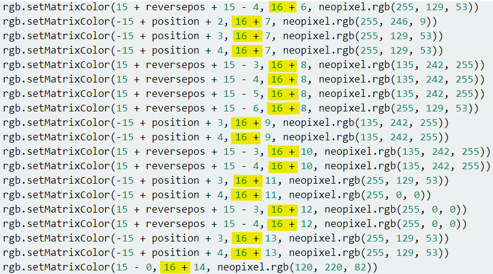

# RGB LED Screen Daisy Chaining

The LED Screens can be chained together to create a larger screen.

## Daisy Chaining

### Wiring

Connect the dout(male)of screen 1 to the din(female) of screen 2

    It is not recommended to connect 2 screens of different types as the calculations may become difficult.
    
### Coding Tutorial

#### Load the NeoPixel extension.

Initialize the screen with the total number of LEDs(256x2=512).

Pixels 0-255 and 256-511 control screen 1 and screen 2 respectively.

[Sample Code Download](https://bit.ly/LEDMatrixT3_06Hex)

[Sample Code Link](https://makecode.microbit.org/_W6eTxHa4cEj5)

### Daisy Chaining and Matrices

Daisy Chaining can be used alongside matrices. We initialize a matrix with the width of 1 screen.

Using 2 16x16 screens, a 16x32 matrix can be created.

Lighting up the first 2 LEDs of each screen.

    Y=0 and Y=16 refer to the first rows of each screen.       
    When rotation is 0 or 2, the 2nd screen extends the Y axis. When rotation is 1, the 2nd screen extends the X axis.

[Sample Code Download](https://bit.ly/LEDMatrixT3_07Hex)

[Sample Code Link](https://makecode.microbit.org/_ipJh3qVgdbtr)

## Daisy Chaining and Animations

Please reference "16x16 RGB LED Screen - Dynamic Effects Tutorial" for details on how to create animations.

[16x16 RGB LED Screen - Dynamic Effects Tutorial](./LEDMatrixNeoMatrix3.md)

The logic is similar to this tutorial, we just change Y to control the 2nd screen.

Example: We add 16 to Y to control the animation on the 2nd screen.

The order of frames may require changing if there are multiple frames.

    Example: When playing an animation with 2 frames on a daisy chain with 2 screens, the order of frames in screen 1 is frame 1-> frame 2. but the order of frames in screen 2 is frame 2-> frame 1.

[Sample Code Download](https://bit.ly/LEDMatrixT4_03Hex)

[Sample Code Link](https://makecode.microbit.org/_8Xy2mWWLoDtg)

## Extension Version and Updates

There may be updates to extensions periodically, please refer to the following link to update/downgrade your extension.

[Makecode Extension Update](../../../Makecode/makecode_extensionUpdate)

## FAQ

Q: Why is red the only colour lit up when I try to use different colours?

A: There is not enough power.

Solution: Reduce brightness or turn on the power on the Robotbit, or connect to a USB power.

## Precautions

- Do not connect a power supply with a voltage higher than 5V.
- Connect to a USB power supply when for prolonged use.
- Lower the brighness when a lot of LEDs are lit.
- This product is suitable for users aged over 14, children aged 8-14 need to be under the supervision of an adult when using this product.
- Please refer to Kittenbot's official guidelines before using, wiring must follow the guidelines, do not use a high power servo or motor when using this product.
- To avoid short circuiting, do not put this product on conductive surfaces such as metal.
- To avoid short circuiting, do not put this product in water.
- Do not touch the exposed wires with bare hands.

