# RGB LED Screen - Static Effects Tutorial

This tutorial is about programming the RGB LED Screen to display static text or icons.

## Wiring

RGB LED Screen is used with the Robotbit, please refer to the following figures. 

### 1. Connect the screen to the adapter.

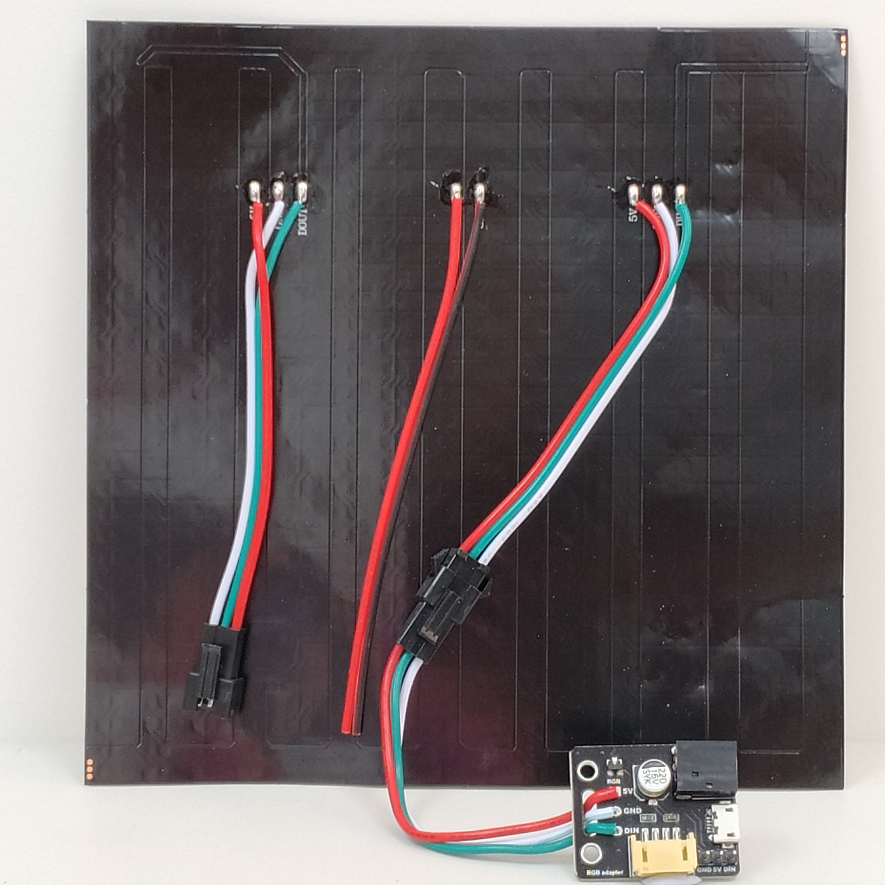

### 2. Connect the adapter to Robotbit。

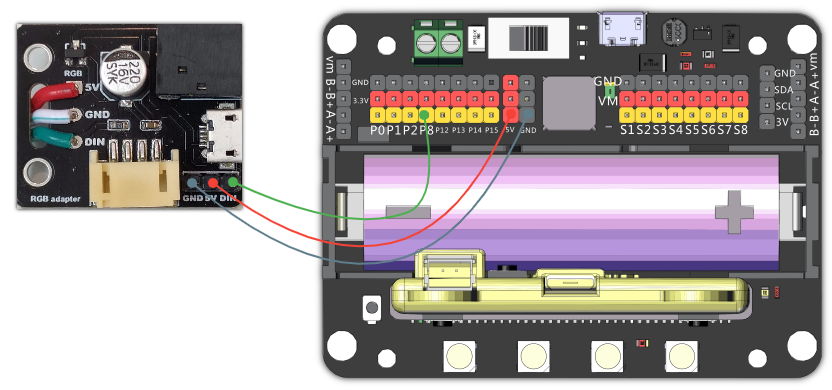

### 3. For prolonged use, connect a USB power.

As power is delivered via USB, you don't have to use the 5V pin on the adapter.

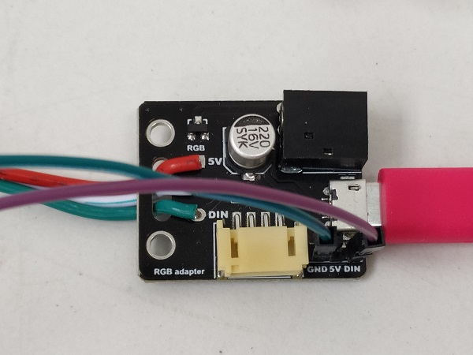

### 4. Demonstration of wiring

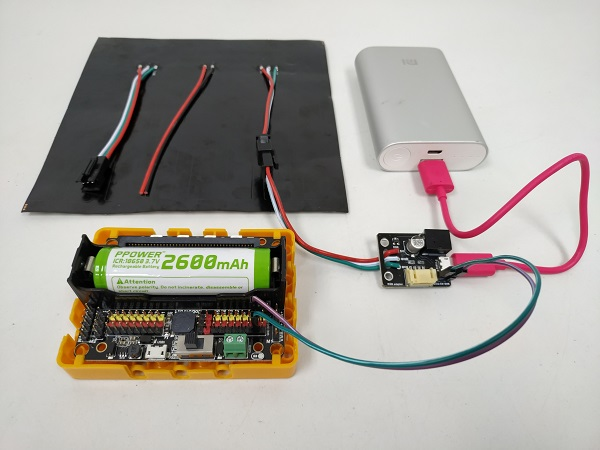

## Makecode Coding Tutorial (Only for Offline Version of MakeCode)

It is troublesome to display text or images using NeoPixel, therefore Kittenbot has developed NeoMatrix to make it easy for users.

#### (This plugin is only supported in offline MakeCode)

Download Kittenbot's MakeCode：https://www.kittenbot.cn/software
 
### 1. Load NeoMatrix Extension

NeoMatrix Extension: https://github.com/KittenBot/pxt-neomatrix

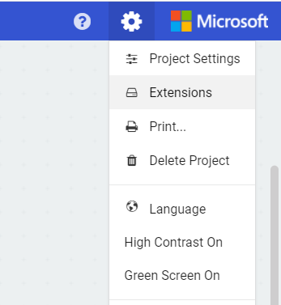 

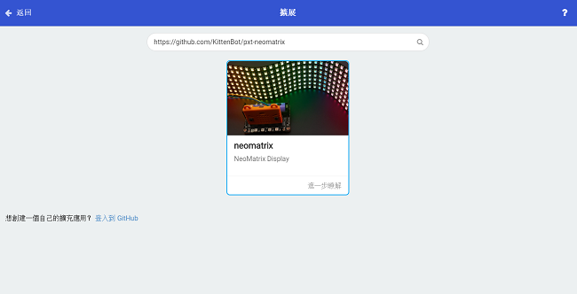 

#### NeoMatrix blocks:

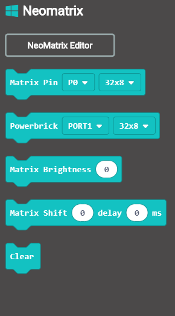

    Warning! This is incompatible with Powerbrick extension, only use Robotbit.
    Powerbrick only supports the included RGB module.

### 2. Enter NeoMatrix Editor

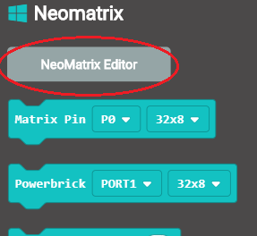

Choose type of screen.（16x16/8x32）

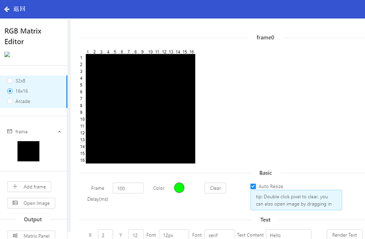

Enter text in the Text Content Box, and then click Render Text.

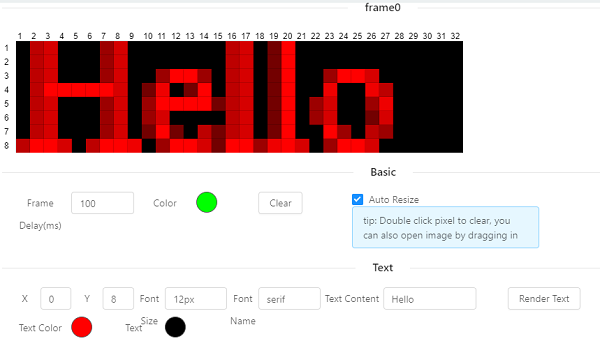

Draw by filling the squares. (Click to color, double click to clear.)

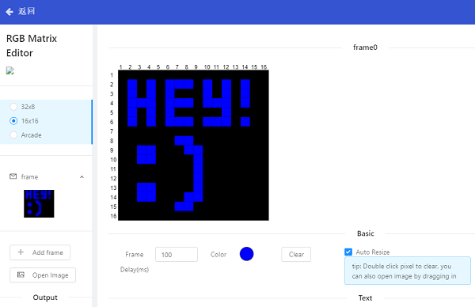

Add another frame by clicking Add Frame.

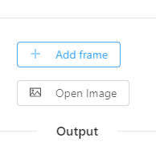

Auto-generate pattern by clicking Open Image.

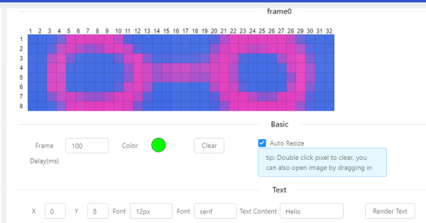

Finish your frames then click Matrix Panel in Output column to generate the blocks.

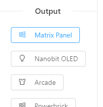

Return to MakeCode Editor, a block called Show Frame will appear.

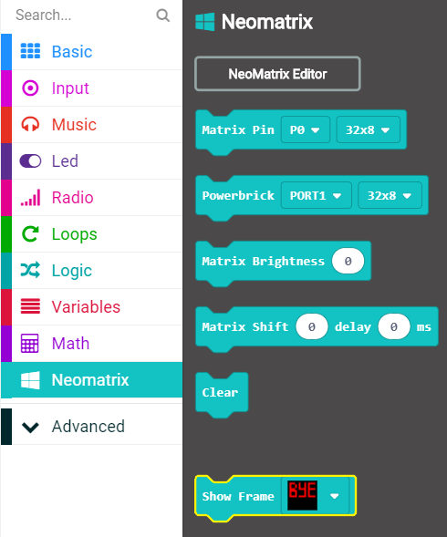

### 3. Coding

Toggle between frames every 500ms.

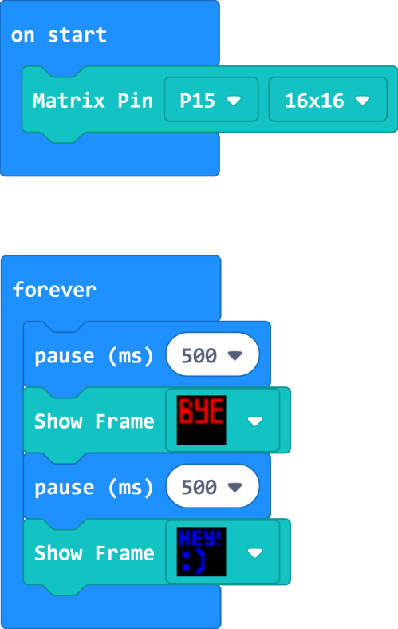

    Use the PowerBrick block if you are using the RGB module in PowerBrick.

[Sample Code Download](https://bit.ly/LEDMatrixT2_01Hex)

[Sample Code Link](https://makecode.microbit.org/_02iY5iJkJfy2)

## Extension Version and Updates

There may be updates to extensions periodically, please refer to the following link to update/downgrade your extension.

[Makecode Extension Update](../../../Makecode/makecode_extensionUpdate)

## FAQ

Q: Why is red the only colour lit up when I try to use different colours?

A: There is not enough power.

Solution: Reduce brightness or turn on the power on the Robotbit, or connect to a USB power.

## Precautions

- Do not connect a power supply with a voltage higher than 5V.
- Connect to a USB power supply when for prolonged use.
- Lower the brighness when a lot of LEDs are lit.
- This product is suitable for users aged over 14, children aged 8-14 need to be under the supervision of an adult when using this product.
- Please refer to Kittenbot's official guidelines before using, wiring must follow the guidelines, do not use a high power servo or motor when using this product.
- To avoid short circuiting, do not put this product on conductive surfaces such as metal.
- To avoid short circuiting, do not put this product in water.
- Do not touch the exposed wires with bare hands.