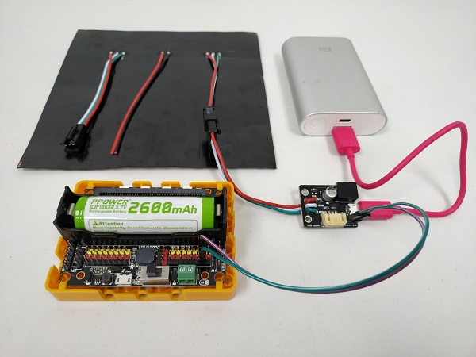
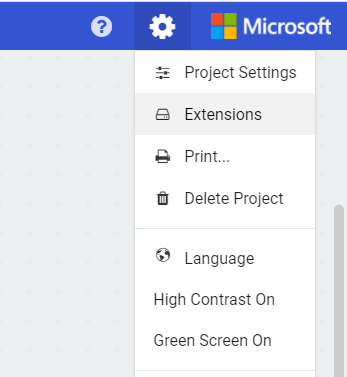

# 16x16 RGB LED Screen - Dynamic Effects Tutorial 

As of currently, NeoMatrix does not support animations for 16x16 RGB LED Screens.

This tutorial is about **MANUALLY** programming the RGB LED Screen to display animated text or icons.

## Wiring

RGB LED Screen is used with the Robotbit, please refer to the following figures. 

### 1. Connect the screen to the adapter.

### 2. Connect the adapter to Robotbit。

### 3. For prolonged use, connect a USB power.

As power is delivered via USB, you don't have to use the 5V pin on the adapter.

### 4. Demonstration of wiring

## Advanced MakeCode Tutorial

1. Load the Robotbit extension.

 

 

2. Open NeoMatrix Editor in your browser

    ### [NeoMatrix Editor](https://kittenbot.github.io/pxt-neomatrix/index.html)
    

    Do not load the NeoMatrix extension.

### Animation with single frame

#### Coding tutorial

Initialize the screen as a matrix.

    Refer to the following link for tutorial on RGB LED Screen and Matrices.
    
[RGB LED Screen and Matrices](./LEDMatrixT3.md)

    Setting the variable name to rgb aids our operations later on.

Add a function.

For now, the function just need to contain these blocks.

Switch to NeoMatrix Editor and create your pattern.

Select MakeCode JS Code. 

Copy the JavaScript code from rgb.clear() to rgb.show().

        
Switch to JavaScript mode in MakeCode.

Navigate to the function we created.

Paste our code between strip.clear() and basic.pause().

Manually check the value of Y. If Y is an even number, minus X from the width of matrix.

    Computer count from 0, so 15 is the width of the matrix.
    The RGB Module is Powerbrick is wired differently and does not require this modification.

Modify all values.

Add 2 variables for controlling the animation.

    Since the direction of X changes each row, we need 2 variables to control the direction, 1 to represent forwards and 1 to represent backwards.
    This tutorial is about horizontal movement, for vertical movement please refer to the logic given and modify your code accordingly.

Add the following blocks.

Switch into JavaScript mode and check Y. If Y is an odd number, add position+ to X, else add reversepos+ to X.

Change all values and it is done.

[Sample Code Download](https://bit.ly/LEDMatrixT4_01Hex)

[Sample Code Link](https://makecode.microbit.org/_dtwYPt8zvXEp)

### Animation with multiple frames

#### Coding Tutorial

Using the code from above, create the second frame in NeoMatrix Editor.

Paste the JavaScript code after the code for 1st frame and change X with the same logic.

Add an offset to X for the 2nd frame. -15 when Y is odd, +15 if otherwise.

    With the offset, the 2nd frame appears outside of the matrix, as the position changes, the frame moves into the RGB Screen.
    The offset is calculated by multiplying the number of frames by the width of matrix. Since 1 frame is added, the offset is 15(15x1=15).

Switch back to blocks editor, change the point of where the animation resets.

    The reset point and restarting position may change for your pattern.
    Here, the reset point is set to 24, the restarting position is set to -8. Which means the animation moves 32 pixels before resetting(the total width of the 2 frames).
    Lowering the reset point results in an earlier end to the animation, and vice versa.
    Restarting position is usually set to below 0, this is just to create the effect that the frame is moving into the matrix.

And it is done.

[Sample Code Download](https://bit.ly/LEDMatrixT4_02Hex)

[Sample Code Link](https://makecode.microbit.org/_AxqhpeafJ8jv)

## Extension Version and Updates

There may be updates to extensions periodically, please refer to the following link to update/downgrade your extension.

[Makecode Extension Update](../../../Makecode/makecode_extensionUpdate)

## FAQ

Q: Why is red the only colour lit up when I try to use different colours?

A: There is not enough power.

Solution: Reduce brightness or turn on the power on the Robotbit, or connect to a USB power.

## Precautions

- Do not connect a power supply with a voltage higher than 5V.
- Connect to a USB power supply when for prolonged use.
- Lower the brighness when a lot of LEDs are lit.
- This product is suitable for users aged over 14, children aged 8-14 need to be under the supervision of an adult when using this product.
- Please refer to Kittenbot's official guidelines before using, wiring must follow the guidelines, do not use a high power servo or motor when using this product.
- To avoid short circuiting, do not put this product on conductive surfaces such as metal.
- To avoid short circuiting, do not put this product in water.
- Do not touch the exposed wires with bare hands.