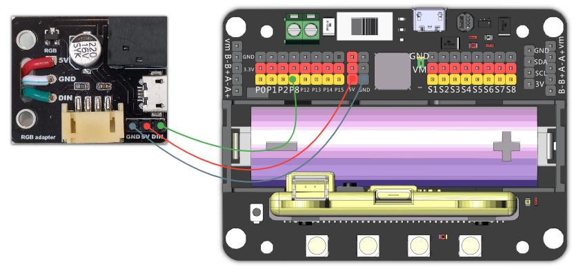

# RGB LED Screen - Neopixel Tutorial

This tutorial is about programming the RGB LED Screen using the Neopixel extension.

Effects such as lighting up the whole screen with single or multiple colours, lighting up just a range or marquee effects.

## Wiring

RGB LED Screen is used with the Robotbit, please refer to the following figures. 

### 1. Connect the screen to the adapter.

### 2. Connect the adapter to Robotbit。

### 3. For prolonged use, connect a USB power.

As power is delivered via USB, you don't have to use the 5V pin on the adapter.

### 4. Demonstration of wiring

### LED arrangement：

The LEDs on the screen are wired in a zig zag pattern in to a rectangle, please refer to the following figures.

#### 8x32 screen

#### 16x16 screen

## Makecode Coding Tutorial

#### Load the Robotbit extension.

 

 

#### Neopixel blocks:

 

### LED Screen Initialization:

    Since there are 256 LEDs on the screen, we initialize a light strip with 256 LEDs.

### Lighting up the whole screen.

We can light up the screen with a single colour.

    You can select a colour from the presets.
    

[Sample Code Download](https://bit.ly/LEDMatrixT1_01Hex)

[Sample Code Link](https://makecode.microbit.org/_XDpRDjarw5cH)

### Rainbow Effect

We can apply a rainbow effect to the screen.

    Rainbow effect uses the HSL format.
    Showing multiple colours require more power, you may need to connect the external power.
    

[Sample Code Download](https://bit.ly/LEDMatrixT1_02Hex)

[Sample Code Link](https://makecode.microbit.org/_Kj80s46jqCju)

### Adjusting brightness

It is recommended to lower the brightness to reduce the current and to avoid damage to our eyes.

    
    The brightness value ranges from 0 to 255.
    Since the current is reduced, there is no need for external power.

[Sample Code Download](https://bit.ly/LEDMatrixT1_03Hex)

[Sample Code Link](https://makecode.microbit.org/_2diVmMKc4ThV)
    
### Lighting up a single LED

Each LED can be individualy controlled.

    The effect only shows after using show.
    

[Sample Code Download](https://bit.ly/LEDMatrixT1_04Hex)

[Sample Code Link](https://makecode.microbit.org/_AsPV8k5RqTbR)
  
### Marquee effect
   
Pixels can move when we use a marquee effect, there are two modes in Marquee, shift or rotate.

    Effects are only shown after refreshing.

### Shift mode

    In shift mode, the animation ends after the pixel reaches the end.

[Sample Code Download](https://bit.ly/LEDMatrixT1_05Hex)

[Sample Code Link](https://makecode.microbit.org/_J0hJf2AmrUsY)
  
#### Rotate mode

    In rotate mode, the animation restarts after the pixel reaches the end.

[Sample Code Download](https://bit.ly/LEDMatrixT1_06Hex)

[Sample Code Link](https://makecode.microbit.org/_RACcp4VzPD21)
    
### Selecting a range

We can control a range of LEDs.

    Selecting 4 LEDs starting from pixel 10. (10, 11, 12 ,13)
    

[Sample Code Download](https://bit.ly/LEDMatrixT1_07Hex)

[Sample Code Link](https://makecode.microbit.org/_FTRb2M4hm2Ke)

### Customizing Colour

We can customize colours using RGB or HSV format.

    

[Sample Code Download](https://bit.ly/LEDMatrixT1_08Hex) 

[Sample Code Link](https://makecode.microbit.org/_KirTzVa9JX6q)

## Extension Version and Updates

There may be updates to extensions periodically, please refer to the following link to update/downgrade your extension.

[Makecode Extension Update](../../../Makecode/makecode_extensionUpdate)

## FAQ

Q: Why is red the only colour lit up when I try to use different colours?

A: There is not enough power.

Solution: Reduce brightness or turn on the power on the Robotbit, or connect to a USB power.

## Precautions

- Do not connect a power supply with a voltage higher than 5V.
- Connect to a USB power supply when for prolonged use.
- Lower the brighness when a lot of LEDs are lit.
- This product is suitable for users aged over 14, children aged 8-14 need to be under the supervision of an adult when using this product.
- Please refer to Kittenbot's official guidelines before using, wiring must follow the guidelines, do not use a high power servo or motor when using this product.
- To avoid short circuiting, do not put this product on conductive surfaces such as metal.
- To avoid short circuiting, do not put this product in water.
- Do not touch the exposed wires with bare hands.

