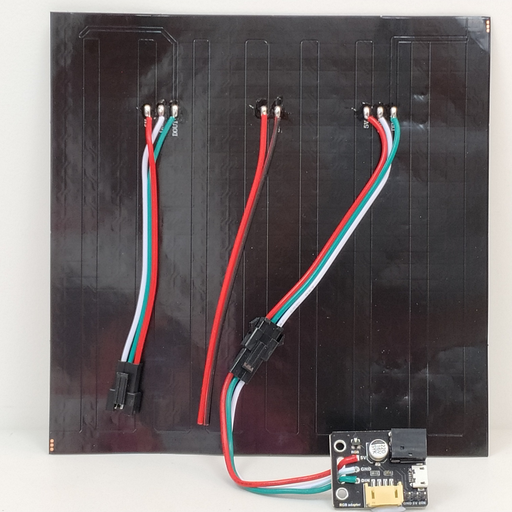
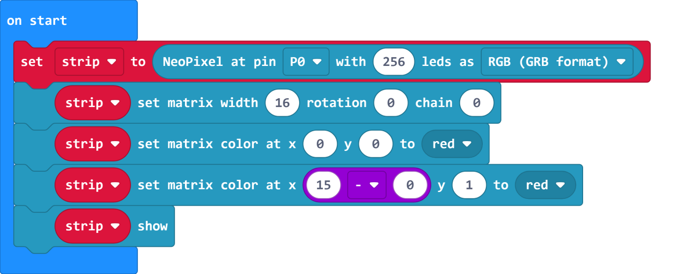

# RGB LED Screen and Matrices

This tutorial is about RGB LED Screen and Matrices, understanding matrices allow us to create more complicated patterns.

## Wiring

RGB LED Screen is used with the Robotbit, please refer to the following figures. 

### 1. Connect the screen to the adapter.

### 2. Connect the adapter to Robotbit。

### 3. For prolonged use, connect a USB power.

As power is delivered via USB, you don't have to use the 5V pin on the adapter.

### 4. Demonstration of wiring

## RGB LED Screen and Matrices

A matrix can be understood as a table with X and Y axes. So a table with 10 columns and 10 rows can be understood as a 10x10 matrix.

For example, a resolution of 1920x1080 is a matrix of 1920x108.

In other words, the 8x32 or 16x16 screens are also matrices.

## Makecode Coding tutorial

### Load the NeoPixel extension.

We can initialize the screen as a 16x16 matrix. Pixels can be selected by using coordinates.

[Sample Code Download](https://bit.ly/LEDMatrixT3_01Hex)

[Sample Code Link](https://makecode.microbit.org/_WWiYHp7F50Cg)

Lighting up the first pixel in the first 2 rows.

[Sample Code Download](https://bit.ly/LEDMatrixT3_02Hex)

[Sample Code Link](https://makecode.microbit.org/_T02XMz8ooihy)

We can see that the pixel that lights up is different in the 2 rows despite having the same X value.
    

This is because the screen is wired in a zig zag pattern, so the direction of X changes on each row(Refer to the following figure).

In our code, the direction of X is from right to left on the first row(Y=0).

But on the second row(Y=1), the direction of X is left to right.

Therefore, when Y is and odd number, we have to reverse the position of X.

    Computers count from 0.

Reversing is simple, we just have to minus X from the width of the matrix.

[Sample Code Download](https://bit.ly/LEDMatrixT3_03Hex)

[Sample Code Link](https://makecode.microbit.org/_bjMWtxVJpffc)

    Although the matrix width is 16, but computers count from 0. So we have to minus 1.(16-1=15)）
    The RGB module from Powerbrick does not need this modification.
    

As a result, we need to modify X when displaying patterns.

[Sample Code Download](https://bit.ly/LEDMatrixT3_04Hex)
   
[Sample Code Link](https://makecode.microbit.org/_5Fiag7F001ec)

 
## Matrix Rotation

The following code shows the effect on the X and Y axis when rotating the matrix.

Rotating the matrix may sometimes be helpful.

    There are 3 kinds of rotation.
    

[Sample Code Download](https://bit.ly/LEDMatrixT3_05Hex)
   
[Sample Code Link](https://makecode.microbit.org/_E95HhRdT5gPX)
    
Refer to this figure for the relation between the axes and rotation.

## Extension Version and Updates

There may be updates to extensions periodically, please refer to the following link to update/downgrade your extension.

[Makecode Extension Update](../../../Makecode/makecode_extensionUpdate)

## FAQ

Q: Why is red the only colour lit up when I try to use different colours?

A: There is not enough power.

Solution: Reduce brightness or turn on the power on the Robotbit, or connect to a USB power.

## Precautions

- Do not connect a power supply with a voltage higher than 5V.
- Connect to a USB power supply when for prolonged use.
- Lower the brighness when a lot of LEDs are lit.
- This product is suitable for users aged over 14, children aged 8-14 need to be under the supervision of an adult when using this product.
- Please refer to Kittenbot's official guidelines before using, wiring must follow the guidelines, do not use a high power servo or motor when using this product.
- To avoid short circuiting, do not put this product on conductive surfaces such as metal.
- To avoid short circuiting, do not put this product in water.
- Do not touch the exposed wires with bare hands.
