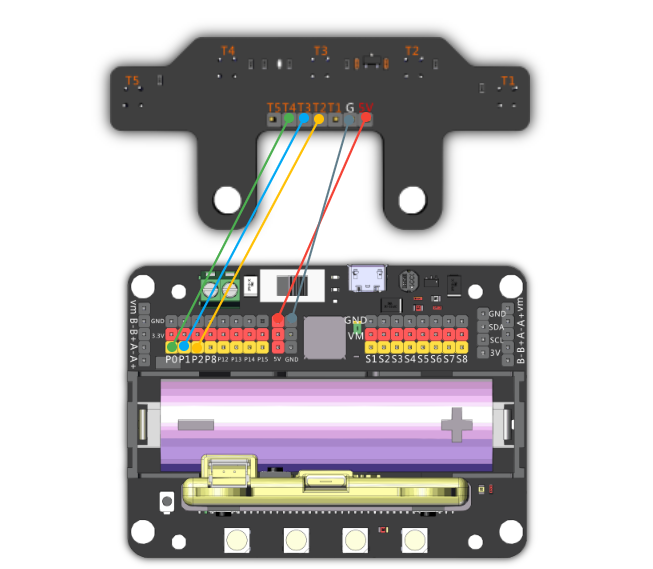
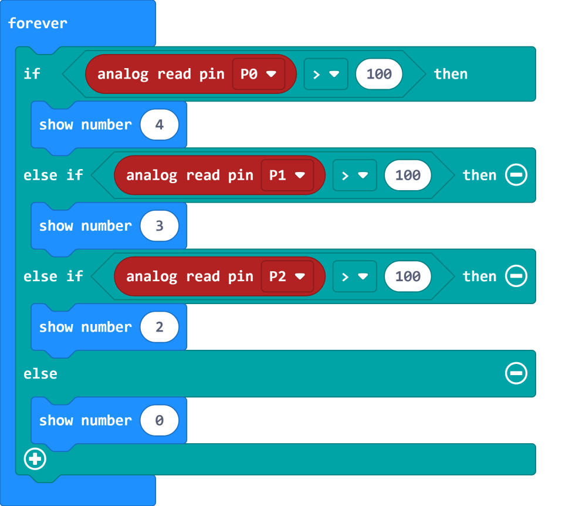
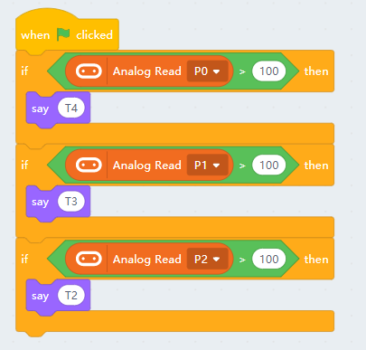

# 5 Way Line Follow Module

5 Way Line Follow Module

This is a line follow module, it has 5 IR sensors and returns an analog value.

The darker the reading is(black line), the lower the return value.

## Specifications

- Voltage：3V-5V
- Distance between Sensors：11mm
- Mounting Hole Diameter：5mm
- Effective Distance：1cm-5cm
- Interface：Dupont Cable

## Wiring Diagram

5 Way Line Follow Module can be connected to 3.3V or 5V power.

    This is an analog module, it can only use P0-P2.(Remove the buzzer jumper when P0 is in use.)

## MakeCode Coding Tutorial

### This module can be used with Microbit and Meowbit.

#### Line Follower Sensor Coding

    The sensors return value may change in different environments, such as height of sensors and color or material of tape。
    It is recommended to calibrate values before using the module.

### Microbit:

[Sample Code Link](https://makecode.microbit.org/_c7rXpLY791Cw)

### Meowbit:

[Sample Code Link](https://makecode.com/_2pw59JbHhVfV)

## KittenBlock Coding Tutorial

### Load Robotbit Extension

#### Line Follow Sensor Coding

    The sensors return value may change in different environments, such as height of sensors and color or material of tape。
    It is recommended to calibrate values before using the module.

