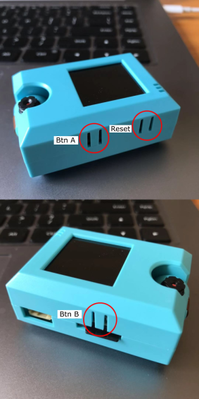
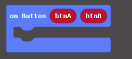
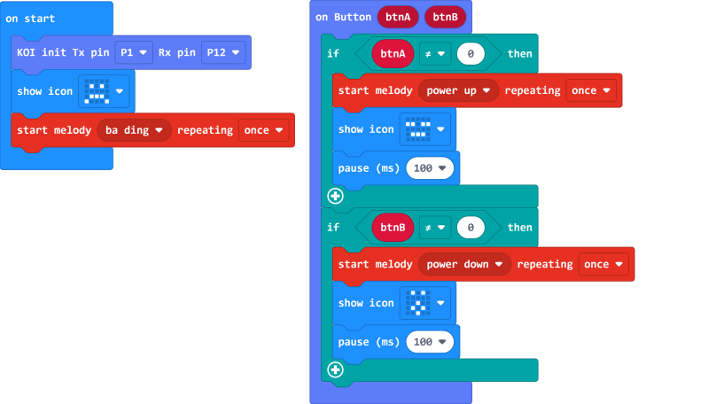

# **A and B Buttons**

KOI has 2 built in programmable buttons called A and B.

 

## Using A and B Buttons

### Load KOI Extension: https://github.com/KittenBot/pxt-koi

### [Loading Extensions](../../../Makecode/powerBrickMC)

Button Blocks:

 

btnA and btnB refer to Button A and B respectively.

When the button is being pressed, it returns a value of 1. When it is not being pressed, it returns a value of 0.

### Sample Program:

## Program Flow

Download the program to Micro:bit.

Pressing button A on the KOI causes Micro:bit to show a smiley face, pressing button B on the KOI causes Micro:bit to show a surprised face.

## Sample Code

[KOI AB Buttons (Ext0.5.7)](https://makecode.microbit.org/_cjVL49CmfWKJ)

## Extension Version and Updates

There may be updates to extensions periodically, please refer to the following link to update/downgrade your extension.

[Makecode Extension Update](../../../Makecode/makecode_extensionUpdate)

## FAQ

### 1: There is no reaction after pressing the buttons on the KOI.

·    A: This is because KOI has a longer boot time than Micro:bit. When the power is turned on, Micro:bit has already ran the code for KOI initialization before KOI is ready.

·    Solution: Reset your Micro:bit after KOI has been turned on. (The trick is to let KOI power on completely before initialization.)

### 2: Does KOI work with 3V input?

·    A: No, KOI only works with 5V.

