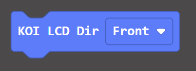
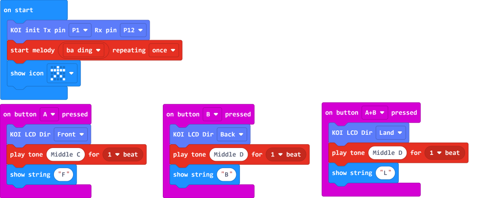

# **LCD Orientation**

One advantage of the KOI is that camera is able to rotate from 0°~180°, however the image may be reversed on the LCD when the camera is rotated, thus we may need to change the LED orientation based on our use case.

## Changing LCD Orientation

### Load KOI Extension: https://github.com/KittenBot/pxt-koi

### [Loading Extensions](../../../Makecode/powerBrickMC)

Block for Changing LCD Orientation:

 

From the drop down menu, there are 3 types of orientation to choose from.

 

 

### Sample Program:

 

## Program Flow

Download the program to Micro:bit.

1: When button A is pressed, the LCD is set to Front mode. The image looks correct when the camera is facing towards you.

2: When button B is pressed, the LCD is set to Back mode. The image looks correct when the camera is facing away from you.

## Sample Code

[LCD Orientation (Extension0.5.7)](https://makecode.microbit.org/_HEfgPi4YxbTa)

## Extension Version and Updates

There may be updates to extensions periodically, please refer to the following link to update/downgrade your extension.

[Makecode Extension Update](../../../Makecode/makecode_extensionUpdate)

## FAQ

### 1: There is no reaction after pressing the buttons on the Micro:bit.

·    A: This is because KOI has a longer boot time than Micro:bit. When the power is turned on, Micro:bit has already ran the code for KOI initialization before KOI is ready.

·    Solution: Reset your Micro:bit after KOI has been turned on. (The trick is to let KOI power on completely before initialization.)

### 2: Does KOI work with 3V input?

·    A: No, KOI only works with 5V.