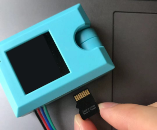
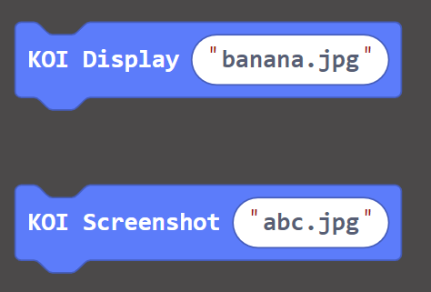
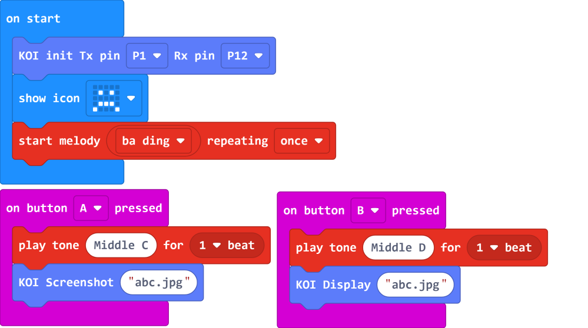
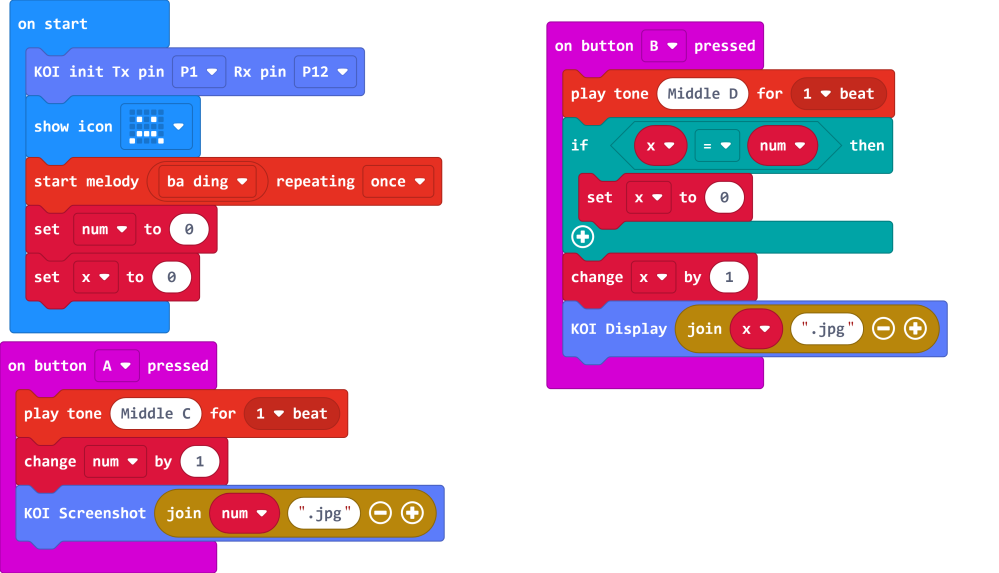

# **Taking and Displaying Pictures**

KOI can take pictures and display them like a digital camera.

### Install an SD Card

 

    The pictures are stored onto an SD card, without an SD card, these operations would fail.
    
## Taking and Displaying Pictures

### Load KOI Extension: https://github.com/KittenBot/pxt-koi

### [Loading Extensions](../../../Makecode/powerBrickMC)

Blocks for taking pictures and displaying:

  

### Sample Program:

 

## Program Flow

Download the program to MicroL:bit.

1. Press button A on the Micro:bit to take a picture.

2. Press button B on the Micro:bit to display the picture.

## Advanced Program

The above program can only save 1 picture because the file is overwritten when a picture is saved. By making use of numbers, we can create a camera program that stores many photos and show them all.

## Sample Code

[1. Taking and Displaying Pictures (Extension0.5.7)](https://makecode.microbit.org/_ATq6rYToD0K0)

[2. Advanced Camera Program (Extension0.5.7)](https://makecode.microbit.org/_LqehKgCrmhbF)

## Extension Version and Updates

There may be updates to extensions periodically, please refer to the following link to update/downgrade your extension.

[Makecode Extension Update](../../../Makecode/makecode_extensionUpdate)

## FAQ

### 1: There is no reaction after pressing the buttons on the Micro:bit.

·    A: This is because KOI has a longer boot time than Micro:bit. When the power is turned on, Micro:bit has already ran the code for KOI initialization before KOI is ready.

·    Solution: Reset your Micro:bit after KOI has been turned on. (The trick is to let KOI power on completely before initialization.)

### 2: Does KOI work with 3V input?

·    A: No, KOI only works with 5V.

### 3: The picture appears noisy and there are black bars when I view the pictures on my computer.

·    A: This is because KOI's camera is not a phone camera, the quality and resolution is not as good. The black bars are caused by the difference in aspect ratio, since our computer monitors are typically 16:9 and KOI is 1:1, black bars would appear.

